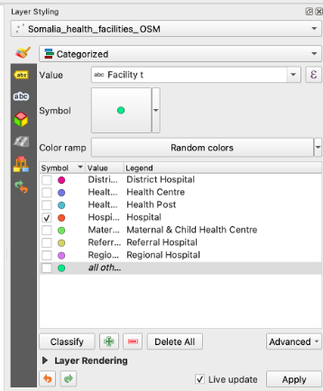

# QGIS Basic Exercise SRCS

## CSV in QGIS

### Aim of exercise

In this task, we will load a CSV file in QGIS and do some analysis. 


## Task 1: Load data in QGIS
1.	Open the folder “Exercise 2”. Go into the “data” folder and copy all data from the “input” folder into the “temp” folder
2.	To load the file “Water_sources.csv” into QGIS click on `Layer` -> `Add layer` -> `Open Delimited Text Layer`. Next to `File name` click on the three points  and navigate to your "temp" folder. Her select the file "water_sources.csv".
3. Use the setings like in the image below. 
```{figure} /fig/add_csv.png
---
width: 400px
name: 
align: center
---
```
4. Click `Add`
5. Load the file "district_pop_som.shp" into QGIS

```{Tip}
To directly load .csv or EXCEL data into QGIS, the datasets need to have columns containing geometry in the form of latitude (Y-field) and longitude (X-field). 
```


## Task 2: Counting water sources per district 

1. In the `Toolbox`-> Search for `Join attribute by location (summary)`
      * Tip: If the `Toolbox` is not opne click `Processing`-> `Toolbox` 
2. `Input Layer`: Select your “district_pop_som” layer
3. `Input Layer 2`: Select “Water_sources"
4. `Geometric predicate`: Select “Intersection”
5. `Field to summarise`: Select “fid"
6. `Summaries to calculate`: Chose only the option “count”
7. Under `Join Layer` click on the three points -> `Save to File` and navigate to your "temp" folder. Give the output the name "district_watersources" and click `Save`
8. Click `Run`
```{figure} /fig/Join_layer_summary_watersources.png
---
width: 450px
name: 
align: center
---
```

```{dropdown} Video: impoering .csv
<video width="100%" controls src="https://github.com/GIScience/gis-training-resource-center/raw/main/fig/qgis_open_textfile.mp4"></video>
```


## Task 3: Calculating water sources per 10.000 people

1. Open the Attribute Table of "district_watersources"
2. Click on  [`Field Calculator`](https://giscience.github.io/gis-training-resource-center/content/Wiki/en_qgis_table_functions_wiki.html#calculate-field) to open the field calculator
3.  Check `Create new field`
3. `Output field name`: Name the new column “Watersources_pop"
4. `Result field type`: Decimal number (real)
5. Add the code into the `Expression` field
```md
( "fid_count"  /  "districtpo"  )  * 10000

```

```{figure} /fig/watersources_per_pop_field_calculator.png
---
width: 600px
name: 
align: center
---
```
6. Click `ok`
7. Save the new column by clicking on  in the attribute table and end the editing mode by clicking on 
8. Sorte the new column “Watersources_pop" and finde out wich districts have the highest and lowest number of water sources per 10.000 people


## QGIS Intro

### Aim of exercise
The goal of the exercise is to get to know the basic functionality of QGIS and how to handle geodata.

 
## Task 1: Folder and data structure
1.	Save the folder Exercise_1 on your computer. Check out the folder structure in the Exercise_1 folder.  
The standard folder structure used makes certain that you never lose any data. You can find more infos about the standard folder structure we recommend [here](https://giscience.github.io/gis-training-resource-center/content/Wiki/en_qgis_projects_folder_structure_wiki.html#standard-folder-structure).
2. Please save your QGIS project in the “project” folder. 
3. Copy the data from the "input" folder into the “temp” folder. During this exercise we will manipulate the input data, that is why we do not work with the original data in the “input” folder. 

```{Tip}
Intermediate results should also be saved in the “temp” folder. The final results should be saved in the “output” folder and your final maps in the “results” folder.
```


## Task 2: Data import into QGIS
1.	Open QGIS and create a new project by clicking  on `Project` -> `New Project` ([Wiki](https://giscience.github.io/gis-training-resource-center/content/Wiki/en_qgis_projects_folder_structure_wiki.html)).
2. To give the project a name click on `Project` -> `Save As`. Navigate to "Exercise_1" and open the "project" folder. Give your project the name "Exercise_1" and click on `Save`. Now you should see the name of your project in the upper left corner of your QGIS.
3.	Open the file **"Somaliland_country.shp"** in QGIS. Click on the `Layer` Tab in the upper left corner -> `Vector`. Select **"Somaliland_country.shp"**. Click `Add` ([Wiki Import Vector layer](https://giscience.github.io/gis-training-resource-center/content/Wiki/en_qgis_import_geodata_wiki.html#open-vector-data-via-layer-tab))
:::{dropdown} Video: Import Vector data
<video width="100%" controls src="https://github.com/GIScience/gis-training-resource-center/raw/main/fig/qgis_open_vector.mp4"></video>
:::
4. Open the file **Somaliand_District_pop.gpkg** in QGIS. Use the drag-and-drop method. Click on the file and pull the file directly into your Layers window.
:::{dropdown} Video: Import data by drag and dop
<video width="100%" controls src="https://github.com/GIScience/gis-training-resource-center/raw/main/fig/qgis_import_vector_d_d.mp4"></video>
:::
5. Open the files **"Somalialand_District_pop.gpkg"** and **Somaliland_airports.gpkg** with either drag and drop or via `Layer` -> `Vector`.
6. Save your project by clicking on the `Save Project` button (small disc in the upper left corner).

## Task 3: Interface 


   

1. __Layers List / Browser Panel:__ The __layers list__ shows __all layers/files__ that are __loaded in the project__. You can show/hide layers and set other properties.

2. __Toolsbars:  __Toolbars__ are shortcuts__ to execute frequently used commands. For example, there are special toolbars for __vector and raster files__, but also general ones for saving your project, etc. The toolbar contains, among other things, a list of all the commands you can use. The toolbar also contains the __toolbox__, which is used later in many of the wiki videos.


3. __Map View:__ The __map view__ is the __central component__ of every GIS programme. This is where the __geodata__ are displayed. The map view has a projection which does not always have to correspond to the projection of the layers.

4.  __Status bar:__ In the __status bar__ you will find __central information about the current map view__. Here you can set the __projection of the map view and the scale__. You can read the coordinates of the mouse pointer and thus quickly find out the coordinates of points on the map. You can rotate your map view, e.g. if you want to create a map facing south.

5. __Side Toolbar__. You may see a __side toolbar__. This is another way to easily open vector and raster files in QGIS.

6. __Locator bar__. Here you can __search for tools and layers__. If you don't know where to find a tool, you can try here.


## Task 4: Layer concept


In this task, we familiarise ourselves with the layer window (Layer List). The concept means that a map in GIS is always a combination of multiple layers. We can combine the layers in many different ways and thus get different results.

You can find more infos in the __[Wiki Layer concept](https://giscience.github.io/gis-training-resource-center/content/Wiki/en_qgis_layer_concept_wiki.html#layer-concept)__.

1. Switch off the "Somalia_country" layer by removing the check on the layer panel ([Wiki](https://giscience.github.io/gis-training-resource-center/content/Wiki/en_qgis_layer_concept_wiki.html#hide-and-show-layers)).
:::{dropdown} Video: Show and hide layers
<video width="100%" controls muted src="https://github.com/GIScience/gis-training-resource-center/raw/main/fig/qgis_show_hide_layer.mp4"></video>
:::{dropdown} Video: 
2. Change the hierarchy of your layers so that "Somalia_airports" is at the top, followed by "Somalia_District_pop". Move the layer up and down in the Layer panel by drag-and-drop [Wiki](https://giscience.github.io/gis-training-resource-center/content/Wiki/en_qgis_layer_concept_wiki.html#move-layers-in-the-hierarchy).
:::{dropdown} Video: Import data by drag-and-drop
<video width="100%" controls muted src="https://github.com/GIScience/gis-training-resource-center/raw/main/fig/qgis_layer_hierarchy.mp4"></video>
:::
3. Move the "Somalia_country" layer to the top and switch it on. What happens?
4. Change the name of the layer "Somalia_airports" to Airports by right click on your layer --> `Rename Layer`
:::{dropdown} Video: Change Layer Name
<video width="100%" controls muted src="https://github.com/GIScience/gis-training-resource-center/raw/main/fig/qgis_rename_layer.mp4"></video>
:::
5. To the properties of a layer right click on your layer -> `Properies` -> `Information`. 
    1. When was the layer "Somaliland_district_pop" last modified?
    2. How many features does the airport layer have?
    3. What geometry does the Somalia_country layer have?

```{Tip}
If you have "lost" your layer, right click on your layer -> `Zoom to layer(s)`

__[Wiki Video](https://giscience.github.io/gis-training-resource-center/content/Wiki/en_qgis_layer_concept_wiki.html#have-you-lost-your-layer)__
```

## Task 5: Attribute tables

The attribute table, a core component of Geographic Information Systems (GIS), organizes and presents detailed information about features in a selected layer. Each row in the table represents a feature, while columns store specific attributes. This table facilitates searching, selection, sorting, filtering, and editing of features.

__Example of an attribute table__


__[Wiki Attribute Table](https://giscience.github.io/gis-training-resource-center/content/Wiki/en_qgis_attribute_table_wiki.html#attribute-table-in-qgis)

1. Open the attribute table of "Somaliland_district_pop". Right-click on "Somaliland_district_pop" --> `Open Attribute Table` ([Wiki](https://giscience.github.io/gis-training-resource-center/content/Wiki/en_qgis_attribute_table_wiki.html))
:::{dropdown} Video: Open attribute Table
<video width="100%" controls muted src="https://github.com/GIScience/gis-training-resource-center/raw/main/fig/qgis_show_attribute_table.mp4"></video>
:::
2. Sort by "Population" by clicking on the column header. 
3. In the attribute table select the feature “Berbera” by clicking on the left edge of the row.
:::{dropdown} Video: Select features in Attribute Table
<video width="100%" controls muted src="https://github.com/GIScience/gis-training-resource-center/raw/main/fig/qgis_attribute_table_select.mp4"></video>
:::
4. To select more features press `Ctrl` and click on the features.
5. To only see selected features click in the down left corner of the attribute table on the drop-down menu and select `Show selected features`. To show again all features click on `Show all features`. 
6. To only show unselect features and click on  in the attribute table. 
7. To unselect all features click on  in the attribute table
:::{dropdown} Video: Unselect features
<video width="100%" controls muted src="https://github.com/GIScience/gis-training-resource-center/raw/main/fig/qgis_attribute_table_unselect.mp4"></video>
:::
8. To zoom to one feature right click on your feature --> `Zoom To Feature`


## Task 6: Basic Data visualization

Depending on the use case and type of geodata at your disposal, there are multiple ways to visualise geodata in a comprehensive format:

- You can change the 'styling' and color of the data
- You can add textlabels 

All the styling in QGIS happens in `Symbology`

1.	To open the symbology window of the "Somaliland_country" layer right click on the Somaliland_country layer -> `properties`. A new window will open up with a vertical tab section on the left. Navigate to the `symbology` tab. 
:::{dropdown} Video: Opening the styling panel
<video width="100%" controls src="https://github.com/GIScience/gis-training-resource-center/raw/main/fig/en_30.30.2_opening_the_styling_panel.mp4"></video>
:::
2. Change the colour of the layer fill by selecting a style for the drop-down menu. 
3. To change the colour of the borders of the "Somaliland_country" layer by clicking on `Simple fill` in the symbology window and change the colour in the `Stroke Colour` drop-down menu.
4. Adjust the thickness of the borders under `Stroke width`
5. To only show the boarders of Somaliland click on `Simple Fill` -> `Fill Colour` -> `Transparent Fill`
:::{dropdown} Video: Only display the outlines of polygons
<video width="100%" controls src="https://github.com/GIScience/gis-training-resource-center/raw/main/fig/en_30.30.2_make_only_outlines_visible.mp4"></video>
:::
6. Add a OpenStreetMap base map by clicking on `Layer` in the to left corner of QGIS -> `Add Layer` -> `Add XYZ layer...` -> Select the OpenStreetMap
:::{dropdown} Video: Adding basemap
<video width="100%" controls src="https://github.com/GIScience/gis-training-resource-center/raw/main/fig/Add_basemap_OSM.mp4"></video>
:::


## Task 7: Clipping and Extract by location
1.	Import the file **Somalia_health_facilities_WHO.gpkg** in QGIS.
::: {dropdown} Video: Import data by drag and drop
<video width="100%" controls src="https://github.com/GIScience/gis-training-resource-center/raw/main/fig/qgis_import_vector_d_d.mp4"></video>
:::
2.	The layer **Somalia_health_facilities_WHO** includes health facilities in Somaliland and Somalia. We only want to use the facilities in Somaliland. To cut the layer to the size of Somaliland we will use the tool __[clip](https://giscience.github.io/gis-training-resource-center/content/Wiki/en_qgis_geoprocessing_wiki.html#clip). Open the `Porcessing Toolbox` by cliking on `Processing` -> search for “Clip” 
:::{dropdown} Video: Open `Processing toolbox`
<video width="100%" controls src="https://github.com/GIScience/gis-training-resource-center/raw/main/fig/qgis_open_toolbars.mp4"></video>
:::
3. In the window of the Clip tool...

    1. `Input Layer`: "Somalia_health_facilities_OSM"
    2. `Overlay Layer`: "Somaliland_country"
    3. `Clipped`: Click on the three points   -> `Save to File` -> search for your "temp" folder -> give the result layer the name "Somaliland_health_facilities" and click on `Save`
    4. Click `Run`
```{figure} /fig/QGIS_basics_Fig11.png
---
width: 400px
name: 
align: center
---
```
:::{dropdown} Video: Clip example
<video width="100%" controls src="https://github.com/GIScience/gis-training-resource-center/raw/main/fig/en_qgis_clip_wiki.mp4"></video>
:::
4. Now you should have a new point layer with all health facilities in Somaliland. Delete the old "Somalia_health_facilities_WHO" layer by right-click on the layer -> `Remove layer`


## Task 8: Data visualization- Categorized classification of Points

Categorized classification in QGIS groups spatial data into distinct categories based on specific attributes. This classification enhances the organization and interpretation of geospatial information for clearer insights.
1. Open the attribute table of "Somaliland_health_facilities_OSM" by right clicking on "Somaliland_health_facilities_OSM" -> `Open Attribute Table`
2. Check out the column “Facility t”. This column has the data on the type of the health facility. As you can see there are not just hospitals but many different typs of facilities like Health posts.
3. To categorise all facilities by type on the map, open the symbology window. Right-click on the "Somaliland_health_facilities_OSM" layer -> `properties`-> `symbology`
4. Click on `Categorized`
5. `Value`: “Facility t”.
Further down the window click on `Classify`.  Now you should see all unique values or attributes of the selected “Facility t” column.
6. We only want to see the hospitals, so uncheck Maternal & Child Health Centre, Health Post and Health Center.
6. Click `Apply`
```{figure} /fig/QGIS_basics_Fig12.png
---
width: 400px
name: 
align: center
---
```
:::{dropdown} Video: Categorized classification Example 
<video width="100%" controls src="https://github.com/GIScience/gis-training-resource-center/raw/main/fig/Classify_by_categorized.mp4"></video>
:::
7. To use a prearranged style for the hospitals go to the Symbology window. In the down left corner click on `Style` -> `Load Style`
4. In the new window click on the three points . Navigate to the "Project" folder -> "Style" folder and select the file “Hospital_style_training.qml. ([Wiki](https://giscience.github.io/gis-training-resource-center/content/Modul_4/en_qgis_map_design_I.html#exporting-and-importing-styles))
5. Click `Open`. Then click on `Load Style`
6. Back in the “Layer Properties” Window click `Apply` and `OK`





 
