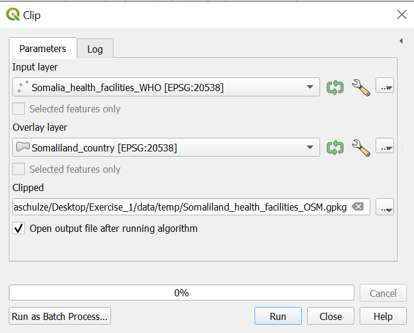

# Exercise 1: Somalia healthcare and accessibility 

### Aim of exercise
The goal of the exercise is to get to know the basic functionality of QGIS and how to handle geodata.

As an example, we will create a map which shows the position of hospitals and the population of districts in Somalia.


**Data:**
You find all of the data in the training folder: *GIS_Trainig_Data/Exercise_1*

Somalia_country.shp
Somalia_health_facilities_WHO.shp
Somalia_Districts.gpkg
Somalia_District_Pop.gpkg
Somalia_roads.gpkg
Somalia_airports.csv
 
## Task 1: Folder and data structure
1.	Save the folder Exercise_1 on your computer. Check out the folder structure in the Exercise_1 folder.  
The standard folder structure used makes certain that you never lose any data. You can find more infos about the standard folder structure we recument [here](https://giscience.github.io/gis-training-resource-center/content/Wiki/en_qgis_projects_folder_structure_wiki.html#standard-folder-structure).
2. Please save your QGIS project in the “project” folder. 
3. Copy the data from the "input" folder into the “temp” folder. Do not change the original data in the “input” folder. 

```{Tip}
Intermediate results should also be saved in the “temp” folder. The final results should be saved in the “output” folder and your final maps in the “results” folder.
```


## Task 2: Data import into QGIS
1.	Open QGIS and create a new project by cliking  on `Project` -> `New Project` ([Wiki](https://giscience.github.io/gis-training-resource-center/content/Wiki/en_qgis_projects_folder_structure_wiki.html)).
2. To give the project a name Click on `Project` -> `Save As`. Navigate to "Exercise_1" and open the "project" folder. Give your project the name "Exercise_1" and click on `Save`. Now you should see the name of your project in the upper left corner of your QGIS.
3.	Open the file **"Somalia_country.shp"** in QGIS. Click on the `Layer` Tab in the upper left corner -> `Vector`. Select **"Somalia_country.shp"**. Click `Add` ([Wiki Import Vector layer](https://giscience.github.io/gis-training-resource-center/content/Wiki/en_qgis_import_geodata_wiki.html#open-vector-data-via-layer-tab))
<video width="100%" controls src="https://github.com/GIScience/gis-training-resource-center/raw/main/fig/qgis_open_vector.mp4"></video>
4. Open the file **Somalia_District_pop.gpkg** in QGIS. Use the drag-and-drop method. Click on the file and pull the file directly into your Layers window.
<video width="100%" controls src="https://github.com/GIScience/gis-training-resource-center/raw/main/fig/qgis_import_vector_d_d.mp4"></video>
5. Open the files **"Somalia_District_pop.gpkg"** and **Somalia_airports.gpkg** with either drag and drop or via `Layer` -> `Vector`.
6.	Save your project by clicking on the “Save Project” button (small disc in the upper left corner).

## Task 3: Interface 


   

1. __Layers List / Browser Panel:__ The __layers list__ shows __all layers/files__ that are __loaded in the project__. You can show/hide layers and set other properties.

2. __Toolsbars:  __Toolbars__ are shortcuts__ to execute frequently used commands. For example, there are special toolbars for __vector and raster files__, but also general ones for saving your project, etc. The toolbar contains, among other things, a list of all the commands you can use. The toolbar also contains the __toolbox__, which is used later in many of the wiki videos.


3. __Map View:__ The __map view__ is the __central component__ of every GIS programme. This is where the __geodata__ are displayed. The map view has a projection which does not always have to correspond to the projection of the layers.

4.  __Status bar:__ In the __status bar__ you will find __central information about the current map view__. Here you can set the __projection of the map view and the scale__. You can read the coordinates of the mouse pointer and thus quickly find out the coordinates of points on the map. You can rotate your map view, e.g. if you want to create a map facing south.

5. __Side Toolbar__. You may see a __side toolbar__. This is another way to easily open vector and raster files in QGIS.

6. __Locator bar__. Here you can __search for tools and layers__. If you don't know where to find a tool, you can try here.

__Offical QGIS Documentation: [An Overview of the Interface](https://docs.qgis.org/3.4/de/docs/training_manual/introduction/overview.html)__

___

## Task 4: Layer concept
__[Layer concept](https://giscience.github.io/gis-training-resource-center/content/Wiki/en_qgis_layer_concept_wiki.html#layer-concept)__

In this task, we familiarise ourselves with the layer window (Layer List). The concept means that a map in GIS is always a combination of multiple layers. We can combine the layers in many different ways and thus get different results.
1. Switch off the Somalia_country layer by removing the check on the layer panel ([Wiki](file:///C:/HeiGIT/RCRC_GIS_Training/gis-training-resource-center/_build/html/content/Wiki/en_qgis_layer_concept_wiki.html#hide-and-show-layers)).
<video width="100%" controls muted src="https://github.com/GIScience/gis-training-resource-center/raw/main/fig/qgis_show_hide_layer.mp4"></video> 
2. Change the hierarchy of your layers so that Somalia_airports is at the top, followed by Somalia_District_pop. Move the layer up and down in the Layer panel by drag-and-drop [Wiki](file:///C:/HeiGIT/RCRC_GIS_Training/gis-training-resource-center/_build/html/content/Wiki/en_qgis_layer_concept_wiki.html#move-layers-in-the-hierarchy).
<video width="100%" controls muted src="https://github.com/GIScience/gis-training-resource-center/raw/main/fig/qgis_layer_hierarchy.mp4"></video>
3. Move th Somalia_country layer to the top and switch it on. What happens?
4. Change the name of the layer Somalia_airports to Airports by right click on your layer --> `Rename Layer`
<video width="100%" controls muted src="https://github.com/GIScience/gis-training-resource-center/raw/main/fig/qgis_rename_layer.mp4"></video>
5. To the properties of a layer right click on your layer -> `Properies` -> `Information`. 
    5.1 When were the layer Somaliland:district_pop last modified?
    5.2 How many features does the airport layer have?
    5.3 What geometry does the Somalia_country layer have?

```{Tip}
If you have "lost" your layer right click on your layer -> `Zoom to layer(s)`

([Wiki Video](https://giscience.github.io/gis-training-resource-center/content/Wiki/en_qgis_layer_concept_wiki.html#have-you-lost-your-layer))
```

## Task 5: Attribute tables

The attribute table, a core component of Geographic Information Systems (GIS), organizes and presents detailed information about features in a selected layer. Each row in the table represents a feature, while columns store specific attributes. This table facilitates searching, selection, sorting, filtering, and editing of features.

__Example__


__[Wiki Attribute Table](file:///C:/HeiGIT/RCRC_GIS_Training/gis-training-resource-center/_build/html/content/Wiki/en_qgis_attribute_table_wiki.html#attribute-table-in-qgis)

1. Open the attribute table of Somaliliand_district_pop. Right-click on Somaliliand_district_pop --> `Open Attribute Table` ([Wiki]())
<video width="100%" controls muted src="https://github.com/GIScience/gis-training-resource-center/raw/main/fig/qgis_show_attribute_table.mp4"></video>
2. Sort by "Population" by clicking on the column header. 
3. In the attribute table select the feature “Berbera” by clicking on the left edge of the row.
<video width="100%" controls muted src="https://github.com/GIScience/gis-training-resource-center/raw/main/fig/qgis_attribute_table_select.mp4"></video>
4. To select more features press `Ctrl` and click on the features.
5. To only see selected features click in the down left corner of the attribute table on the drop-down menu and select `Show selected features`. To show again all features click on `Show all features`. 
6. To only show unselect features and click on  in the attribute table. 
7. To unselect all features click on  in the attribute table
<video width="100%" controls muted src="https://github.com/GIScience/gis-training-resource-center/raw/main/fig/qgis_attribute_table_unselect.mp4"></video>
8. To zoom to one feature right click on your feature --> `Zoom To Feature`


## Task 6: Basic Data visualization

Depending on the use case and type of geodata at your disposal, there are multiple ways to visualise geodata in a comprehensive format:

- You can change the 'styling' and color of the data
- You can add textlabels 

All the styling in QGIS happens in `Symbology`

1.	To open the symbology window of the Somaliland_country layer right click on the Somaliland_country layer -> `properties`. A new window will open up with a vertical tab section on the left. Navigate to the `symbology` tab. 
:::{dropdown} Video: Opening the styling panel
<video width="100%" controls src="https://github.com/GIScience/gis-training-resource-center/raw/main/fig/en_30.30.2_opening_the_styling_panel.mp4"></video>
:::
2. Change the colour of the layer fill by selecting a style for the drop-down menu. 
3. To change the colour of the borders of the Somaliland_countrs layer by clicking on `Simple fill` in the symbology window and change the colour in the `Stroke Colour` drop-down menu.
4. Adjust the thickness of the borders under `Strocke width`
5. To only show the boarders of Somaliland click on `Simple Fill` -> `Fill Colour` -> `Transparent Fill`
:::{dropdown} Video: Only display the outlines of polygons
<video width="100%" controls src="https://github.com/GIScience/gis-training-resource-center/raw/main/fig/en_30.30.2_make_only_outlines_visible.mp4"></video>
:::
6. Add a OpenStreetMap base map by cliking on `Layer` in the to left corner of QGIS -> `Add Layer` -> `Add XYZ layer...` -> Select the OpenStreetMap
:::{dropdown} Video: Adding basemap
<video width="100%" controls src="https://github.com/GIScience/gis-training-resource-center/raw/main/fig/Add_basemap_OSM.mp4"></video>
:::


### Data visualization - Categorized classification of lines
18.	Open the file **Somalia_roads.gpkg** in QGIS.
19.	As you can see the road network layer like this is not very useful. We only want to identify the important roads. 
First, let's have a look at the attribute table. As you can see in the column “highway” the different types of roads are listed. We can the info from this column to only show important roads. To do so close the attribute table and open the Layers styling panel.
Select the layer **Somalia_roads**. Instead of Single Symbols choose *Categorized*. In the *Value* drop-down menu select the column *“highway”*. Then click on *classify*.
Now uncheck all boxes except “secondary”, “secondary_link”, “tertiary”, “trunk” and “trunk_link”.


### Clipping and Extract by location
20.	Open the file **Sub_Saharan_health_facilities_OSM.gpkg** in QGIS 
21.	The layer **Sub_Saharan_health_facilities_OSM** includes health facilities in Somalia and Somalia. We only want to use the facilities in Somalia. 
There are two methods for cutting the data to our area of interest, the Extract by location method and the Clip method.
* **Extract by location**: *Processing Toolbox -> search for “Extract by location”*. Extract feature from: **Sub_Saharan_health_facilities_OSM** By comparing to the features from **Somalia_country**.
Extracted (location): **Somalia_health_facilities_WHO**
Click *Run*


* Clip: Porcessing *Toolbox -> search for “Clip”*x
Input Layer: **Sub_Saharan_health_facilities_OSM**
Overlay Layer: **Somalia_country**
Clipped: **Somalia_health_facilities_OSM**
Click *Run*




### Data visualization- Categorized classification of Points
22.	If you check the attribute table of your new **Somalia_health_facilities_WHO** layer you can see in the “Facility t” column that there are different types of health facilities. We only want to show the hospitals on our map. To do so you can use the same workflow as with the roads.


### Labels
23.	To add the names of the districts to the map use the Layers Styling Panel. Select the **Somalia_District_pop** layer and click on *Labels*.
Use the select *Single labels* and in the value drop-down menu select “admin2Name”.
Add buffer around the names of the districts by clicking on *Buffer* and checking the box *Draw text buffer*.


 
