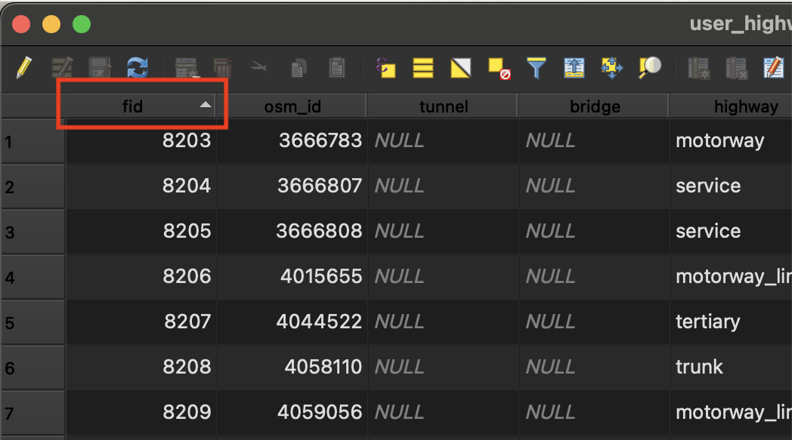
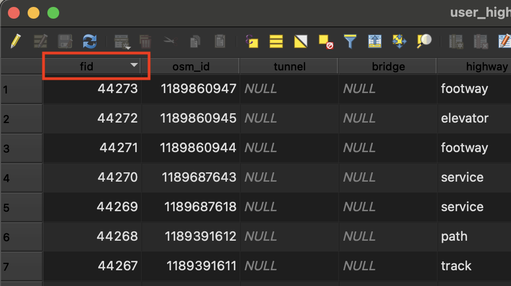

🚧 This training platform and the entire content is under ⚠️construction⚠️ and may not be shared or published! 🚧

# Geodata and Geodata processing
**Competences:**
* Data Import
* Geo features and attributes
* Feature selection
* Basemap selection


## Data import

Before you can start visualizing and analysing in QGIS, you need to import your data. [Here](../../content/Modul_2/en_data_sources.md) you can look up, where to find different data sources.
Depending on which file format you want to import, the process differs slightly.

::::{tab-set}

:::{tab-item} Vector data import
The possible data formats are listed [here](../../content/Modul_2/en_qgis_geodata_concept.md). 
Go to the data source manager and choose vector on the right. By clicking on the three dots you can browse your files and choose the ones you want to import.

  


:::

:::{tab-item} Raster data import
Go to the data source manager and choose vector on the right. By clicking on the three dots you can browse your files and choose the ones you want to import.  

  


:::

:::{tab-item} Delimited text import
Go to the data source manager and choose vector on the right. By clicking on the three dots you can browse your files and choose the ones you want to import. Next, choose your file format and expand the geometry definition section to select **latitude (Y field)** and **longitude (X field)**. Usually there is one column each that contains the geometry ot coordinates.  
 Click on Geometry CRS (5) and select the Project CRS.

 When you choose custom delimiters in the file format (3 & 3.1), you can change the delimiters.

:::

:::{tab-item} GeoPackage import
Go to the data source manager and choose GeoPackage on the right. Click on New to add a connection. Browse through your data to the Geopackage and add. By clicking on Connect and Add you can add the data to your project.


:::

::::

### overpass turbo

[Overpass turbo](https://overpass-turbo.eu) is a web based data mining tool for OSM. By running a query, you can download the data and import it into your project. You can either run it by writing your query on the left or by using the wizard which will assist you in writing your queries. 
> ***Example***  
To search for schools in your bounding box or search area you can either write the query yourself or get it build by the wizard.  
> **1. Check Tagging Guidelines**  
>Search for it in the [OSM wiki](https://wiki.openstreetmap.org/wiki/Tags) and/or [taginfo](https://taginfo.openstreetmap.org). In our example it is: *amenity=school*  
> **2.  Write or build the query**  
Either use the wizard by tiping in *amenity=school in Heidelberg* or write your own query (f. e. for your bounding box):  
>>**Wizard:**
>>```{figure} /fig/en_wizard_overpassturbo.png
>>---
>>height: 250px
>>name: overpass_turbo_wizard
>>---
>>Screenshot of the Wizard in overpass turbo
>>```
>>```{figure} /fig/en_wizard_result.png
>>---
>>height: 250px
>>name: overpass_turbo_wizard_result
>>---
>>Screenshot of the result
>>```  
>>**Query:**
>> ```sql
>>[out:json];  
>>(  
>>  node ["amenity"="school"](49.35,8.553,49.481,8.756);
>>  way ["amenity"="school"](49.35,8.553,49.481,8.756);
>>  relation ["amenity"="school"](49.35,8.553,49.481,8.756);
>>);
>>out; 
>>```
>>>**Bounding Box**  
>>>To query with a bounding box you need a special format. Specify it like so:
>>> + s (southern limit in decimal degrees, lowest latitude)
>>> + w (western limit in decimal degrees, lowest longitude)
>>> + n (northern limit in decimal degrees, highest latitude)
>>> + e (eastern limit in decimal degrees, highest longitude)
>>>     + for example:  
>>> ```sql
>>>         node ["key"="value"] (s, w, n, e);
>>>         out;
>> ```{tip} 
>>For more information on the query language check out the [Language Guide](https://wiki.openstreetmap.org/wiki/Overpass_API/Language_Guide).
>>```
> **3. Download the data**  
>One can export the results in various ways.
>
>::::{tab-set}
>
>:::{tab-item} Data
>By exporting the data as f.e. GeoJSON you can later on import them in your QGIS project.
>```{figure} /fig/en_overpass_turbo_data.png
>---
>height: 250px
>name: overpass_turbo_data
>---
>Screenshot of how to export data in overpassturbo
>```
>
>:::
>
>:::{tab-item} Map
>By exporting the query as map, you can share your current view as link or image.
>
>```{figure} /fig/en_overpass_turbo_map.png
>---
>height: 150px
>name: overpass_turbo_map
>---
>Screenshot of how to export map in overpassturbo
>```
>:::
>
>:::{tab-item} Query
>By exporting your query you can get the text or convert it to an OverpassXML or OverpassQL formated query.
>
>```{figure} /fig/en_overpass_turbo_query.png
>---
>height: 250px
>name: overpass_turbo_query
>---
>Screenshot of how to export query in overpassturbo
>```
>:::
>
>::::

```{tip} 
For more information, check out the [wiki](https://wiki.openstreetmap.org/wiki/Overpass_turbo).
```

### Quick OSM plugin

By installing the QuickOSM plugin you can run the query directly in QGIS to download data from OpenStreetMap. 
First download the plugin by following the steps: 


```{figure} /fig/en_search_plugin.png
---
height: 500px
name: search_plugin
---
Screenshot of how to search for plugins
```

You will see a new icon on your toolbar on the top. Now it is possible to search for your key:value in a given location and run the query. When the download is complete, you will get a notification. The result will be loaded in three temporary layers, one for nodes, ways and relations.


```{figure} /fig/en_quickosmplugin.png
---
height: 500px
name: quickosmplugin
---
Screenshot of the QuickOSM plugin
```
```{note} 
If you are unsure which key and value are used, take a look in the [OSM wiki](https://wiki.openstreetmap.org/wiki/Tags) or [taginfo](https://taginfo.openstreetmap.org). 
```
````{dropdown} What do i do if there is no new icon?
If you can't find your new icon for the plugin, select view - toolbars and check that the QuickOSM plugin has a tick to be shown.

```{figure} /fig/en_no_new_icon.png
---
height: 500px
name: no_new_icon
---
Screenshot of how to add a new icon
````


<details>
<summary>What do i do if there is no new icon?</summary>
<br>
If you can't find your new icon for the plugin, select view - toolbars and check that the QuickOSM plugin has a tick to be shown.

```{figure} /fig/en_no_new_icon.png
---
height: 500px
name: no_new_icon
---
Screenshot of how to add a new icon
```

</details>


## Geo features and attributes

Each layer consists of geometric elements (points, lines or polygons) and an attribute table. The attribute table contains information on each element of the layer, which is stored in a table as rows and columns. Each row corresponds to an element and each column to an attribute. Atrributes can be for example: ID, name, postal code, street name, ...

Having a look into the attribute table can be helpful to get an overview on the data you are working with. It can also be used to select, filter or edit data.

### Open the attribute table

One can open the attribute table in two ways. Either click right on the chosen layer and select *open attribute table* or click on the symbol on the top.

```{figure} /fig/en_attributetable_right_click.png
---
height: 250px
name: Open Attribute Table with right click
---
Screenshot of Opening the Attribute Table with right click
```

```{figure} /fig/en_attributetable_top_right.png
---
height: 250px
name: Open Attribute Table top right
---
Screenshot of Opening the Attribute Table
```

```{note} 
If you have multiple layers, only the attribute table of the layer selected in the layer panel on the left will open. 
```

### Sort the information

Now that the attribute table is opened, it is possible to sort the data within. By clicking on the tab of the column, you can sort the data (alphabetically) in ascending or descending order.
The small arrow indicates whether it is sorted ascending or descending. 


 | 
:-------------------------:|:-------------------------:
The data is sorted ascending.  |  The data is sorted descending.  

### Edit or change data
If you have to edit or change data in the attribute table, you can do so by clicking on the pencil on the top left. This could be the case, for example, because special characters like 'ü' or 'ä' are displayed wrong.

```{figure} /fig/en_editing_mode.png
---
height: 100px
name: Editing Mode in the attribute table
---
Screenshot of the editing mode 
```

In the editing mode, you can also add or delete columns.

```{figure} /fig/en_add_column.png
---
height: 100px
name: Add column in the attribute table
---
Screenshot of adding a column
```

## Feature selection
In QGIS you have many ways to select features, whether that´s in the attribute table or directly in the map canvas.

### Select manually

::::{tab-set}

:::{tab-item} Select manually in the attribute table 
Open the attribute table and click on the number of the row you want to select, so that the row turns blue. 

```{figure} /fig/en_select_row.png
---
height: 150px
name: Select row manually.
---
Screenshot of how to select a row manually.
```

```{note} 
Selected features are highlighted blue in the attribute table. 
```

:::

:::{tab-item} Select manually in the map canvas
To select on the map directly, click on the marked symbol on the top. Now you can either click directly onto objects you want to select or by choosing in the dropdown, you can select all objects within a polygon or by radius.

```{figure} /fig/en_select_map.png
---
height: 110px
name: Select on map manually.
---
Screenshot of how to select objects in the map.
```

```{note} 
Selected features are highlighted yellow in the map. 
```
:::

::::

<details>
<summary>How to deselect features</summary>
<br>
To deselect the objects, you can simply click on this symbol on the top bar. In the dropdown, you can choose whether this should deselect all objects from all layers or only from the active one.

```{figure} /fig/en_unselect.png
---
height: 50px
name: Deselect features.
---
Screenshot of how to desselect objects.
```

</details>

 

```{tip} 
To get all selected objects to the top of the attribute table, you can sort for them like so:


```

```{tip} 
It is also possible to invert your selection, like so:


```

### Select by location
**here or Modul 5?**


### Filter
To filter for certain attributes, you can click on *filter for features* and type the chosen expression that is contained in this column. 

```{figure} /fig/en_filter_features.png
---
height: 100px
name: Filter features.
---
Screenshot of how to filter features.
``` 

```{figure} /fig/en_filter_back_table.png
---
height: 300px
name: Filter features and get back to the table view.
---
Screenshot of how to filter features and get back to the table view.
```
To return to the view as a table, click on the bottom right corner.

### Select features by expression
If you have more or more complex conditions on which the selection should base, you can use the *select by expression* tool.

```{figure} /fig/en_select_by_expression.png
---
height: 100px
name: Select by expression.
---
Screenshot of how to select by expression.
```

A window will open, on the left you can type in your expression, on the right are different drowdowns. Under *field and values* you can select the columns name. 

```{figure} /fig/en_view_expression.png
---
height: 300px
name: Select by expression, the opened window.
---
Screenshot of the window to select by expression.
```

Next, you can choose from different operators: 
+ Arithmetic operators: >, < , =, !=
+ String operators: LIKE, IS, BETWEEN, IN, ...
+ Logical operators: AND, OR

To build your expression, you can double click on the chosen column and then on *All Unique* to get all unique values of this column shown. By double clicking them, you are adding them into your expression.

```{figure} /fig/en_unique_values.png
---
height: 300px
name: Select by expression, unique values.
---
Screenshot of the window to select by expression and show the unique values.
```

For example, to build an expression which will select all *highways* that are *pedestrian* or *cycleway*, you can do so:

```sql
"highway" IS  'cycleway' OR  "highway" IS  'pedestrian' 
```
or by using arithmetical operators:

```sql
"highway" = 'cycleway' OR  "highway" = 'pedestrian' 
```

The logical "OR" combines the two criterias.

The logical "AND" selects only the objects, where both criteria are true/applicable.

For example, if you are looking for a smooth cyleway for a biketour:
```sql
"highway" = 'cycleway' AND  "smoothness" = 'excellent' 
```
This will only show the features where both criteria are true.

### Zoom to selected area
Now that you learned different ways to select features, you can zoom onto your area of interest. To do so you can click on the symbol on the top pannel or click right on the layer and select *Zoom to Selection*

```{figure} /fig/en_zoom_to_selection_1.png
---
height: 50px
name: Zoom to Selection, top pannel.
---
Screenshot of how to zoom to Selection on the top.
```

```{figure} /fig/en_zoom_to_selection_2.png
---
height: 250px
name: Zoom to Selection, right-click.
---
Screenshot of how to zoom to Selection by clicking right.
```

### Save only selected

After you selected your data, you might want to proceed with only the Selection. It is possible to save your Selection as new layer. To do so click right on the layer - *Export* - *Save selected features as*. 

```{figure} /fig/en_save_selection.png
---
height: 200px
name: Save selection, right-click.
---
Screenshot of how to save only selected features.
```
You can then choose the format, layername and crs.

```{tip}
If you are unsure which format is best, check out the wiki [Geodata types](../Wiki/en_qgis_geodata_types_wiki.md)
```

### Field calculator

The field calculator allows you that create a new field or update an existing one. You can perform calculations whether with existing attribute values or by using defined functions. 

As example, we can calculate the population per km²:

```{figure} /fig/en_calculate_area.png
---
height: 250px
name: Calculate area.
---
Screenshot of calculating the area in the field calculator.
```
We create a new field and divide the area by 1.000.000 to get km² instead of m². You have to choose the output field name and type.

You can also tick the box to only calculate with the Selection.
Now we have a new column with the calculated area. Next we need to divide the population by the area to get the density.

```sql
"population" / "area_km"
```

## Basemap selection
A basemap can be added into your QGIS to provide context for your other layers.

### OpenStreetMap

If you are using version 3.4 or higher in QGIS, it is by default possible to add the OSM base map to your project. Unfold the XYZ tiles, right-click on OpenStreetMap and select add layer to project.

```{figure} /fig/en_add_osm_basemap.png
---
height: 500px
name: add_osm_basemap
---
Screenshot of how to add OSM basemap
```

### QuickMapServices
BRC exc 1.3


## Data organization