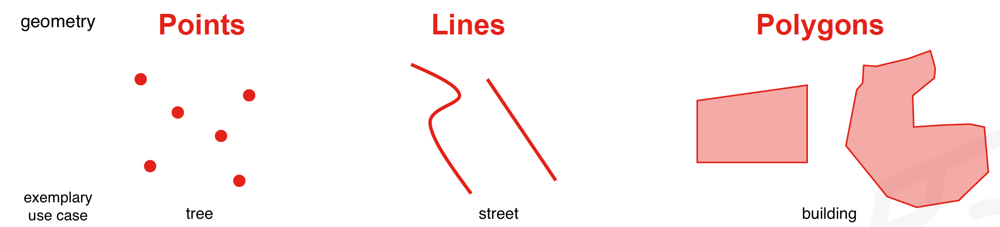

# Geodata concept

**Competences:**
* Projections
* Layer concept
* Vector and raster data (basic concepts)
* Vector file formats


## Projections 
### Theory

The earth is a sphere and cannot be represented on a flat map without being distorted. To able able to display the earth on a flat map for example as a rectangle it needs to be projected. For further explanation, watch this video.
[](https://www.youtube.com/watch?v=kIID5FDi2JQ "Why every world map is wrong")

For this translation, from a curved on a flat surface, thousands of different methods exist. These are called **Coordinate Reference Systems (CRS)**.


Every projection comes with a trade-off in shape, direction, distance and area. That's why it is important to choose different types of CRS for different use cases.
For example, Mercator projections don´t represent the area correctly. Google Maps still uses the Mercator to be able to represent streets correctly, since it works well on a small scale. On a big scale, the shape of the countries stay the same but the area is mispresented. You can check the true size in comparison to different placements on the map on this [website](https://www.thetruesize.com). A popular example is Greenland in comparison with Africa, which seem on the map to be about the same size, but in reality Africa is a lot bigger.


```{Attention}
It's important to work with the right projections, if not we will produce wrong results!
```

This table shows an overview on which projections to use for which needed characteristic:

| Mercator (cylindrical) | Lambert cylindrical | Albers conic |
| :--------------------: | :-----------------: | :----------: |
| [x] shape              | [ ] shape           | [x] shape    |
| [x] rotation           | [x] rotation        | [ ] rotation |
| [ ] area               | [x] area            | [x] area     |

For smaller areas local projections should be used, since they give a more accurate display at the expense of more distortion at the global level. 


### Application

You can find all the projections and their CRS code at this [website](http://epsg.io). 


To change the projection of a **vector file**, click on *Vector*, *Data Management Tools*, *Reproject Layer*. Select your input layer and the target crs. Click on the three dots to *Save to File...* and click *Run*. For a detailed instruction click on this video.
<video width="100%" controls src="https://github.com/GIScience/gis-training-resource-center/raw/main/fig/qgis_reproject_vector.mp4"></video>

To change the projection of a **raster file**, clickclick on *Raster*, *Projections*, *Warp (Reproject)*. Choose your input layer and target crs. Click on the three dots to *Save to File...* and click *Run*. For a detailed instruction click on this video. 
<video width="100%" controls src="https://github.com/GIScience/gis-training-resource-center/raw/main/fig/qgis_reproject_raster.mp4"></video>

It is crucial that you are aware of the difference in data projection and project projection. They should always be the same, or else you will get wrong results! You can change the data projection by following the steps explained above. The project projection is on the bottom left corner, as seen [here](../../fig/en_QGIS_User_Interface.png). 

The interface then will be the same and by searching for the right EPSG you can change the projection. 

## Excercises

Now it's your turn! 

You can apply your knowledge on this excercise by getting used to the interface and changing the projections. 

[Exercise 1](https://gitlab.gistools.geog.uni-heidelberg.de/giscience/disaster-tools/gis-in-anticipatory-humanitarian-action/-/tree/main/Exercise_1) 
--> in future link to HeiCloud


==explain and show often made mistakes?==

This [Website](https://ihatecoordinatesystems.com/) provides explanations und solutions for often made mistakes.

In the [Wiki](../../content/Wiki/en_qgis_projections_wiki.md) are further tips.


## Layer concept

Geodata represents a real-world object on a map as a feature. A feature consists of two types of information: the location and attributes, f. e. name or ID. Those informations are collected in layers. A layer can only consist of geographic objects of the same type. [^1]


[^1]: https://cartong.pages.gitlab.cartong.org/learning-corner/en/3_key_gis_concepts/3_3_key_concepts/3_3_1_layers

By superpositioning different layers, you build your map and can obtain information of different sources. With those you then can perform analyses or adapt the representation by using symbols and colors.


## Vector and raster data

There are two file types of geographic data: **vector and raster**.  


  

> **Vector**  
Vector data contains a shape or a geometry. By using geometry objects (points, lines and polygons) the real world is represented. Each object stores the location (as adress or coordinates) and further attributes, f. e. name or ID. Which geometry is used, depends on the feature it represents. 

  >>Examples: buildings, streets 


> **Raster**  
Raster data are images which contain a matrix of pixels. Each pixel stores a value. 
Since a raster is based on an image, the resolution is crucial. It defines the accuracy of the data and size of the pixels. 

>> Examples (stored as a value): elevation, temperature, land cover


In this picture you can see the same location, on the left as vector data, visualising streets and urban area, and on the right hand as raster data (satellite image), showing the land cover.

vector                     |  raster
:-------------------------:|:-------------------------:
  |    


## Vector file formats

Vector data can have the following data formats:

| Filename extension| Name | Description |
| ----- | --- | --- |
|.shp | Shapefile |Old but still widely used geodataformat. Can only contain one dataset. The file has to consist of at least three different files (.shp, .shx, .dbf)|
|.gpkg| GeoPackage  | Very versatile geodata format and the new standard for geodata. Can contain multiple datafiles (vector, raster and not spatial data like tables)|
|.kml |Keyhole Markup Language | Geodata format for use with [Google Earth]( https://earth.google.com/web/)|
| .gpx| GPS Exchange Format|Geodata format for the exchange of coordinates. For example for waypoints of tracks. |
| .geojson|GeoJSON|Similar to shapefiles, but stores all information in a single file. 
  


