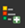

::::{grid} auto
:::{grid-item-card}
:class-card: sd-text-center sd-rounded-circle
:link: https://giscience.github.io/gis-training-resource-center/content/intro.html 
{octicon}`home-fill;1.5em;sd-text-danger`
:::
::::

# Operational Maps Tutorials

Maps play a central role in humanitarian work, helping teams understand needs, capacities, and conditions on the ground. This page brings together practical, scenario-focused tutorials that show how to create clear and effective operational maps in QGIS. Each example highlights techniques you can adapt to your own data and context, supporting better coordination and decision-making in the field.

## Table of content
- [Health Facility Capacity Map: Visualising with multi-variable point symbols](https://giscience.github.io/gis-training-resource-center/content/Module_4/en_module_4_operation_maps.html#health-facility-capacity-map-visualising-with-multi-variable-point-symbols)
- [Creating a 3W Map (Who, What, Where)](https://giscience.github.io/gis-training-resource-center/content/Module_4/en_module_4_operation_maps.html#creating-a-3w-map-who-what-where)

# Health Facility Capacity Map: Visualising with multi-variable point symbols

A health facility capacity map is a practical and valuable tool for health preparedness and response. These maps help responders quickly identify the locations of health services, assess their capacity, and determine whether they are operational. In many situations, this information is crucial for making decisions about resource allocation, referral pathways, surge support, and identifying service gaps. The maps are typically based on datasets provided by governments or partner organizations. If official datasets are not available, OpenStreetMap can serve as a good starting point.

Health capacity maps usually combine multiple attributes into a single symbol by utilizing size, color, and different shapes. 


```{figure} /fig/HS_capacity_map_examepls.drawio.svg
---
name: Building a Multi-Variable Hospital Capacity Map Step by Step
width: 800
---
Building a Multi-Variable Hospital Capacity Map Step by Step
```

In this tutorial, you will learn how to create a multi-variable point map of hospitals in Malawi using QGIS. You will work with a modified version of the Malawi Master Health Facility Registry (with fictitious figures and hospital bed counts added for training purposes) and apply a combination of proportional symbol size, manual classification, and data-defined color overrides to effectively communicate both capacity and operational status at a glance.

## About the Dataset

The data used in this exercise comes from the Malawi Master Health Facility Registry (MHFR), the official national database of all health facilities in Malawi. **[Malawi - Health Facility Registry](https://data.humdata.org/dataset/malawi-health-facility-registry)**
It exists to provide a single, up-to-date source of information for planning and monitoring health services.

> ⚠️ **Note:** For the purpose of this tutorial, the dataset has been **manipulated**.
---
Download the data folder [**here**](https://nexus.heigit.org/repository/gis-training-resource-center/module_4/exercise_6/Module_4_Exercise_Malawi_Health_Facilities_Registry.zip) and save it on your PC. Unzip the .zip file.
### Fields used in this tutorial

| **Field**                 | **Purpose in tutorial** |
|--------------------------|--------------------------|
| **TYPE**                 | To extract hospitals from the full facilities dataset |
| **STATUS**               | To map Functional vs Non-functional facilities using colour |
| **Number_Beds**          | To represent hospital capacity using graduated symbol sizes |
| **LATITUDE & LONGITUDE** | To create point geometries in QGIS |

These fields are enough to build a clear, multi-variable point map.

## Health Facilit Capacity Map Tutorial

### Data preparation
First, we need to load the Malawi - Health Facility Registry dataset into QGIS

::::{dropdown} Import the Malawi health facilities CSV into QGIS.

#### Import the Malawi health facilities CSV into QGIS

1. In the top menu, go to  
   **Layer → Add Layer → Add Delimited Text Layer…**

2. Next to the **File name** field, click the three dots    
    and browse to your **Malawi health facilities CSV** file and click `Open`.


3. After selecting the file, QGIS will show a preview of the table.  
   Take a moment to review the columns:
   - `OWNERSHIP`  
   - `TYPE`  
   - `STATUS`  
   - `ZONE`, `DISTRICT`  
   - `DATE OPENED`  
   - `LATITUDE`, `LONGITUDE`  
   - `Number_Beds`  
   These fields contain all information needed for the mapping exercise.

4. Under **Geometry Definition**:
   - Select **Point coordinates**.  
   - Set **X field** = `LONGITUDE`.  
   - Set **Y field** = `LATITUDE`.  
   - Ensure the **Geometry CRS** is set to **EPSG:4326 – WGS 84**.

5. Click **Add**.  
   The layer will now appear in your **Layers** panel and the points will display on the map canvas.

```{figure} /fig/en_point_visualisation_malawi_HS_csv_import.png
---
name: import_health_facilities_csv
width: 700px
---
```
::::


Next, we need to reduce the points visualised on the map to the facilities that actually have hospital beds. In this tutorial, these are `Central Hospital`, `District Hospital`, and `Hospital`.

::::{dropdown} Filter the dataset to see only hospitals (Video)

#### Filter the dataset to see only hospitals

1. **Open the attribute table**  
   - Right-click `Malawi_health_facilities_raw` → **Open Attribute Table**.  
   - Look briefly at the key fields:
     - **TYPE** – identifies facility type. Hospitals usually appear as `Central Hospital`, `District Hospital`, or `Hospital`.  
     - **STATUS** – should contain `Functional` or `Non-functional`.  
     - **Number_Beds** – mostly fill

2. Filter the dataset to include only hospitals
    - Right-click Malawi_health_facilities_raw → Filter…
    - Enter the expression:
   ```
   "TYPE" IN ('Central Hospital', 'District Hospital', 'Hospital')
   ```
    - Click Test to check how many rows match, then OK.
    - QGIS will now hide all non-hospital facilities.
    - Your filtered layer now shows only hospital facilities.

    <video width="100%" controls src="https://github.com/GIScience/gis-training-resource-center/raw/main/fig/en_malwai_exampel_hospital_filter.mp4"></video>

::::
### Visualising the number of beds with proportional circle methods

Now that your layer is filtered to show only hospitals, you can create a map that shows hospital capacity using proportional circles.  
The number of beds (`Number_Beds`) will control the **size** of each symbol.


::::{dropdown} Visualise hospital capacity using proportional (graduated-size) circles (video)

### Visualise hospital capacity using proportional circles (graduated-size)


1. **Open the Layer Styling panel**  
   - Select your hospital layer (the filtered `Malawi_health_facilities_raw`).  
   - Right-click the layer → **Properties…** → **Symbology**.

2. **Change the renderer to Graduated**
   - At the top of the Symbology window, change the style from **Single Symbol** to **Graduated**.

3. **Select the attribute for symbol size**
   - Under **Value**, choose **`Number_Beds`**.  
     This is the field that will control the size of each circle.

4. **Change the Method to “Size”**
   - Next to **Method**, change the default (usually “Color”) to **Size**.  
     This turns the graduated classification into a **proportional circle map**.

5. **Generate the classes**
   - Click **Classify**.  
     QGIS will create size classes based on the range of bed numbers in your dataset.

#### Adjust the classes manually (recommended)

The data range is **1–200 beds**, but only a few hospitals have more than **80 beds**.  
Most hospitals are small or medium-sized.

Automatic classification would cluster most facilities into one or two classes.  
To avoid this, we create **balanced, domain-informed classes**:

| Class | Bed Range | Meaning |
|-------|-----------|---------|
| 1 | **1–20** | Very small hospitals |
| 2 | **21–40** | Small hospitals |
| 3 | **41–60** | Medium hospitals |
| 4 | **61–80** | Large hospitals |
| 5 | **81–200** | Very large / referral hospitals |

Adjust the Lower/Upper values for each class accordingly.


```{note}
Why these ranges?  
- Most hospitals fall in the **1–60** bed range → we break this into three meaningful groups.  
- Few hospitals exceed **80 beds**, so the top class isolates the rare high-capacity referral facilities.  
- This ensures **variation in symbol size** is visible and not compressed into one tiny class. 
(See [Graduated Classification](https://giscience.github.io/gis-training-resource-center/content/Module_3/en_qgis_data_classification.html#graduated-classification))
```

<video width="100%" controls src="https://github.com/GIScience/gis-training-resource-center/raw/main/fig/en_proportionla_circel_map_malawi_exampel.mp4"></video>

::::

The resulting map displays hospitals as circles of different sizes, each size representing one of the bed-capacity classes you defined earlier.  This gives a quick visual impression of where smaller and larger hospitals are located. However, at this stage the map only shows capacity: it does not yet communicate whether a hospital is functional or non-functional.


::::{grid} 2

:::{grid-item} **Proportional circle map showing the number of beds**
```{figure} /fig/en_Malwai_Exampel_proportional_circel_result.png
---
name: Proportional circles: beds 
width: 400
---
Proportional circles: beds 
```
:::

:::{grid-item} **Classes of proportional circle map**

Smaller circles correspond to hospitals with few beds, while larger circles indicate facilities with higher capacity.
```{figure} /fig/en_Malwai_Exampel_proportional_circel_result_legend.png
---
name: Proportional circles: beds classes
width: 100
---
Proportional circles: beds classes
```
:::
::::
### Adding visualisation of operational status with colour

To visualise the operational status of each hospital (operational or non-operational) alongside its bed capacity, we can use QGIS’s data-defined override functionality. A **data-defined override** allows you to control a symbol property—such as colour, size, rotation, or opacity—using an expression or an attribute value from the layer. This means QGIS adjusts the symbol automatically for each feature, based on the data rather than manual styling. Using this technique, we can assign a colour to each hospital according to its status while keeping the proportional circle sizes for bed capacity.

First, we need to open the **data-defined override Expression Builder**.

::::{dropdown} Open data-defined override to adjust colour based on operational status (Video)

### Open data-defined override to adjust colour based on operational status

1.  Select your hospital layer (the filtered `Malawi_health_facilities_raw`).  
2. Right-click the layer → **Properties…** → **Symbology**.
3. Nex to `Symbol` Tab click on the dropdown menue, then click at the top click on `Configure Symbol`.
4. In the new window click on `Simpel Marker` and then next to `fill colour`on the `data-defined override` symbol
<video width="100%" controls src="https://github.com/GIScience/gis-training-resource-center/raw/main/fig/en_open_data_defined_override_edit.mp4"></video>
::::

To make this work, we now need to tell QGIS which colour to use for each hospital. Data-defined overrides use the QGIS expression language, which lets you write short rules that are applied automatically to every feature in the layer. In this step, we will write a small expression that checks the value in the STATUS field and assigns the correct colour based on whether the hospital is functional or not.

::::{dropdown} Use an Expression to Colour Hospitals by Status (Video)
### Use an Expression to Colour Hospitals by Status

1. This expression tells QGIS to automatically choose a colour for each hospital based on its `STATUS` attribute.  
Functional hospitals become green, non-functional ones become red, and any missing values receive a neutral grey.
The `CASE` statement works like an “if–else” rule: QGIS checks the value in the `STATUS` field and assigns the corresponding RGB colour ([RGB Color Picker](https://share.google/mYczZipa9EqVWFvyD)), ensuring every point is styled consistently without manual editing.
You can copy the complete code here:
```
CASE
  WHEN "STATUS" = 'Functional' THEN color_rgb(0, 130, 0)     -- green
  WHEN "STATUS" = 'Non-functional' THEN color_rgb(190, 0, 0) -- red
  ELSE color_rgb(150, 150, 150)                               -- fallback for missing/unknown
END
```
Or write the code yourself using the help of the functionality of the expression builder:
<video width="100%" controls src="https://github.com/GIScience/gis-training-resource-center/raw/main/fig/en_data_defined_overried_calculator_Malwai_Exampel_code - Made with Clipchamp.mp4"></video>

```{figure} /fig/en_data_defined_overried_calculator_Malwai_Exampel.png
---
name: Expression in data-defined override Expression Builder
width: 700px
---
Expression in data-defined override Expression Builder
```
::::


::::{grid} 2

:::{grid-item} **Proportional circle map showing the number of beds AND operational status**
```{figure} /fig/en_Malwai_Exampel_proportional_data_difined_override_circel_result.png
---
name: Proportional circles: beds + operational status
width: 400
---
Proportional circles: beds + operational status
```
:::

:::{grid-item} **Classes of proportional circle map**
This new visualisation shows the size of the circle, the number of beds, the colour (Green: Operational; Red: Non-Operation), and the operational status of the hospitals.

```{figure} /fig/en_Malwai_Exampel_proportional_circel_data_defined_override_result_legend.png
---
name: Legend proportional circles: beds + operational status
width: 400
---
Legend proportional circles: beds + operational status
```
:::
::::

### Making the Legend Match Your Map

> ⚠️ **Note:** When you use a data-defined override to colour your symbols, QGIS does not automatically update the legend. 
---

To make sure your map readers understand the meaning of the colours, you need to customise the legend manually. Here are two practical ways to do this.

::::{dropdown} Option 1: Legend with helper layer

A straightforward workaround is to duplicate your hospital layer and use these copies solely as legend helpers. Rename the duplicate for easy identification and change its color in the visualization. Make sure to hide this layer in the map view. 

In the `Print layout`, you can add this layer to the legend. This way, the legend will display the correct colors, while your original layer, which contains the data-defined overrides, will still be responsible for the actual map styling.

<video width="100%" controls src="https://github.com/GIScience/gis-training-resource-center/raw/main/fig/en_data_defined_overried_calculator_Malwai_Exampel_Legend_workaround_helper_layer.mp4"></video>
::::

::::{dropdown} Option 2: Edit Legend Colours Directly in the Print Layout

Another option works only in the `Print Layout`. In the Legend, just add your hospital layer twice. The secound one, you can adjust the colour of each symbol directly in the Legend. Set each item to green. Using the option `Start a new column before this term`, you can place the two layers next to each other.

<video width="100%" controls src="https://github.com/GIScience/gis-training-resource-center/raw/main/fig/en_data_defined_overried_calculator_Malwai_Exampel_Legend_workaround_print_layout_costum_symbol.mp4"></video>
::::


```{figure} /fig/en_Malwai_Exampel_proportional_circel_data_defined_override_result_map.png
---
name: Exampel Map Proportional circles: Hospital Beds + Operational Status 
width: 800
---
Exampel Map Proportional circles: Hospital Beds + Operational Status 
```

### Adding a Third Variable Using Stroke Style (Facility Type)

Your hospital capacity map now contains a rich amount of information, and it is already useful in its current form. However, QGIS allows us to add an additional layer of meaning without creating new layers or changing the existing size and colour logic. One way to do this is by using the stroke—the outline of each symbol—which can be styled or patterned dynamically. In the next section, you will learn how to use the stroke style to represent a third attribute, making your visualisation even more informative while keeping it easy to read.

::::{dropdown} Adding a Third Variable Using Stroke Style (Video)

1.  Select your hospital layer (the filtered `Malawi_health_facilities_raw`).  
2. Right-click the layer → **Properties…** → **Symbology**.
3. Nex to `Symbol` Tab click on the dropdown menue, then click at the top click on `Configure Symbol`.
4. In the new window click on `Simpel Marker` and then on the 
<video width="100%" controls src="https://github.com/GIScience/gis-training-resource-center/raw/main/fig/en_open_data_defined_override_strock_style_edit.mp4"></video>

4. You will see:
- Fill colour
- `Outline/stroke colour`
- `Outline width`
- `Stroke style` ← we will use this
5. Add a Data-Defined Override for Stroke Style
- Next to `Stroke style`, click the small `data-defined override` symbol
- Choose `Edit` → This opens the QGIS Expression Editor.
6. Write an Expression to Assign Stroke Styles for `TYPE`

Here is an example that distinguishes three hospital categories using clear and readable stroke patterns:

```
CASE
  WHEN "TYPE" = 'Central Hospital' THEN 'solid'
  WHEN "TYPE" = 'District Hospital' THEN 'dash'
  WHEN "TYPE" = 'Hospital' THEN 'dot'
  ELSE 'solid'
END
```
QGIS applies the rule automatically to each feature.

**How this works:**

- `Central Hospital` → solid outline
- `District Hospital` → dashed outline
- `Hospital` → dotted outline
- `All others` → solid (fallback)

<video width="100%" controls src="https://github.com/GIScience/gis-training-resource-center/raw/main/fig/en_open_data_defined_override_strock_style_expression_builder.mp4"></video>

::::

By adding stroke styles to your symbols, the map now carries a third layer of information while keeping the overall design compact and readable. This works best when you limit stroke styles to just a few meaningful categories; using too many patterns will quickly make the map visually noisy. Make sure your legend clearly explains what each pattern represents, and avoid combining stroke style with additional outline colours unless it is absolutely necessary—too many variations can overwhelm the reader. With these principles in mind, your updated map should now communicate three attributes at once in a clear and balanced way.

::::{grid} 2

:::{grid-item} 
```{figure} /fig/en_Malwai_Exampel_proportional_circel_data_defined_override_strock_style_result_map.png
---
name: Proportional circles: beds + operational status + Owner status
width: 400
---
Proportional circles: beds + operational status + Owner status
```
:::

:::{grid-item} 


```{figure} /fig/en_Malwai_Exampel_proportional_circel_data_defined_override_result_strock_style_legend.png
---
name: Legend 
Proportional circles: beds + operational status + Owner status
width: 200
---
Legend 
Proportional circles: beds + operational status + Owner status
```
:::
::::
With three visual variables now shown in a single symbol, it’s important that the legend reflects all of them clearly. QGIS does not automatically update legend entries when data-defined overrides or stroke styles are used, so a few extra steps are needed to ensure the legend matches what appears on your map. In the next section, you will learn simple ways to adjust the legend so that all size classes, colours, and stroke styles are represented accurately.


::::{dropdown} Legend with helper layer
A straightforward workaround is to duplicate your hospital layer and use the copy solely as legend helpers. Rename the duplicated layer so it’s easy to recognise in the legend. Use 'categorised' classification. Adjust the stroke style (solid, dashed, dotted) to match the categories you used in your map. Make sure to hide the helper layer in the map view so it doesn’t appear on the actual map.

In the Print layout, add the helper layer to the legend. This ensures the legend shows the correct stroke patterns, while your original layer—with its data-defined overrides—continues to control the real map symbology.
<video width="100%" controls src="https://github.com/GIScience/gis-training-resource-center/raw/main/fig/en_data_Malwai_Exampel_Legend_workaround_helper_layer_strok_style.mp4"></video>
::::

```{figure} /fig/en_Malwai_Exampel_proportional_circel_data_defined_override_strock_style_result_map_complet.png
---
name: Exampel Map Proportional circles: Hospital Beds + Operational Status 
width: 800
---
Exampel Map Proportional circles: Hospital Beds + Operational Status 
```

---

# Creating a 3W Map (Who, What, Where)

__Introduction:__

A 3W info map is one of the most commonly requested products during the first month of an operation. __3W__ refers to __who, what, and where__, meaning which organizations and National Societies are involved in the disaster response, what activities they are carrying out, and where those activities are taking place. The 3W is typically updated regularly as additional actors join the operation and expand their sectoral work in affected locations. You’ll commonly find 3Ws included in SitReps and operational documents, shared on the GO Platform, and discussed during Joint Task Force meetings. In this section we will discuss the essential elements of a 3W map and how to create one using QGIS.

:::{figure} ../../fig/4.8_3W_example_Turkey.png
---
name: 3W Map Turkey
width: 720 px
---
3W Map example: Turkish Red Crescent Response to Earthquake
:::

::::{dropdown} Example: 3W Brazil Floods Distribution Map
:::{figure} ../../fig/4.8_3W_Brazil_Floods.png
---
name: 3W Map Turkey
width: 720 px
---
3W Map example: Brazil Floods Distribution Map
:::
::::

__What is needed:__

- A recent version of QGIS
- Access to 3W data
- [IFRC icons](https://learn-sims.org/style-guidance/logos-and-icons/) for map making
- Logos of the organizations involved

__Getting the 3W data:__

A variety of factors can affect how much 3W information you have available. In the early weeks of a response, there may not yet be a structured process for gathering data from the different sectors and organizations involved. The IM Coordinator may recommend using a simple survey for sector leads and/or National Societies to capture an initial snapshot of who is doing what and where. As the operation becomes more organized, sector leads and National Societies can begin entering 3W data directly into a joined platform, which then can be used as the primary source for the 3W map.

If no formal 3W data collection system is in place, information might need to be extracted from SitReps and other reports produced by the operation team. Focus first on identifying the following:

- __What response activities are the National Society involved in, and where?__
- __What response activities are being done by IFRC operation, and where?__
- __Key situation overview figures__, such as number of __people affected by the disaster__, __number of deaths or injuries__, number of houses damaged, number of geographical units affected (all of these data points can be modified based on the context of the disaster). 
- Make sure to __note the data source__ you are using for key situation overview figures, and whenever possible to align the figures you are using to those used by the host National Society instead of using figures released by the media.
- How many people or households are being reached by sectoral activities, and where?

It is normal that the initial dataset is limited. The 3W map will evolve and expand as additional information comes in.

:::{admonition}
Helpful information on how to create such a 3W map can be found [here](https://learn-sims.org/information-design/creating-a-3w-who-what-where-infographic/).

For a variety of 3W map examples, browse the Maps/Infographics section on [Reliefweb](https://reliefweb.int/updates?view=maps&search=title%3A%223W%22).
:::

::::{dropdown} Example: Hurricane Melissa November 2025 | Jamaica
The two 3W example maps below demonstrate how such __products develop__ as new information becomes available. The first map, produced at the beginning of November by a single organization (MapAction), contains limited data and represents an __initial community assessment__. Three weeks later, the second map created jointly by MapAction and OCHA, includes significantly more information. In addition to expanded data, the __map’s styling has also evolved__. This progression is entirely normal; maps are expected to __improve__ and become __more detailed__ over time. What matters most is establishing an initial version that can be updated and refined as the response advances.

:::{figure} ../../fig/4.8_3w_jamaica_03_11_2025.png
---
name: 3W Map Jamaica Melissa Start
width: 720 px
---
Jamaica: Hurricane Melissa - Who, What, Where (3W) as of 03-Nov-2025: Community Assessments (Source: MapAction).
:::

:::{figure} ../../fig/4.8_3w_jamaica_24_11_2025.png
---
name: 3W Map Jamaica Melissa End
width: 720 px
---
Jamaica: Hurricane Melissa - Who, What, Where (3W) as of 24-Nov-2025 12:00L (Sources: MapAction, OCHA).
:::

::::

## 3W Map Creation

1. Add all the relevant spatial data. Used in probably every instance:
    - Administrative boundaries
    - Affected areas with the relevant disaster
    - Points of Interest (Airports, Ports, Cities)
    - Background map (OpenStreetMap is always a solid choice)
2. Import the 3W Activity data
    - Add the 3W dataset to QGIS (mostly CSV or Excel)
    - Ensure that it contains information about the organization, activity type, and location.

::::{dropdown} How to import .csv or .txt

__Delimited text import (.csv, .txt)__

When working with 3W data, the most common format encountered is a delimited text file, such as `.csv` files (Comma Separated Values). These files contain tabular data, which can be opened by programs such as Microsoft Excel. They can contain geographical or positional information as point coordinates in separated columns (for example, latitude and longitude, or x- and y-coordinates), or as "Well Known Text" (WKT), which represents complex geometries, such as polygons or lines. In some cases, the table may not include any geographic information at all. When this happens, the file is simply added as a non-spatial table, allowing access to its attribute information without displaying it on the map.

__Open Delimited Text Layer__

:::{Tip}
To load data from spreadsheets such as Comma Separated Value (`.csv`) or Excel (`.xlsx`), the datasets need to have columns containing geometry - this is most often in the form of latitude (Y field) and longitude (X field), but might also be in other formats, such as WKT. In this case, you can also have complex geometries in your delimited text file.  
:::

:::{figure} /fig/en_import_delimeted_text.png
---
width: 600px 
align: center
name: en_import_delimeted_text
---
Import delimited text in QGIS 3.36.
:::

1. `Layer` -> `Add Layer` -> `Open Delimited Text Layer`.
2. Click on `File name` click on the three points  and navigate to your CSV file and click `Open`.
3. `File Format`: Here you can specify which delimiter is used in the file you want to import. In a standard CSV file, commas `,` are used. If this is not the case, select `Custom delimiters`. Here you can choose the exact delimiter used in your file. 

:::{Tip}
To find out which delimiter is used you can open your .csv file in Notepad or Excel. There you can check which delimiter is used to separate the information.
:::

:::{figure} /fig/en_delimited_text_fileformat.png
---
width: 600px
align: center
name: en_delimited_text_fileformat
---
Adjusting the file format parameters while importing a delimited text layer into QGIS.
:::

4. If your CSV file contains geometry, continue with `Geometry definition`: In this section, you specify which columns of the file contain the spatial information to georeference the data on the map. If the file has a column containing __latitude__ and another with __longitude__ data, you can use them to georeferenced the data. Check `Point Coordinates` if the `.csv`-file contains point data. Select for `X field` “LONGITUDE” and for `Y field` “LATITUDE”.
5. Under `Geometry CRS` select the coordinate reference system (CRS). By default, QGIS will select the CRS of the project. If the file does not have spatial information choose the option `No geometry (attribute only table)`.
6. Click `Add`

:::{dropdown} Video: Opening delimited text files in QGIS

<video width="100%" controls src="https://github.com/GIScience/gis-training-resource-center/raw/main/fig/qgis_open_textfile.mp4"></video>

:::

::::

3. Style the administrative boundaries with a transparent fill and choose an appropriate `Stroke color` and `Stroke width` to ensure they are clearly visible without obscuring underlying map content.

::::{dropdown} Styling administrative boundaries

__Styling administrative boundaries (Polygons)__

When creating 3W maps, administrative boundaries are always a key component. Most overview maps display disaster-related information aggregated by these boundaries. To visualize multiple administrative levels at once, each layer needs to be styled so that lower layers remain visible and the hierarchy between levels is clear. Often, this begins with adding the country outline and then progressively adding each subsequent administrative level, ensuring that the symbology distinguishes them without cluttering the map.

__Only display the outlines of polygons__

Now, we want to change the symbology of a layer so that __only the outlines of the polygons are visible__. This is necessary to make layers below this one visible.

To change the symbology of a single layer:
1. Open the `Styling panel` and navigate to the symbology tab. By default, the symbology will be set to `Single Symbol`. This means that the same colors and contours will be applied to all the features in that layer.
2. Click on `Simple Fill`.
3. Click on the arrow to the right of `Fill Color`.
4. Check the `Transparent Fill` option.

:::{figure} ../../fig/en_30.30.2_vector_layer_styling_transparent.png
---
name: en_30.30.2_vector_layer_styling_transparent
width: 500 px
---
:::

:::{dropdown} Video: Making the fill color transparent

<video width="100%" controls src="https://github.com/GIScience/gis-training-resource-center/raw/main/fig/en_30.30.2_make_only_outlines_visible.mp4"></video>

:::

__Adjusting the Styles of Multiple Overlaying Layers__

__Ordering the layers__

1. Import all the administrative boundaries into your QGIS-project that you want to work with (e.g. Admin 0-2).
2. One option is to order the layers in the Layers panel so that the `Admin0`-layer sits on top, followed by `Admin1` and `Admin2`. At first, this might look weird because `Admin0` will cover everything.

:::{figure} ../../fig/en_30.30.2_changing_layer_style_1.png
---
name: en_30.30.2_changing_layer_style_1
height: 400px 
---
Order the layers and navigate to the styling panel of the topmost layer
:::

3. Change the symbology of the `Admin0` layer by opening the styling panel and navigating to the Symbology tab. 
4. Click on `Simple Fill` to open the style options.
5. Expand the `Fill Color` menu and check the `Transparent Fill` option. This will make only the boundaries visible, so __we will be able to see the layer under this one__.
6. Choose a `Stroke Color`, and adjust the `Stroke Width`.
7. Click OK.
8. __Repeat the same process__ for the `Admin1` layer, using the same color as for `Admin0` (it will be in "Recent colors). Adjust the stroke width so that it differs from `Admin0`, ensuring that the administrative levels remain visually distinct. 
9. Now we can see the boundaries of the country and its states, and behind that we can see the districts (`Admin2`).
10. Let's make the district layer's style consistent with the others.
11. Choose a `Fill Color`.
12. Use the same `Stroke Color` as for `Admin0` and `Admin1`, but make the width even thiner and the Stroke Style a __Dash Line__.
13. Click OK and look at your map: hopefully it's starting to look nicer!

:::{figure} ../../fig/en_30.30.2_changing_layer_style_3.png
---
width: 500 px
name: en_30.30.2_changing_layer_style_3
---
The styling of a vector data consists of the color and the outline.
:::

:::{dropdown} Video: Adjusting the style for multiple layers
<video width="100%" controls src="https://github.com/GIScience/gis-training-resource-center/raw/main/fig/en_30.30.2_change_style_for_multiple_layers
.mp4"></video>
:::

::::

4. Style the disaster-related information by selecting a color ramp that fits the context. One common approach is to create a choropleth map using __Graduated__ styling, which visually represents variations in impact or case numbers across administrative areas.

::::{dropdown} Styling disaster-related information

__Creating a Choropleth Map ("Gradudated Styling)__

If a layer contains numeric values that are continuous, they can be organized in intervals. These intervals can be displayed in graduated colors. In this example, colors are assigned to Admin1 polygons based on the total population of each State.

1. Open the `Symbology` options and choose `Graduated`.
2. __Select the value you want to use to assign colors__, in this case, it will be `total_pop`.

:::{figure} ../../fig/en_30.30.2_symbology_variable_ranges.png
---
name: en_30.30.2_symbology_variable_ranges
width: 550px
---
With variable ranges, select __Graduated__ symbology and choose the attribute with continuous values
:::

3. Click on `Classify` to __list all values divided in classes__.
4. Choose __how many classes__ you want the data to be divided into ‒ let's say 4. You can also assign different `Modes`. We usually work with `Equal Count` or `Equal Interval` depending on our data.
5. By default, the color ramp will be red. However, red is not the right color to use for population count, as it is generally used to communicate negative elements, such as food insecurity or cholera cases.
6. Click on __the arrow next to the color ramp__ to choose another combination of colors - let's say a color ramp from white to blue.
7. Click `Apply` to preview the look of your layer, then `OK`.

:::{figure} ../../fig/en_30.30.2_symbology_variable_ranges_2.png
---
name: en_30.30.2_symbology_variable_ranges_2
width: 500px
---
You can categorize the continuous values into classes and assign a color ramp .
:::

The following map shows the most populated states of Nigeria using a graduated color categorization. These types of maps are called __Choropleth maps__. 

:::{figure} ../../fig/en_map_design_example_variable_ranges.png
---
name: en_map_design_example_variable_ranges
width: 500px
---
A map showing the population of Nigerian states.
:::

:::{dropdown} Video: How to create a choropleth map
<video width="100%" controls src="https://github.com/GIScience/gis-training-resource-center/raw/main/fig/en_30.30.2_graduated_styling
.mp4"></video>
:::

::::

5. Add labels to the Admin boundaries (at the level of interest) for clearer identification. 

:::::{dropdown} Label administrative boundaries

__Single Labels__

Creates a single label style for every feature in the layer. You can select an attribute (value) which will be 
displayed. For example, the name of a district. You need to know which attribute displays the information you want to 
display. Look at the attribute table of the dataset to find it out.

:::{figure} /fig/labels_single_labels_example_nga_adm1.png
---
width: 600 px
name: labels_single_labels_example_nga_adm1
---
Single labels for each administrative region (adm1) in Nigeria. The reader is able to assign each label to the respective administrative entity.
:::

:::{figure} /fig/en_30.30.2_assigning_value_to_labels.png
---
width: 600 px
name: en_30.30.2_assigning_value_to_labels
---
Assigning the correct attribute value in the labeling options. QGIS needs to know which attribute (column) of the attribute table should be displayed as a label. In this case, we want the name of the administrative region (`ADM1_EN`) to be displayed. 
:::

__Adding Single Labels to a Layer__

1. In the styling panel, click on the `Labels`-tab underneath the Symbology tab.
2. Select `Single labels`.
3. `Value` is where you choose the attribute that will be displayed as a label. For example `ADM1_EN` will display the English names of Nigerian states for each feature in the data set.
4. Let's __change the font__: Open the font dropdown menu and select Arial. Make the text `Bold` in the Style dropdown menu. Change the color by clicking on `Color`, and change the `Size` to 8 pt.
5. Let's __add a white buffer__ around the label. In the `Labels` tab, you will find a list with different options to style the labels. Right now, we are in the `Text` menu. Select `Buffer` and check the `Draw text buffer` option. This will make the labels stand out more on dark or crowded maps.
7. Click `Apply` and `OK`.

:::{figure} ../../fig/en_30.30.2_setting_up_labels.png
---
width: 600px
name: en_30.30.2_setting_up_labels
---
Setting up labels in QGIS 30.30.2
:::

:::{dropdown} Video: How to add single labels
<video width="100%" controls src="https://github.com/GIScience/gis-training-resource-center/raw/main/fig/en_30.30.2_setting_up_labels.mp4"></video>
:::

::::{attention}

Single Labels are not always useful. For example, if the dataset is too big, or you only want to display certain features in the dataset. In the example below, there are too many settlements to display labels for each settlement. Instead, it might be useful to only display the regional and national capitals. For such a use case, Rule-based Labeling is ideal.

:::{figure} /fig/single_labels_bad_example.png
---
name: single_labels_bad_example
width: 400 px
---
Single Labels were selected to display the names of the settlements (red dots). A map with so much text information is unreadable and the information can hardly be understood. 
:::

::::

:::::

6. Set up a new __Print Layout__. 
    - Add a new map by clicking on the  `Add map`-button. 
    - Position the main map frame at the center of the page and size it generously so that place names, symbols, and activity markers are easy to read.
    - Add a header using the  `Add Label`-tool. It should contain the following information:
        - The title (e.g. Sudanese Red Crescent Response)
        - The type of disaster or emergency
        - The geographic location of the disaster
        - The last updated date to indicate the currency of the data. Because operations evolve quickly, the date is especially important for users who need to understand how recent the information is.
    - Add __Organizational logos__ (e.g., International Medical Corps, Relief International, International Rescue Committee) using the  `Add image`-tool to ensure that each active organization can be easily identified on the map.
    - Icons which describe the specific activity. These can also be added using the  `Add image`-tool. Make use of the [IFRC icons](https://learn-sims.org/style-guidance/logos-and-icons/) for map making.
    - A small overview map to help situate the disaster-affected area within a broader geographic context.

:::{note}
Multiple text boxes can be used to display the header in different font sizes, helping to clearly separate different layers of information. If all content should remain within a single label box, `Render as HTML` can be applied to format and style the text as needed.
:::

::::{dropdown} Starting the Print Layout

__Open the Print Layout__

1. Go to __Project > New Print Layout > enter a name for the new print layout > click OK__
2. A new window with a blank print layout will appear.

:::{figure} ../../fig/en_30.30.2_create_print_layout.png
---
width: 700px
name: Create Print Layout
---
Create a new Print Layout
:::

__Map Composition__

A good map guides the reader in understanding the information available on the map, makes the information easily accessible, and is not overloaded with information.

In general, there are a few things to keep in mind when creating a map:

- The main map should cover the largest portion of the page and be centred.
- A complete map must have:
    - A meaningful title
    - All the sources used
    - A legend  explaining symbols and color schemes.
    - A scale bar
    - A north arrow
    - and necessary other information to contextualize the information presented on the map.
- This additional information, such as the title should be scaled accordingly.
    - Titles should be large so the reader can identify it as the main topic of the map.
    - Additional information should be smaller and moved out of the main focus of the page (e.g. at the bottom, to the sides, or in the corners).
- A well-structured page layout helps the reader discern the different information on the map and makes it easier to know where to look for certain information. Frames and boxes can structure the page layout. For example, a legend can be put on the bottom or to the right of the map.

::::

7. Areas of operation for each organization
    - Place the logos of each organization within the districts where they are active.
    - Add activity icons to indicate the specific types of work each organization is carrying out in those districts.
    - To illustrate the link between organization logos, activity icons, and their corresponding areas, arrows can be added to the map. Using this feature helps clearly emphasize the relationships and improves overall readability.

:::{dropdown} How to add arrow item
The arrows  can be added from the left-side panel in the Print Layout. Click and drag on the layout to draw it, then use the Item Properties panel to adjust the arrow’s style, thickness, color, and direction. Arrows can be moved or resized like any other layout item, allowing you to visually connect map features, icons, or labels.
:::

:::{Caution}
Add labels and logos where needed, but avoid cluttering the map with unnecessary text or symbols. Organize map elements by topic, importance, and visual hierarchy to keep the layout clean and structured. Items can be reordered in the Item panel on the upper right side. Once added as images, logos and activity icons can be positioned directly on the map using drag-and-drop. Place them in meaningful locations so they do not overlap or obscure other important information.
:::

:::{note}
All the necessary information about the Print Layout Composer can be found [here](https://giscience.github.io/gis-training-resource-center/content/Module_4/en_qgis_understanding_print_layout.html)
:::

:::{figure} ../../fig/4.8_3W_own_example.png
---
width: 700px
name: 3W example cholera
---
A simple example of a 3W map showing the distribution of Oral Rehydration Points and the active organizations operating in south-eastern Sudan.
:::


# Creating a epidemological overview map


## Introduction:


Epidemiological overview maps are among the most frequently requested analytical products during the early stages of an outbreak response. These maps synthesize when, where, and how intensely disease transmission and mortality are occurring across affected areas. By visualizing weekly case incidence and identifying whether transmission is increasing, stable, or decreasing in each location, responders gain rapid insight into the evolving dynamics of the epidemic. A related view, incorporating weekly deaths and mortality rates, supports assessment of disease severity and potential gaps in access to care. These outputs are routinely included in Situation Reports, operational updates, and epidemiological briefings, and serve as key reference tools during coordination meetings. In this section, we will explore the essential components of epidemiological overview maps and demonstrate how to produce them in QGIS using simulated weekly case and mortality data.


In this tutorial, you will learn how to create a multivariable map to generate an epidemiological overview of a cholera outbreak in Somalia. Using a fictional dataset with weekly infection counts and death rates, you will visualize the situation for a selected week by applying several QGIS visualization tools.


## About the Dataset


The dataset contains epidemiological parameters for Somalia at the regional level, covering a 12-week period during a cholera outbreak. The parameters include weekly new cases, weekly cumulative cases, and the weekly death rate.


### Fields used in this tutorial


| **Field**                 | **Contents** |
|--------------------------|--------------------------|
| **adm1_name**           | Names of administrative districts|
| **weekX_inf_new**         | Count of new weekly infections |
| **weekX_inf_cul**          | Cumulative count of infections |
| **weekX_dc**          | Count of weekly deaths |


### Data preparation
First, we need to load the dataset into QGIS:


::::{dropdown} Import the data


#### Import the dataset into QGIS


1. In the top menu, go to 
  **Layer → Add Layer → Add Vector Layer**


2. Next to the **File name** field, click the three dots   
   and browse to your **Som_outbreak_epi** file and click `Open`.


3. Click **Add**. 
  The layer will now appear in your **Layers** panel and the polygons will display on the map canvas.


::::


### Creating a map visualising weekly infections and infection trends

As we want to visualize multiple variables later we choose to use a secondary point layer to map weekly infections. We will use week 8 of the outbreak for our example map. The number of new weekly infections (`week8_new_inf`) will control the **size** of each circle.


::::{dropdown}


#### Create circles proportional to weekly infections


1. **Create centroids for every region**
   - Open the **Processing Toolbox Panel** and search for the `Centroids` tool and open it
   - As `Input Layer` select `Som_outbreak_epi`.
   - Save the Centroids as `centroids_infections` to your drive by clicking "Run".


:::{figure} /fig/mod_4_centroid_tool.png
---
width: 700px
name: Centroid tool
---
Configuration of the centroid tool to generate centroids of the administrative district polygons
:::


These centroids take all fields and their stored information from the polygons they are created from, which is crucial if they are utilized for visualization of the stored variables.


2. **Visualize weekly infections with point size** 
  - Open the `Layer Styling Panel` select your centroid layer `Centroids_infections` and make sure the **Symbology** menue is selected.
  - At the top of the Symbology window, change the style from **Single Symbol** to **Graduated**
  - As Value, choose `week8_inf_new`. This is the field that will control the size of each circle.
  - Next to **Method**, change the default option **"Color"** to **Size**. This turns the graduated classification into a proportional circle map. Click "classify" and choose 5 classes for displaying you values.
  - As classification mode choose **"Equal Interval"** next to "Mode".


:::{figure} /fig/mod_4_point_styling.png
---
width: 700px
name: Point styling
---
Configuration of the Layer Styling Panel to achieve proportional point sizes
:::


:::{Tip}
With the visualizatioj variable **"Size from ... to ..."** you can alter the size interval the points will cover to display the values. Try differnet options and choose which combination communicates the values optimally for you purpose. A good default for this visualization is 5 to 15 millimeters.
:::


::::


To further enhance the information content of the map you can add labels to your circles that show the exact number of new infections for week 8.


::::{dropdown}
### Add labels to weekly infections points**


- Open the `Layer Styling Panel`, select your centroid layer `Centroids_infections` and select **Labels** in the side bar on the left hand side
- In the labels panel select **"Single labels"** in the drop down menue.
- As **"Value"** select the field containing the infection count for week 8 `week8_inf_new`.


:::{figure} /fig/mod_4_point_stylinginfection_labels.png
width: 700px
name: label generation
---
Configuration of the Layer Styling Panel to generate point labels
:::


- Select the third panel of the label options and check the box **"Draw text buffer"** to generate a small buffer around you labels to enhance visibility.
- To optimize the location of the point labels navigate to the **"Placement"** panel and for "Mode" select **"Offset from Point"**. With the "Quadrant" option you can determine the placement of the labels relative to the the centroid to you liking


:::{figure} /fig/mod_4_label_placement.png
width: 700px
name: label placement
---
Configuration of the Placement Panel
:::


::::


Your centroid layer now should look something like this (colour may vary):


:::{figure} /fig/mod_4_centroids_example.png
width: 700px
name: label placement
---
Configuration of the Placement Panel
:::


:::{Note}
Just by changing the selected field under "Value" in the Symbology panel, you can quickly use your configured visualization style for a different variable. E.g. you can select the field "week8_inf_cul" and check if the cumulative cases of infections per region show a similar pattern to the current state of new infections.
:::


#### Display the current infection trend with polygon colours


Now that we have visualized our first epidemiological parameter ("weekly new cases") using proportional circle sizes, we can use our polygon layer `Som_outbreak_epi` to display additional relevant information. Alongside the weekly infections, we want to show the **infection trend** from week 7 to week 8 for each regi to analyze, whether weekly infections are rising, falling, or stagnating. To achieve this, we first need to generate a new field using the **Field Calculator**:


::::{dropdown} Generate a infection trend field with the field calculator


### Generate a infection trend field with the field calculator


1. **Open the field calculator**
   - Open the attribute table of your polygon layer `Som_outbreak_epi` by right clicking on it and select "Open Attribute Table" in the pop up window.
   - In the attribute table open the `Field Calculator` by clicking on the ![]../../fig/mod_4_fieldcalc_symbol symbol at the top of the window.


2. **Create a new field diplaying infection trend**
   - In the Field Calculator interface keep "Create a new field" selected and choose "infection_trend" as **"Output field name"**. As **Output field type** choose **"Text (string)"**
   - In the "Expression panel" enter the following code chunk:


   ```python
      CASE
          WHEN "week8_inf_new" > "week7_inf_new" THEN 'increase'
          WHEN "week8_inf_new" < "week7_inf_new" THEN 'decrease'
          ELSE 'no change'
      END
   ```
   For every polygon this code fills the newly generated field with "increase"/"decrease" if the week 8 value is higher/lower that the one of the previous week and with "no change" if both values are equal.
   - Click on **"Ok"** to generated the new field.


:::{figure} /fig/mod_4_trend_calculation.png
---
width: 700px
name: Trend calculation
---
Configuration of the Field Calculator interface to generate the infection trend field
:::


::::


With your newly generated infection trend field you are now able to display the trend direction for every region with polygon colour:


::::{dropdown} Generate a infection trend field with the field calculator


### Vizualize the current infection trend


- Open the `Layer Styling Panel` and select your polygon layer layer `Som_outbreak_epi` and select **Symbology**.
  - At the top of the Symbology window, change the style from **Single Symbol** to **Categorized**
  - As Value, choose `infection trend` to display the calculated trend direction.
  - Click "Classify" to execute the classification. Choose coulours of your liking for the values "decrease" and "increase" and "no change" (e.g. green,red and grey) by double clicking on the coloured squares in the panel displaying the classes.
  - As classification mode choose **"Equal Interval"** next to "Mode".
  - For nicer visuals you can optionally also slightly reduce the **opacity** of the layer by adjusting it in the "Symbol" dropdown menue in the "Symbology" panel


::::


Now display you polygon layer `Som_outbreak_epi` together with you point layer `Centroids_infections` (centroids on top) to display all generated information in one map view. The result should look something like this (colour may vary):


:::{figure} /fig/mod_4_infectionmap_example.png
width: 700px
name: label placement
---
:::


If you want to generate a proper map layout of your epidemological overview map follow the descriptions outlined in [The Print Layout Composer](https://giscience.github.io/gis-training-resource-center/content/Wiki/en_qgis_map_making_wiki.html).


## Creating a map visualising weekly deaths and mortality rate

After we created our multi variable map with information about the development of ifections we can transfer the used steps to also create a map providing information about weekly deaths and the current mortality rate of the outbreak. The basic information needed is stored in the `weekX_dc` fields of your polygon layer `Som_outbreak_epi`, which provide weekly death counts for every week of the cholera outbreak.

#### Create circles proportional to weekly infections

- To create a point layer that visualizes weekly death count with proportional circles repeat the same steps that you learned previously when visualizing the new weekly infections. The only change you need to implement is changing the **"Value"** dropdwon menue in the Symbology panel from `week8_inf_new` to `week8_dc` to link the death count to the point sizes.


#### Display the current mortality rate with polygon colours
 