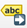

## Labels for Vector Data

Labels are text that display information or values of the data. In QGIS, you can either select __Single Labels__ or 
__Rule-based Labelling__. For each option, an attribute (`value`) that will be displayed on the map. For example, the 
name of a city or region.  Additionally, you can __change the font, font size, colour and some other styling options__ 
for the label text. When you create a map, you can add labels to help your reader understand the map quickly. However, 
be aware that too much text information can overload the map with too much information for the reader to process.

### Single Labels and Rule-based Labeling

QGIS offers two methods to display labels: __Single Labels__ and __Rule-based Labeling__

#### Single Labels

Creates a single label style for every feature in the layer. You can select a attribute (value) which will be 
displayed. For example, the name of a settlement. You need to know which attribute displays the information you want to 
display. Look at the attribute table of the dataset to find it out.

```{figure} /fig/labels_single_labels_example_nga_adm1.png
---
width: 600 px
name: single labels example
---
Single labels for each administrative region (adm1) in Nigeria. The reader is able to assign each label to the respective administrative entity.
```

```{figure} /fig/en_30.30.2_assigning_value_to_labels.png
---
width: 600 px
name: assigning value to labels
---
Assigning the correct attribute value in the labeling options. QGIS needs to know which attribute (column) of the attribute table should be displayed as a label. In this case, we want the name of the administrative region (`ADM1_EN`) to be displayed. 
```

#### Adding Single Labels to a Layer

1. In the styling panel, click on the `Labels`-tab underneath the Symbology tab.
2. Select  `Single labels`.
3. `Value` is where you choose the attribute that will be displayed as a label. For example `*ADM1_EN*` will display the English names of Nigerian states for each feature in the data set.
4. Let's __change the font__: Open the font dropdown menu and select Arial. Make the text `Bold` in the Style dropdown menu. Change the colour by clicking on `Colour`, and change the `Size` to 8 pt
5. Let's __add a white buffer__ around the label. In the `Labels` tab, you will find a list with different options to style the labels. Right now, we are in the `Text` menu. Select `Buffer` and check the `Draw text buffer` option. This will make the labels stand out more on dark or crowded maps.
7. Click `Apply` and `OK`.

```{figure} ../../fig/en_30.30.2_setting_up_labels.png
---
width: 600px
name: Setting up labels
---
Setting up labels in QGIS 30.30.2
```

<video width="100%" controls src="https://github.com/GIScience/gis-training-resource-center/raw/main/fig/en_30.30.2_setting_up_labels
.mp4"></video>

:::{attention}
Single Labels are not always useful. For example, if the dataset is too big, or you only want to display certain features in the dataset. In the example below, there are too many settlements to display labels for each settlements. Instead, it might be useful to only display the regional and national capitals. For such a use case, Rule-based Labeling is ideal.

```{figure} /fig/single_labels_bad_example.png
---
name: single labels bad example
width: 400 px
---
Single Labels was selected to display the names of the settlements (red dots). A map with so much text information is unreadable and the information can hardly be understood. 
```

:::

#### Rule-based Labelling

Create rules using expressions to select accurately which features are to be labeled. Each rule can have a different 
text formatting. Use this if you want to have more control over the information that will be displayed as labels. For 
example, you can filter your data to only display the names of regional capitals.

```{figure} /fig/rule-based_labeling_example_settlements_nga.png
---
name: rule-based labeling example settlements nga
width: 500 px
---
Rule-based labeling allows you to filter datasets. This way, you can display the labels only for selected features without altering the dataset.
```

The rules, or filters, are based on an expression. You can use the  `Expression string builder` to the right of the __Filter__ option in the label panel.

#### Adding Rule-based Labels to a Layer

1. In the styling panel, click on the `Labels` tab underneath the Symbology tab.
2. Select  `Rule-based Labeling`.
3. Add a Rule by clicking on the `+`-button in the left corner of the styling panel. A new window will open in the styling panel. In this window, you will enter the rule (`Filter`) and customize the label font, size, and placement. Additionally, you can enter a description.
4. Enter a Filter (red box in the figure below). The easiest way is to use the `Expression string builder` to the right of the Filter option. Click on the -Symbol. A new panel will open.
5. In the Expression String builder enter a rule. In the example in the video below, we want to only display settlements that are either national or regional capitals. This corresponds to the String `("CLASS" = 1 ) OR ("CLASS" = 2)`. We know this because we know our data and have looked at the attribute table beforehand.
6. Click `OK`
7. Set the font and font size.
8. Click `Apply`.

<video width="100%" controls src="https://github.com/GIScience/gis-training-resource-center/raw/main/fig/en_30.30.2_adding_rule-based_labels.mp4"></video>

```{note}
To add rules to your labels, you need to be familiar with your data! Look at the metadata (in the properties or at the source) and take a look at the attribute table. Think about what the different columns mean and identify the attributes. This might not always be easy, as they might have abbreviated names, but as you work more with data, this will become easier.
```

Below are some further considerations to keep in mind when using labels:

- Only display information that serves the purpose of the map or is helpful to the reader. Useful information can be the name of a settlement or a place, so the reader can assign a certain symbol on the map to this particular place.

- If you want to display different types of information as labels, the font needs to be different so the reader can differentiate between the different types of information that is displayed. A good practice is to display the labels in a similar colour to the objects it is referring to. For example, dark blue text for the labels of light blue bodies of water, or brown text for the labels of light-brown houses.

```{figure} ../../fig/good_labels_example.png
---
width: 400 px
name: Axis Maps good labels example
---
A good example of label placement and font. Pay attention to the text colours and orientation. Every label can easily be attributed to the correct cartographic feature. (Source: [Axis Maps](https://www.axismaps.com/guide/labeling))
```

```{Attention}

- In most cases, displaying numerical values as labels is confusing to the reader and makes the map to complex. In most cases, for numerical data, you can choose a different visualization such as colours or symbol size.

:::::{grid} 2
::::{card}

:::{figure} ../../fig/labels_numerical_values_bad_example.png
---
name: numerical labels bad example
---
Numerical Labels
:::

::::

::::{card}

:::{figure} /fig/labels_graduated_symbology_example.png
---
name: graduated symbology instead numerical values
---
[Graduated Symbology](https://giscience.github.io/gis-training-resource-center/content/Module_3/en_qgis_data_classification.html#graduated-classification)
:::

::::

:::::

```

- QGIS places the labels automatically. Sometimes, if you are using a lot of black outlines or dark colours, black text is hard to read on the map. In that case, you can add white buffer around the text to make it visible.

```{figure} ../../fig/label_text_buffer_example.png
---
width: 500 px
name: label buffer example
---
A label without a text buffer (left) and a label with a white text buffer (right)
```

```{note}
QGIS renders labels automatically.
Sometimes labels can obstruct other symbols. In that case, you can either adjust the placement of the labels in the __Label tab__, or use the  `Move a Label, Diagram, or Callout`-tool in __Label toolbar__

By default, QGIS renders the labels so that they don't overlap with other labels. This means that not all the labels will be visible if the data is dense or rendered close to each other. You can optimize the rendering under the rendering option. 

```

:::{admonition} Now it's your turn!

Take the time to apply what we've learned yourself by doing one or two of the [exercises of module 4](/content/Module_4/en_qgis_module_4_exercises.md).

```{card}
:link: 
```

:::

<!--MOVE: move admonition a bit up?--->


:::{Attention}

Check out the [wiki article](/content/Wiki/en_qgis_representation_wiki.md) for detailed, step-by-step tutorials on how to use the different features of the styling panel.

You can also read further in the article "[Labeling and text hierarchy in cartography](https://www.axismaps.com/guide/labeling)" by Axis Maps. 


:::