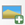

::::{grid} auto
:::{grid-item-card}
:class-card: sd-text-center sd-rounded-circle
:link: https://giscience.github.io/gis-training-resource-center/content/intro.html 
{octicon}`home-fill;1.5em;sd-text-danger`
:::
::::

# Good Map Design & Semiological Errors

In this chapter we will discuss well designed maps and give examples of how to recreate specific design elements in QGIS. A second part of this chapter will focus on common semiological missteps. If you need further examples for good map design, check out these websites/repositories:

- [impact-initiatives.org/resource-centre maps](https://www.impact-initiatives.org/resource-centre/?category%5B%5D=information_products&category%5B%5D=data_methods&type%5B%5D=281&order=latest&limit=10)
- [geo.msf.org maps](https://geo.msf.org/catalogue/DOCID-1877329211-4979?from=0&sort=_score&desc=true)
- [reliefweb.int maps](https://reliefweb.int/updates?list=Maps%20/%20Infographics&view=maps)

## Map Examples

### Map Example 1: Flood-affected areas and roads in the Somali Region, Ethiopia

:::{figure} ../../fig/ET_Somali_Humanitarian_Access_Flooded_Areas_11152023_A4.png
---
name: Flood affected Areas in Somali
width: 800 px
---
Flood affected areas and roads in the Somali Region, Ethiopia (Source: OCHA).
:::

:::{dropdown} Context: Situation in Ethiopia

The Greater Horn of Africa receives 20 to 70 percent of the annual total rainfall in the months from October to December. The IFRC reports an exceptionally high forecast probability (over 80%) of experiencing wetter than normal rainfall conditions. Additionally, El Niño conditions started between July and August, which further accrued the possibility of high rainfall conditions in Ethiopia.

Since October, floods have affected at least 763,000 people in the region, taken 33 lives in the Somali Region alone, and killed 4,806 livestock. The flooding has also resulted in immense damage to infrastructure, transportation, and schooling. The population's livelihood and health have been greatly affected.
The impact of flooding is projected to increase in the next few years, which will lead to more flash and river floods.

Access maps, such as the one above, play a crucial role in helping inform information managers and ground staff which areas are accessible. This is especially important as a timely deployment of relief or aid operations is essential in flooding disasters.

(Source: [IFRC](https://go.ifrc.org/emergencies/6773/details))
:::

The map above shows the flood-affected areas, as well as the important road networks in the Somali Region, Ethiopia in November 2023. Maps such as these are crucial for humanitarian aid workers when planning relief or aid operations and need to be up-to-date. They display important settlements and, most importantly, the accessibility of roads and airstrips. 

This is a thematic map with a clear purpose, featuring only the most essential elements relevant to that purpose.

- A shapefile for the flood affected areas was given a hashed fill. In QGIS, you can find this symbology.
- A layer with the road network has been put above the layer with the flood-affected areas. The road symbology has been __categorised__ into three categories: Accessible road (green), partially accessible road (grey), and hard-to-reach road (red).
- The topmost layer is a point-layer with information on inaccessible roads or bridges as well as the location of airstrips and which airstrips are accessible. The points have been symbolized with SVG-symbols. 
- (The administrative boundaries of Ethiopia are set apart from the surrounding countries by making the polygon a clear white and the surrounding countries in a shade of grey. This can be achieved by copying the polygon of Ethiopia into a new layer, and changing the symbology respectively)

:::{note} 
The colour scheme of the roads makes it possible to read the map intuitively, as red is typically associated with negative qualities and green with positive qualities. It should be noted, however, that people with colourblindness will have trouble reading the map.
:::

---

### Map Example 2: Flooding Risk in the Ouham Region, Central African Republic

:::{figure} ../../fig/REACH_CAF_Susceptibilite_inondations_CF32_Juillet2023_A3_FR.png
---
name: REACH Flooding Risk Ouhman Region, Central African Republic
width: 720 px
---
Flooding risk in the Ouham Region, Central African Republic (Source: REACH).
:::

:::{dropdown} Context: Situation in the Central African Republic

The Central African Republic has been hit by destructive floods in late 2019, which displaced over 100,000 people and caused considerable damage to infrastructure. The floods have destroyed shelters, obstructed transportation routes, and have led to disease outbreaks such as cholera and malaria. Due to climate change, such floods will become more frequent, leading to increased vulnerability for towns and villages. Since natural hazards are hard to predict, the changing climate reduces community resilience.

Source: [REACH Initiative](https://reliefweb.int/report/central-african-republic/central-african-republic-flood-susceptibility-risk)
:::

This map displays the flooding risk using a raster image. The raster data was calculated using several factors, including the precipitation intensity, the maximum duration of precipitation, the height of the nearest drainage, the flow direction and river network, the topographic humidity, a digital elevation model, and the ground cover.

- The raster data is displayed using a diverging colour ramp. (Here you can see how to assign a colour ramp).
- The surrounding administrative districts have been overlayed with a transparent grey.
- The river network has been added in blue.
- The main roads as well have been added in black.
- Settlements are displayed as black dots. This helps to identify areas with a higher population density in the areas most at risk.

---

## Common Missteps in Semiology

### The Modifiable Areal Unit Problem

:::{caution}
Be careful when representing data in administrative regions. 
:::

The Modifiable Areal Unit Problem (MAUP) is a statistical bias that arises when spatial data is aggregated into regions. It highlights how the results of spatial analysis can change depending on how data is grouped into areal units (spatial zones).

The Modifiable Areal Unit Problem has two key components:

__Scale Effect:__

The scale of aggregation (small vs. large areas) affects the results.

- When smaller units (e.g., census blocks) are used, the analysis may capture fine-grained local variations.
- When larger units (e.g., counties or states) are used, local variations get smoothed out, and the results may show broader trends. For example, average income might vary significantly at the neighborhood level but look more uniform at the county level.

__Zoning Effect:__

The shape and arrangement of the zones used for aggregation can also affect the results.

- Changing the boundaries of zones (e.g., splitting a city into east-west vs. north-south regions) can lead to different outcomes, even if the total population or data remains the same. This happens because boundaries influence how values are averaged or summed.

__Why is this important in GIS?__

- Policy Decisions: If the analysis depends on arbitrary boundaries, decisions (e.g., allocating resources) might be based on misleading results.
- Spatial Statistics: Correlations, regressions, and other analyses involving spatial data can be biased due to MAUP.

:::{figure} /fig/en_modifiable_areal_unit_problem_diagram.png
---
name: en_modifiable_areal_unit_problem_diagram
width: 500 px
---
Visualising the Modifiable Areal Unit Problem: The same indicator represented at three different scales (Source: Kitchin, Rob & Lauriault, Tracey & McArdle, Gavin. (2015). Knowing and governing cities through urban indicators, city benchmarking and real-time dashboards. Regional Studies, Regional Science. 2. 6-28. 10.1080/21681376.2014.983149. )
:::

### Proportional Circles vs. Solid Colours

:::{caution}
Be cautious when representing __quantitative__ data with a __solid colour__.
:::

While it is graphically appealing, representing quantitative data with solid colours can lead to problems and distract from the message of the map:

- You lose the __order relationship between the data__ (a circle can be twice as big as another one, a colour cannot be "twice as dark").
- Countries with a large surface area stand out visually (e.g. Russia in the example below).
- We are trying to represent __data that has nothing to do with the area of a country__.

<!---Add example-->

### Colour Gradient vs. Distinct Colour Palette

:::{caution}
DO NOT use a __separate__ colour palette to represent __ordered entities__
:::

A representation that "feels right" because it seems logical that a "low" rate would be represented differently than a "high" rate.

It is a mistake because:

- By using a differentiating colour variable, __you lose the ordinal relationship between entities__. Instead, a __gradient of the same colour__ that should be used.
- Different colours are used to differentiate between distinct entities.

### Gradient in a Single Colour vs. Gradient between two Colours

:::{Caution}
Be cautious when using a __gradient across two different colours__ for data that is __always positive__ (or negative).
:::

This is difficult because our brains are used to prioritising certain colours, especially green to red, or blue to red. We must remember that __if our values do not have a meaningful zero point__, it might be better to stay in the same single colour and use different shades of that colour to indicate different values. Alternatively, a colour gradient that is not diverging can be used. 

A diverging gradient between two colours can be used when it is necessary to show a gradation that can go from negative to positive. As for temperatures, it makes sense to distinguish negative values (in shades of blue for example) and positive values (in shades of red).

It is a mistake because:

- By choosing different colours for values that are linked to each other, our eyes perceive a difference between the elements, and not an order.
- Darker colours stand out more than lighter colours, and can be perceived as more important.
- The map will send a message of divergence, of opposition between certain values, when we are simply trying to represent a hierarchy between values.
- In this way, the colour itself directly indicates information about the trend (positive/negative or increasing/decreasing).

### Limited Geometric Symbols vs. Complex Icons and Symbols

:::{Caution}
DO NOT use __too many symbols__ in a thematic map.
:::

Incorporating a multitude of symbols (and data) for an informative map is a common desire. However, too many symbols can __overload the map__ and __reduce the readability__ of the map. Using too many symbols (especially geometric ones) can make it difficult to read and understand the map.  
__The eye can easily distinguish between four to five different symbols.__ Beyond that, it is difficult to tell elements apart. However, this is a less serious error because it does not convey false information on the map.

It is a mistake because:

- It complicates the map and limits its impact.
- Sometimes you are forced to represent several symbols, so you must be careful about overlapping points and overloading the map.

---

## Self-Assessment Questions

::::{admonition} Test your knowledge
:class: note

1. __What makes a map “good” or effective? In your own words, list at least three qualities or principles illustrated by the example maps.__

:::{dropdown} Answer
1. __Clarity/readability at a glance__
    - A good map allows the viewer to immediately understand the key message or distribution without having to decipher overly complex symbology. For example, the example maps use clean colour schemes (or minimal distractions) so that the spatial pattern stands out.
2. __Appropriate visual hierarchy and focus__
    - That means emphasising the main theme or data of the map, while de-emphasising background or context layers so they don’t compete. For example, context features (roads, boundaries, basemap) are often light, subtle, or greyed out; while the thematic layers are bold. This directs the viewer’s eye to what matters. One of the example maps shows how subsidiary layers are subdued so the main data pops out.
3. __Fit for purpose/audience and effective design choices__
    - A good map aligns its design (colours, symbols, labelling, orientation) with the intended audience and the purpose (operational, humanitarian, public communication, scientific). For example, using intuitive colours (e.g., red for high risk, green for safe) or simplified icons for non‑technical audiences. The module implicitly shows different example map types tailored to humanitarian use, operational decision‑making, etc.
:::

2. __Consider the intended audience and use case for one of the example maps (e.g. humanitarian, operational, public communication). How do design choices reflect that audience (e.g. simplicity, clarity, icon selection)?__

:::{dropdown} Answer
Design choices should reflect that:
- __Simplicity and clarity__: The map avoids overly detailed or decorative features; it focuses on the essential: the affected area, safe zones/routes, relief hubs in the context of a flood-response map.
- __Use of intuitive icons/symbology__: For instance, a shelter icon, or a triangle for hazard, arrows for movement — easily understood without needing deep legend lookup.
- __High contrast and meaningul colours__: For instance, red/orange for hazardous zones, green for safe or cleared areas, possibly a neutral grey for context. This helps non‑technical users quickly interpret what’s urgent.
- __Minimal distractions__: The background may be subdued, roads/boundaries muted, to make the operational layer stand out. Also large readable fonts for titles/labels because maybe viewed in the field.
- __Clear map elements and layout for quick reference__: Big title (e.g., “Flood Damage Zones – 24 Oct 2025”), a prominent legend, scale bar, north arrow, and possibly an inset map for orientation.
Thus, the design choices reflect the audience by prioritising readability, immediacy, and intuitive interpretability over cartographic elegance or deep detail.
:::

::::

## Creating a 3W Info-Map

__Introduction:__

A 3W info map is one of the most commonly requested products during the first month of an operation. __3W__ refers to __who, what, and where__, meaning which organizations and National Societies are involved in the disaster response, what activities they are carrying out, and where those activities are taking place. The 3W is typically updated regularly as additional actors join the operation and expand their sectoral work in affected locations. You’ll commonly find 3Ws included in SitReps and operational documents, shared on the GO Platform, and discussed during Joint Task Force meetings. In this section we will discuss the essential elements of a 3W map and how to create one using QGIS.

__What is needed:__

- A recent version of QGIS
- Access to 3W data
- [IFRC icons](https://learn-sims.org/style-guidance/logos-and-icons/) for map making
- Logos of the organizations involved

__Getting the 3W data:__

A variety of factors can affect how much 3W information you have available. In the early weeks of a response, there may not yet be a structured process for gathering data from the different sectors and organizations involved. The IM Coordinator may recommend using a simple survey for sector leads and/or National Societies to capture an initial snapshot of who is doing what and where. As the operation becomes more organized, sector leads and National Societies can begin entering 3W data directly into a joined platform, which then can be used as the primary source for the 3W map.

If no formal 3W data collection system is in place, information might need to be extracted from SitReps and other reports produced by the operation team. Focus first on identifying the following:

- __What response activities are the National Society involved in, and where?__
- __What response activities are being done by IFRC operation, and where?__
- __Key situation overview figures__, such as number of __people affected by the disaster__, __number of deaths or injuries__, number of houses damaged, number of geographical units affected (all of these data points can be modified based on the context of the disaster). 
- Make sure to __note the data source__ you are using for key situation overview figures, and whenever possible to align the figures you are using to those used by the host National Society instead of using figures released by the media.
- How many people or households are being reached by sectoral activities, and where?

It is normal that the initial dataset is limited. The 3W map will evolve and expand as additional information comes in.

:::{admonition}
Helpful information on how to create such a 3W map can be found [here](https://learn-sims.org/information-design/creating-a-3w-who-what-where-infographic/).

For a variety of 3W map examples, browse the Maps/Infographics section on [Reliefweb](https://reliefweb.int/updates?view=maps&search=title%3A%223W%22).
:::

::::{dropdown} Example: Hurricane Melissa November 2025 | Jamaica
The two 3W example maps below demonstrate how such __products develop__ as new information becomes available. The first map, produced at the beginning of November by a single organization (MapAction), contains limited data and represents an __initial community assessment__. Three weeks later, the second map created jointly by MapAction and OCHA, includes significantly more information. In addition to expanded data, the __map’s styling has also evolved__. This progression is entirely normal; maps are expected to __improve__ and become __more detailed__ over time. What matters most is establishing an initial version that can be updated and refined as the response advances.

:::{figure} ../../fig/4.8_3w_jamaica_03_11_2025.png
---
name: 3W Map Jamaica Melissa Start
width: 720 px
---
Jamaica: Hurricane Melissa - Who, What, Where (3W) as of 03-Nov-2025: Community Assessments (Source: MapAction).
:::

:::{figure} ../../fig/4.8_3w_jamaica_24_11_2025.png
---
name: 3W Map Jamaica Melissa End
width: 720 px
---
Jamaica: Hurricane Melissa - Who, What, Where (3W) as of 24-Nov-2025 12:00L (Sources: MapAction, OCHA).
:::

::::

### 3W Map Creation

1. Add all the relevant spatial data. Used in probably every instance:
    - Administrative boundaries
    - Affected areas with the relevant disaster
    - Points of Interest (Airports, Ports, Cities)
    - Background map (OpenStreetMap is always a solid choice)
2. Import the 3W Activity data
    - Add the 3W dataset to QGIS (mostly CSV or Excel)
    - Ensure that it contains information about the organization, activity type, and location.

::::{dropdown} How to import .csv or .txt

__Delimited text import (.csv, .txt)__

When working with 3W data, the most common format encountered is a delimited text file, such as `.csv` files (Comma Separated Values). These files contain tabular data, which can be opened by programs such as Microsoft Excel. They can contain geographical or positional information as point coordinates in separated columns (for example, latitude and longitude, or x- and y-coordinates), or as "Well Known Text" (WKT), which represents complex geometries, such as polygons or lines. In some cases, the table may not include any geographic information at all. When this happens, the file is simply added as a non-spatial table, allowing access to its attribute information without displaying it on the map.

__Open Delimited Text Layer__

:::{Tip}
To load data from spreadsheets such as Comma Separated Value (`.csv`) or Excel (`.xlsx`), the datasets need to have columns containing geometry - this is most often in the form of latitude (Y field) and longitude (X field), but might also be in other formats, such as WKT. In this case, you can also have complex geometries in your delimited text file.  
:::

:::{figure} /fig/en_import_delimeted_text.png
---
width: 600px 
align: center
name: en_import_delimeted_text
---
Import delimited text in QGIS 3.36.
:::

1. `Layer` -> `Add Layer` -> `Open Delimited Text Layer`.
2. Click on `File name` click on the three points  and navigate to your CSV file and click `Open`.
3. `File Format`: Here you can specify which delimiter is used in the file you want to import. In a standard CSV file, commas `,` are used. If this is not the case, select `Custom delimiters`. Here you can choose the exact delimiter used in your file. 

:::{Tip}
To find out which delimiter is used you can open your .csv file in Notepad or Excel. There you can check which delimiter is used to separate the information.
:::

:::{figure} /fig/en_delimited_text_fileformat.png
---
width: 600px
align: center
name: en_delimited_text_fileformat
---
Adjusting the file format parameters while importing a delimited text layer into QGIS.
:::

4. If your CSV file contains geometry, continue with `Geometry definition`: In this section, you specify which columns of the file contain the spatial information to georeference the data on the map. If the file has a column containing __latitude__ and another with __longitude__ data, you can use them to georeferenced the data. Check `Point Coordinates` if the `.csv`-file contains point data. Select for `X field` “LONGITUDE” and for `Y field` “LATITUDE”.
5. Under `Geometry CRS` select the coordinate reference system (CRS). By default, QGIS will select the CRS of the project. If the file does not have spatial information choose the option `No geometry (attribute only table)`.
6. Click `Add`

:::{dropdown} Video: Opening delimited text files in QGIS

<video width="100%" controls src="https://github.com/GIScience/gis-training-resource-center/raw/main/fig/qgis_open_textfile.mp4"></video>

:::

::::

3. Style the administrative boundaries with a transparent fill and choose an appropriate `Stroke color` and `Stroke width` to ensure they are clearly visible without obscuring underlying map content.

::::{dropdown} Styling administrative boundaries

__Styling administrative boundaries (Polygons)__

When creating 3W maps, administrative boundaries are always a key component. Most overview maps display disaster-related information aggregated by these boundaries. To visualize multiple administrative levels at once, each layer needs to be styled so that lower layers remain visible and the hierarchy between levels is clear. Often, this begins with adding the country outline and then progressively adding each subsequent administrative level, ensuring that the symbology distinguishes them without cluttering the map.

__Only display the outlines of polygons__

Now, we want to change the symbology of a layer so that __only the outlines of the polygons are visible__. This is necessary to make layers below this one visible.

To change the symbology of a single layer:
1. Open the `Styling panel` and navigate to the symbology tab. By default, the symbology will be set to `Single Symbol`. This means that the same colors and contours will be applied to all the features in that layer.
2. Click on `Simple Fill`.
3. Click on the arrow to the right of `Fill Color`.
4. Check the `Transparent Fill` option.

:::{figure} ../../fig/en_30.30.2_vector_layer_styling_transparent.png
---
name: en_30.30.2_vector_layer_styling_transparent
width: 500 px
---
:::

:::{dropdown} Video: Making the fill color transparent

<video width="100%" controls src="https://github.com/GIScience/gis-training-resource-center/raw/main/fig/en_30.30.2_make_only_outlines_visible.mp4"></video>

:::

__Adjusting the Styles of Multiple Overlaying Layers__

__Ordering the layers__

1. Import all the administrative boundaries into your QGIS-project that you want to work with (e.g. Admin 0-2).
2. One option is to order the layers in the Layers panel so that the `Admin0`-layer sits on top, followed by `Admin1` and `Admin2`. At first, this might look weird because `Admin0` will cover everything.

:::{figure} ../../fig/en_30.30.2_changing_layer_style_1.png
---
name: en_30.30.2_changing_layer_style_1
height: 400px 
---
Order the layers and navigate to the styling panel of the topmost layer
:::

3. Change the symbology of the `Admin0` layer by opening the styling panel and navigating to the Symbology tab. 
4. Click on `Simple Fill` to open the style options.
5. Expand the `Fill Color` menu and check the `Transparent Fill` option. This will make only the boundaries visible, so __we will be able to see the layer under this one__.
6. Choose a `Stroke Color`, and adjust the `Stroke Width`.
7. Click OK.
8. __Repeat the same process__ for the `Admin1` layer, using the same color as for `Admin0` (it will be in "Recent colors). Adjust the stroke width so that it differs from `Admin0`, ensuring that the administrative levels remain visually distinct. 
9. Now we can see the boundaries of the country and its states, and behind that we can see the districts (`Admin2`).
10. Let's make the district layer's style consistent with the others.
11. Choose a `Fill Color`.
12. Use the same `Stroke Color` as for `Admin0` and `Admin1`, but make the width even thiner and the Stroke Style a __Dash Line__.
13. Click OK and look at your map: hopefully it's starting to look nicer!

:::{figure} ../../fig/en_30.30.2_changing_layer_style_3.png
---
width: 500 px
name: en_30.30.2_changing_layer_style_3
---
The styling of a vector data consists of the color and the outline.
:::

:::{dropdown} Video: Adjusting the style for multiple layers
<video width="100%" controls src="https://github.com/GIScience/gis-training-resource-center/raw/main/fig/en_30.30.2_change_style_for_multiple_layers
.mp4"></video>
:::

::::

4. Style the disaster-related information by selecting a color ramp that fits the context. One common approach is to create a choropleth map using __Graduated__ styling, which visually represents variations in impact or case numbers across administrative areas.

::::{dropdown}

__Creating a Choropleth Map ("Gradudated Styling)__

If a layer contains numeric values that are continuous, they can be organized in intervals. These intervals can be displayed in graduated colors. In this example, colors are assigned to Admin1 polygons based on the total population of each State.

1. Open the `Symbology` options and choose `Graduated`.
2. __Select the value you want to use to assign colors__, in this case, it will be `total_pop`.

:::{figure} ../../fig/en_30.30.2_symbology_variable_ranges.png
---
name: en_30.30.2_symbology_variable_ranges
width: 550px
---
With variable ranges, select __Graduated__ symbology and choose the attribute with continuous values
:::

3. Click on `Classify` to __list all values divided in classes__.
4. Choose __how many classes__ you want the data to be divided into ‒ let's say 4. You can also assign different `Modes`. We usually work with `Equal Count` or `Equal Interval` depending on our data.
5. By default, the color ramp will be red. However, red is not the right color to use for population count, as it is generally used to communicate negative elements, such as food insecurity or cholera cases.
6. Click on __the arrow next to the color ramp__ to choose another combination of colors - let's say a color ramp from white to blue.
7. Click `Apply` to preview the look of your layer, then `OK`.

:::{figure} ../../fig/en_30.30.2_symbology_variable_ranges_2.png
---
name: en_30.30.2_symbology_variable_ranges_2
width: 500px
---
You can categorize the continuous values into classes and assign a color ramp .
:::

The following map shows the most populated states of Nigeria using a graduated color categorization. These types of maps are called __Choropleth maps__. 

:::{figure} ../../fig/en_map_design_example_variable_ranges.png
---
name: en_map_design_example_variable_ranges
width: 500px
---
A map showing the population of Nigerian states.
:::

:::{dropdown} Video: How to create a choropleth map
<video width="100%" controls src="https://github.com/GIScience/gis-training-resource-center/raw/main/fig/en_30.30.2_graduated_styling
.mp4"></video>
:::

::::

5. Add labels to the Admin boundaries (at the level of interest) for clearer identification. 

:::::{dropdown}

__Single Labels__

Creates a single label style for every feature in the layer. You can select an attribute (value) which will be 
displayed. For example, the name of a district. You need to know which attribute displays the information you want to 
display. Look at the attribute table of the dataset to find it out.

:::{figure} /fig/labels_single_labels_example_nga_adm1.png
---
width: 600 px
name: labels_single_labels_example_nga_adm1
---
Single labels for each administrative region (adm1) in Nigeria. The reader is able to assign each label to the respective administrative entity.
:::

:::{figure} /fig/en_30.30.2_assigning_value_to_labels.png
---
width: 600 px
name: en_30.30.2_assigning_value_to_labels
---
Assigning the correct attribute value in the labeling options. QGIS needs to know which attribute (column) of the attribute table should be displayed as a label. In this case, we want the name of the administrative region (`ADM1_EN`) to be displayed. 
:::

__Adding Single Labels to a Layer__

1. In the styling panel, click on the `Labels`-tab underneath the Symbology tab.
2. Select `Single labels`.
3. `Value` is where you choose the attribute that will be displayed as a label. For example `ADM1_EN` will display the English names of Nigerian states for each feature in the data set.
4. Let's __change the font__: Open the font dropdown menu and select Arial. Make the text `Bold` in the Style dropdown menu. Change the color by clicking on `Color`, and change the `Size` to 8 pt.
5. Let's __add a white buffer__ around the label. In the `Labels` tab, you will find a list with different options to style the labels. Right now, we are in the `Text` menu. Select `Buffer` and check the `Draw text buffer` option. This will make the labels stand out more on dark or crowded maps.
7. Click `Apply` and `OK`.

:::{figure} ../../fig/en_30.30.2_setting_up_labels.png
---
width: 600px
name: en_30.30.2_setting_up_labels
---
Setting up labels in QGIS 30.30.2
:::

:::{dropdown} Video: How to add single labels
<video width="100%" controls src="https://github.com/GIScience/gis-training-resource-center/raw/main/fig/en_30.30.2_setting_up_labels.mp4"></video>
:::

::::{attention}

Single Labels are not always useful. For example, if the dataset is too big, or you only want to display certain features in the dataset. In the example below, there are too many settlements to display labels for each settlement. Instead, it might be useful to only display the regional and national capitals. For such a use case, Rule-based Labeling is ideal.

:::{figure} /fig/single_labels_bad_example.png
---
name: single_labels_bad_example
width: 400 px
---
Single Labels were selected to display the names of the settlements (red dots). A map with so much text information is unreadable and the information can hardly be understood. 
:::

::::

:::::

4. Set up a new __Print Layout__. Add a new map by clicking on the  `Add map`-button. Position the main map frame at the center of the page and size it generously so that place names, symbols, and activity markers are easy to read.
5. Add a header using the  `Add Label`-tool. It should contain the following information:
    - The title (e.g. Sudanese Red Crescent Response)
    - The type of disaster or emergency
    - The geographic location of the disaster
    - The last updated date to indicate the currency of the data. Because operations evolve quickly, the date is especially important for users who need to understand how recent the information is.

:::{note}
Multiple text boxes can be used to display the header in different font sizes, helping to clearly separate different layers of information. If all content should remain within a single label box, `Render as HTML` can be applied to format and style the text as needed.
:::

6. Add map elements
    - A legend  explaining symbols and color schemes.
    - A scale bar 
    - A north arrow
    - Organizational logos (e.g., International Medical Corps, Relief International, International Rescue Committee) using the  `Add image`-tool
    - Icons which describe the specific activity. These can also be added using the  `Add image`-tool
    - A small overview map

7. Areas of operation for each organization
    - Place the logos of each organization within the districts where they are active.
    - Add activity icons to indicate the specific types of work each organization is carrying out in those districts.

:::{Caution}
Add labels and logos where necessary, but avoid cluttering the map with excessive text or symbols. Arrange map elements by topic, importance, and visual hierarchy to maintain a clean and structured layout. Map items can be reordered in the __Item__ panel on the upper right side.
:::

:::{note}
All the necessary information about the Print Layout Composer can be found [here](https://giscience.github.io/gis-training-resource-center/content/Module_4/en_qgis_understanding_print_layout.html)
:::
