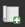
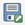
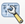

::::{grid} auto
:::{grid-item-card}
:class-card: sd-text-center sd-rounded-circle
:link: https://giscience.github.io/gis-training-resource-center/content/intro.html 
{octicon}`home-fill;1.5em;sd-text-danger`
:::
::::

# Understanding the Print Layout Composer

```{figure} ../../fig/en_30.30.2_understanding_the_print_layout_composer.png
---
name: en_30.30.2_understanding_the_print_layout_composer
---
The interface of the Print Layout Composer
```

1. __Layout Settings__ (Add pages, Export Map, manage panels)
2. __Dialer Tools__ (Save, New, Duplicate, Add items from template, Save template)
3. __Navigation bar__ (Zoom, Refresh, Lock/Unlock elements)
4. __Toolbar__ (Zoom, Select, Move in Map, Add new map/image/text/legend/scale/shape/...)
5. __Feature Panel__: Displays the elements added to the print layout
6. __Advanced Options__: Customise each element of the layer

The print layout manager also works with toolbars (on the left side of the screen), where you can select different tools (e.g. to add images) and panels (on the right side of the screen), where you can change the settings of the tools or the elements you have added to the map. 

First of all, you should always set the size of your map:

- Right-click on the blank map > `Page Properties`
- Choose __the size of your document__ (A4, A3, A2). A4 and A3 are the most commonly used sizes for maps.
- Choose the orientation (Landscape or Portrait).

## Adding Elements to the Print Layout

### Adding a new map

- Add a new map by clicking on the  `Add map`-button on the __toolbar on the left__ and drag a rectangle on the map canvas.  
- To move the map on the canvas, simply __select the map__ and __drag__ it with your mouse
- To move within a map select  `Move item content`-button on the left toolbar.
- To zoom in on the map, while using the  `Move item content` tool, you can __Press CTRL + scroll the mouse wheel__ (gently) or enter the scale manually in the item properties.

```{figure} ../../fig/en_30.30.2_adding_a_map.png
---
width: 750px
name: en_30.30.2_adding_a_map
---
Adding a new map to the Print Layout (Source: CartONG)
```

::::{tab-set}
:::{tab-item} Adding a new map

<video width="100%" controls src="https://github.com/GIScience/gis-training-resource-center/raw/main/fig/en_30.30.2_adding_a_new_map.mp4"></video>

:::

:::{tab-item} Moving and scaling the map

<video width="100%" controls src="https://github.com/GIScience/gis-training-resource-center/raw/main/fig/en_30.30.2_moving_the_map.mp4"></video>

:::
::::

### Adding a title or a text box

A title should describe the phenomenon represented on the map.

- To add text (title, explanations), use the  `Add Label`-tool and draw a rectangle of the desired size.
- In the __Item Properties__ panel (on the right of your screen) you can __enter your text__ and __change the font, style, colour, etc.__ (_Remember to use the scroll bar in the window to see all the options).

```{figure} ../../fig/en_30.30.2_print_layout_add_text.png
---
width: 750px
name: en_30.30.2_print_layout_add_tex
---
Adding text to the print layout (Source: CartONG).
```

:::{dropdown} Video: Adding a textbox

<video width="100%" controls src="https://github.com/GIScience/gis-training-resource-center/raw/main/fig/en_30.30.2_print_layout_adding_a_title.mp4"></video>

:::

### Adding an image or logo

If you are working for an organisation, most likely you will add the logo of that organization on the maps you produce.

1. Click on the  `Add image`-tool in the left toolbar.
2. Drag a rectangle on the canvas.
3. In the __Item Properties__ tab, you will have the option to choose an SVG image from your SVG-library in QGIS or choose a __Raster image__. Most image files are raster images.
4. Select `Raster image` and click on `...` to choose the location of the image.
5. Your image will appear in the print layout. In order to make sure that the image does not get distorted, leave the `Resize Mode` on "Zoom".

```{figure} /fig/3.36_print_layout_add_image.png
---
name: 3.36_print_layout_add_image
width: 650 px
---
Adding an image or logo to the print layout.
```

:::{dropdown} Video: Adding an image to the print layout
<video width="100%" controls src="https://github.com/GIScience/gis-training-resource-center/raw/main/fig/en_30.30.2_adding_a_raster_image.mp4"></video>
:::

### Adding a legend

Before adding a legend, make sure that:

- All your layers have an explicit name ("rivers", "primary roads",...)
- You use the final version of your map (no more layers to add, move, rename or modify). You can still modify them later but you will have to redo the legend.

To add a legend, you can use the  `Add legend`-button on the __left toolbar__.

```{figure} ../../fig/en_30.30.2_print_layout_add_legend.png
---
width: 750px
name: en_30.30.2_print_layout_add_legend
---
Adding a legend to the print layout
```

In the __Item Properties__ panel, if you keep the __`Auto update`__ option checked, new layers added to your project will automatically be added to the legend but you cannot control them individually (rename if necessary, reorder ot remove items).  
Once the option is unchecked, you can update the name of the layers, group them, remove or reorganise them, etc.

If you have to many items on your legend, and they don't fit on your map horizontally, you can also split the legend into several columns by navigating through the Item Properties panel, expand the `Columns`-section, and increase the `Count`.

::::{tab-set}
:::{tab-item} Adding a legend

<video width="100%" controls src="https://github.com/GIScience/gis-training-resource-center/raw/main/fig/en_30.30.2_adding_a_legend
.mp4"></video>

:::

:::{tab-item} Editing the legend

<video width="100%" controls src="https://github.com/GIScience/gis-training-resource-center/raw/main/fig/en_30.30.2_editing_the_legend
.mp4"></video>

:::

:::{tab-item} Adding a two-column legend

Sometimes the space on your map is not suited for a single vertical legend. In this case, it is useful to add multiple columns. Make sure to group the legend items logically so that the vertical legend is easier to read.

<video width="100%" controls src="https://github.com/GIScience/gis-training-resource-center/raw/main/fig/en_30.30.2_multiple_columns_legend
.mp4"></video>

:::

::::

### Adding a scale bar

Before adding a scale bar, select your main map and check in the __Item Properties__ panel that the `Scale` field has a __round number__ 

```{figure} ../../fig/en_30.30.2_print_layout_scale.png
---
width: 750px
name: en_30.30.2_print_layout_scale
---
Make sure that the scale is at a round number
```

To add a scale bar, you can use the `Add scale bar`-button on the __left toolbar__. In the __Item Properties__ panel, customize the following functions

- Which Map __is related to the scale__
- __Unit system of the bar__ (metres, miles, degrees)
- __Segments on the left__: segments shown before 0 m (always set to 0). 
- __Fixed width__: define the width of each segment (e.g. 1 km, 10 km, 50 km, ...). 
- __Height__: height (thickness) of the scale bar

There are many other options to customize the scale bar (change the font, colours, etc.).

```{figure} ../../fig/en_30.30.2_print_layout_add_scale_bar.png
---
width: 750px
name: en_30.30.2_print_layout_add_scale_bar
---
Add and customise the scale bar
```
:::{dropdown}
<video width="100%" controls src="https://github.com/GIScience/gis-training-resource-center/raw/main/fig/en_30.30.2_print_layout_adding_scalebar.mp4"></video>
:::

### Adding an overview map

Adding an overview map in the corner of your map will help locate the area you are viewing on the main map.

To create an overview map, you need to follow these steps:

1. Make sure that you __lock the layers and layer styling__ for your main map
    - Navigate to the __item properties__ panel > 
2. Prepare a __layer with national or subnational borders or important landmarks__ in your project (e.g: Administrative boundaries, Capitals). These should not be the same layers as your main map. If necessary, you can duplicate layers you wish to use on the overview map (such as administrative boundaries). Do not change the layers of your main map, if you intend to change the symbology later on.
3. __Insert the overview map__ into your print layout, by using the `Add Map` tool (in the bottom right corner, for example)
4. __Lock the new map__ in the Item properties panel
5. Add a rectangle to display the extent of your main map
    1. Go to the __properties__ of your Main map > scroll down until you see __"Overviews"__.
    2. Add an Overview by clicking on the `+`-button.
    3. __Link the main map__ by selecting it in the `Map frame` option.

```{figure} ../../fig/en_30.30.2_print_layout_overview_map_preparations.png
---
width: 500px
name: en_30.30.2_print_layout_overview_map_preparations
---
An overview map should show important landmarks and borders so the reader is able to locate the region shown on the map without having specific knowledge of the region.
```

```{figure} ../../fig/en_30.30.2_print_layout_add_overview_map.png
---
width: 750px
name: en_30.30.2_print_layout_add_overview_map
---
Add an overview map and __lock the layer__
```


:::{dropdown} Video: Setting up an overview map
<video width="100%" controls src="https://github.com/GIScience/gis-training-resource-center/raw/main/fig/en_30.30.2_adding_overview_maps
.mp4"></video>
:::

```{Caution}
This method requires you to be sure that you are not going to modify the overview map, as once the layers are locked, they will keep the style, and any updates will not affect the overview map.
```

----

## Exporting the print layout

Once you are finished with the map composition, it is time to export export the print layout as a PDF or SVG file.

1. In the toolbar above the canvas, click on the  `Export as PDF`-button.
2. Give the new file a name and select the location you want to save it.
3. Click on `Save`.
4. A new window "PDF Export Options" will open. Here you can adjust the compression algorithm. For the best results, select the lossless image compression.
5. Click `Save` again.
6. A new green bar will pop up underneath the toolbars. Click on the file link to __review the exported map__.

```{note}
Make sure to check the map after exporting the PDF as some design elements might have changed in the exporting process.
```

## Map Templates

Map templates can simplify and speed up the creation of a print layout by saving the arrangement of elements. However, they do not save the project's layers and images, which will need to be reconfigured each time.
If you work for an organisation that frequently publishes maps, or you need to create several maps on the same topics but in different regions or times, you can use map templates to skip the arrangement of elements.

```{note}
The individual layers, maps and images are not saved in the template. However, if you have the same layers in the project you load the template into, the legend will update accordingly. 
```

::::{tab-set}
:::{tab-item} Saving a template

1. Once you are satisfied with your map layout, click on the  `Save as template`-button in the toolbar above the canvas to save it as a new template.
2. Choose a location where you want to save the template. Ideally, you should choose the template directory.
3. Click `Save`.
4. You can open the template by dragging it into a QGIS-project.

<video width="100%" controls src="https://github.com/GIScience/gis-training-resource-center/raw/main/fig/en_30.30.2_saving_layout_template
.mp4"></video>
:::

:::{tab-item} Opening a template

You can drag and drop template-files (`.qpt`, QGIS template file) into QGIS or use the __Layout manager__.

1. Open the Layout manager under `Layout` > `Layout Manager`
2. Navigate to the section "__New from Template__"
3. Choose `Specific` and select the location where you saved your template
4. Click open.

<video width="100%" controls src="https://github.com/GIScience/gis-training-resource-center/raw/main/fig/en_30.30.2_opening_template
.mp4"></video>

:::

:::{tab-item} Template directory

The template directory is where QGIS stores layout templates. If you have templates saved here, you can load templates directly through the layout manager without selecting the file.
On Windows computers, the file path is `\Users\AppData\Roaming\QGIS\QGIS3\profiles\default\composer_templates`.

<video width="100%" controls src="https://github.com/GIScience/gis-training-resource-center/raw/main/fig/en_30.30.2_template_directory.mp4"></video>

:::

::::

```{tip}
The layout manager in QGIS already has a dedicated location for map templates. On Windows computers, the file path is `\Users\AppData\Roaming\QGIS\QGIS3\profiles\default\composer_templates`.
If you save templates here, you can load templates directly through the layout manager without looking for the file.
You can also add file paths in the QGIS template settings.
```

## The Atlas function (automatic map generation)

In some cases, it can be necessary to create multiple maps for different locations with the same layers. For example, if you have a detailed dataset on affected flood areas in Nigeria, you can create a more detailed map for each subnational district. In QGIS, this can be done automatically with the __Atlas Function__.

The Atlas Function can be found in the __Print Layout Composer__ on the toolbar. 

```{figure} ../../fig/en_atlas_toolbar.png
---
name: en_atlas_toolbar
width: 500 px
---
The atlas toolbar
```

```{note}
If you can't see the Atlas Tools, you must first activate the Atlas Toolbar under `View` > `Toolbars` > `Atlas Toolbar`.
```

### Generating an Atlas

An atlas will generate a new page with the same map layout for each feature in a layer. For most purposes, it useful to first create a map layout with the elements such as legend, sources and overview map and then insert the map item that will be controlled by the Atlas. To generate an atlas:

1. Click on the  `Atlas Settings`-button in the Atlas Toolbar.
2. In the new window, activate the `Generate an Atlas` option.
3. Select the `Coverage Layer`. This will determine the features or polygons that will be displayed on a page. In our example, we will use the subnational administrative regions in Nigeria (`ADM1`).
4. Select the `Page Name`. This should be the name of the subnational region or location that is displayed on that page. To display the name of the region, we will choose the column `ADM1_REF`, which holds the names of the regions in english.
5. Now let's add a map to the empty print layout.
6. Click on the map and navigate to the __Layer Properties__ window on the right.
7. Scroll down until you see the option `Controlled by Atlas` and activate it.
8. Now activate the preview of the Atlas in the __Atlas Toolbar__. Otherwise, the print layout will not update to show you the atlas page. You can click through each page to see how it looks. Depending on the amount of features on your map, they may take a while to render.
9. Now you can adjust the __Margin options__ to best fit the readability of the map. By default, it is set to 10% and this should fit most purposes.
10. Before printing or exporting the atlas, make sure to check every page that other elements of the map do not cover the represented region.

```{Note}
The only item in the print layout that is being controlled by the atlas is the map we added (unless you specify otherwise in the item properties). The other elements of the map will be the same on every page.
```

:::{dropdown} Video: Setting up an Atlas
<video width="100%" controls src="https://github.com/GIScience/gis-training-resource-center/raw/main/fig/en_30.30.2_setting_up_an_atlas
.mp4"></video>
:::

## Self-Assessment Questions

::::{admonition} Test your knowledge

1. __How do you create or open a new layout in QGIS?__
2. __What is the difference between the “map item” (map frame) inside a layout and the main QGIS map canvas?__
3. __How do you lock layer in a map you've added to the print layout?__
4. __If you update your map layers or styling in the QGIS project after creating a layout, what will happen to the layout when you re-open it?__


::::