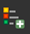
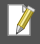

# Sketch Map Tool Exercise 6 - Reservoir Water Level monitoring with OpenAerialMap (fictional)

## Characteristics of the exercise 

All data and assumptions are fictional.

:::{card}
__Aim of this exercise:__
^^^
Learn how you can use OAM in your Sketch maps and visualize your results in [QGIS](../Wiki/en_qgis_installation_wiki.md).
:::

::::{grid} 2
:::{grid-item-card}
__Type of trainings exercise:__
^^^
This exercise can be used in online and in-person trainings and is focused on hands-on experience with the basics of OAM, Sketch Map Tool and QGIS.
:::

:::{grid-item-card}
#### Focus group (GIS-Knowledge Level)

- Exercise builds on prior-knowledge of Sketch Map Tool. Make sure [Exercise 1](en_SMT_ex1_.md) has been done before or knowledge on the background on Sketch Map Tool is there.
- GIS Beginners-level: no specific knowledge about QGIS

#### Phase of participatory community mapping

- Analysing participatory mapping
:::
::::

::::{grid} 2
:::{grid-item-card}
#### Estimated time demand for the exercise. 

With absolute beginners approx. 2 hours.
:::

:::{grid-item-card}
#### Available Data 

- [Introductory slides on the Sketch Map Tool](https://nexus.heigit.org/repository/gis-training-resource-center/mobile_data_collection/sketch_map_tool/PPP/Introduction_Sketch_Map_Tool_21_03.pptx)
- Download the data for this exercise [here](https://nexus.heigit.org/repository/gis-training-resource-center/mobile_data_collection/sketch_map_tool_training/Sketch_Map_Tool_Exercise_6.zip) and unzip the folder
- In the data subfolder (`\data\input`), you will find the data you need to start the exercise (created raw map & pre-marked and photographed map). You will also find the geodata of the results (`\data\output`) and the intermediate result (`\data\temp`).
:::
::::

## Instructions for the trainers 

::::{dropdown} __Trainers Corner__

### Prepare the training 

- Online access (creation & upload of Sketch Maps) and devices (PC)
- QGIS installed on the computer
- Take a look and make yourself familiar on the provided material for the exercise and the Sketch Map Tool in general
- Check out [How to do trainings?](../Trainers_corner/en_TOT_intro.md) for some general tips on training conduction

:::{note}
- If you like to skip parts of the workflow, you can use the available geodata or intermediate results.
- This exercise can certainly be adjusted to other use cases. If you would like to adapt it to your specific context, please create your own case description.
:::

### Conduct the training 

__Introduction:__

- introduce the idea, the aim and the general workflow of the Sketch Map Tool beforehand
- provide access to the needed material
- check-in if there are questions or problems

__Wrap up:__

- take some time at the end to wrap up and that several people present their result map
- discuss benefits of showing results as a map
- time for open questions
::::

If you experience any problems during your use of the [Sketch Map Tool](https://sketch-map-tool.heigit.org/), please take a look at the [Help page](https://sketch-map-tool.heigit.org/help).

## Exploration & basic visualization of OpenAerialMap - Sketch Map Tool outputs in QGIS 

### 1. Scenario and Background 

In some cases, the satellite imagery that is available and accessible for Sketch Map Tool (SMT) may not be of the needed high resolution, might be outdated, or you might not be able to assess when exactly the imagery was captured. If you want to capture the current on-the-ground conditions, you can, however, now choose to make or utilise drone imagery of your area of interest. Thanks to the OpenAerialMap (OAM) integration, you can upload your own drone imagery to OAM or access images previously uploaded by others to use as a background layer for your sketch map. The potential of this feature is demonstrated in the example below:

Imagine you’re living in India in a pretty rural area. A few years ago, a barrage was built to supply the surrounding agriculture with water. Since then, the situation again changed drastically, and you just faced another very hot, dry season, with water levels sinking rapidly. You want to raise awareness and inform stakeholders about the current state of the reservoir and the changes since the barrage was built. Unfortunately the only satellite image that is available, in this case of ESRI, is outdated. Luckily, you are, however, able to take a drone imagery of the current water surface area. The community relies on pumps, water intake pipes for their farming and livestock activities. Some of them are broken or disconnected. Use the drone imagery on OAM in SMT to map the pumps, pipes and the different water surfaces to create a documentation of the current situation. The material can then be used to support communication with stakeholders.

### 2. Data Collection 

Please download the prepared maps [here](https://nexus.heigit.org/repository/gis-training-resource-center/mobile_data_collection/sketch_map_tool_training/Sketch_Map_Tool_Exercise_6.zip).

Unzip the .zip folder and navigate to `\data\input\marked_sketch_maps`.

Optional: You find the empty map in the data input folder: `\Sketch_Map_Tool_Exercise_6\data\input\empty_sketch_map`. Feel free to draw some additional maps by printing the template and drawing on it or by using a simple graphics editor.

#### Geo-referencing and auto-extraction with the Sketch Map tool 

Upload the marked sketch maps back to the tool’s website (already marked sketch maps: `\Sketch_Map_Tool_Exercise_6\data\input\marked_sketch_maps`). Head to [sketch-map-tool.heigit.org](https://sketch-map-tool.heigit.org/) and choose 'Digitize your Sketch maps' on the right. Upload all your sketches in .png or .jpg format. You can mark your sketches and simply drag and drop them into the window.

The sketch maps are now being processed and georeferenced with the annotations extracted and vectorized. Download or use prepared vector data in the output data folder: `\Sketch_Map_Tool_Exercise_6\data\output\SMT_Ex6_dig.geojson`.

### 3. Start your QGIS Project 

Open QGIS and navigate to `Project` -> `New` and click on `Save`. Navigate to where you want to save your project, give it a name and click `Save` again. When working in QGIS always remember to save your project every now and then.

Now load your vector file ("SMT_Ex6.geojson") and geotiff files ("SMT_Ex6_3.geotiff") by dragging and dropping them into the layer panel.

### 4. Explore the data 

#### 1. Orientate in the User Interface

If you are a beginner to QGIS get to know the basics of the QGIS User Interface [here](../Wiki/en_qgis_interface_wiki.md).

#### 2. Add a Basemap

For a better overview and orientation it is always helpful to add a basemap to your project and put your situation in a spatial context. You can find basemaps by using the `NextGIS QuickMapServices`-Plugin. After installing the plugin you can find it in the `Browser` Panel under `Web`, open the dropdown by clicking on it and select `QuickMapServices` and `Search QMS`. You can choose any basemap you like (OpenStreetMap etc.).

Click [here](../Wiki/en_qgis_basemaps_wiki.md) for more information on basemaps and how to add them to your project.

#### 3. Understand the Layer Concept

By dragging and dropping your data into QGIS the data will be visualized in the map canvas and its description will be visible in the `Layers` Panel. You should now have 7 layers in your panel: your geojson output (vector), your 5 geotiffs (Raster) and the OpenStreetMap basemap. In order to see all the information you have to bring them into order. It is important to understand the [Layer Concept](../Wiki/en_qgis_layer_concept_wiki.md).

:::{figure} ../../../fig/en_3.34_SMT_Ex6_vector_raster.png
---
height: 500px
name: SMT EX6 Layer Interface QGIS
align: center
---
The QGIS interface with the data loaded into the QGIS-project
:::

#### 4. Explore the data

__Vector data__

In order to explore your detected markings, right-click on your vector file and navigate to `Open Attribute Table` and click on it. The table has one entry (row) for each detected marking. In our example, 7 polygons and 2 points were detected. The column "color" describes the color which has been detected for each marking and the column "name" contains the name of your uploaded Sketch Map.

:::{note}
When you upload several marked Sketch Maps simultaneously, you will get one vector output containing all the markings of all Sketch Maps. In this case the column "name" helps you to track on which map each marking was detected.
:::

:::{figure} ../../../fig/en_3.34_SMT_Ex6_attribute_table.png
---
height: 400px
name: SMT EX6 vector output attribute table
align: center
---
Attribute table of the vector file output of Sketch Map Tool
:::

__GeoTIFF__

The Raster file as result of the Sketch Map Tool is the photo you took of your Sketch Map, but georeferenced. You see if the georeferencing is correct when it matches the base map. Furthermore your `.tiff`-file is helpful to compare and review the marking detection (vector file). In this case your tiff is your "ground truth" and you can check if the marking detection by the tool is true or if there are pieces missing or wrongly detected.

Question:

Do your different outputs match or do you find any errors?

-> Yes, you are right. Unfortunately, in this case one point is missing. This can happen since markings are being detected by machine learning algorithms that can encounter problems in some situations.

### 5. Correct or enhance your data 

#### 1. Digitization: Add a marking manually

So what can we do if a marking has not been detected? We can add missing markings manually by tracking the drawing on the geotiff file. This process is also called [digitisation](../Module_3/en_qgis_digitisation.md).

Right-click on your vector file and click on `Toggle Editing`. The `Digitizing Toolbox` in your menu bar on top of your QGIS will be activated:

:::{figure} ../../../fig/en_3.34_SMT_Ex4_digit_polygon.png
---
width: 700px
name: SMT EX6 digitizing toolbox
align: center
---
Digitising Toolbox in QGIS 3.36
:::

Click on `Add Point Feature` . You will note that your mouse pointer now changed its symbol into a target. This means you can now create a point by left-clicking. You will be asked to enter the descriptions. Enter the information and click ok.

:::{figure} ../../../fig/en_3.34_SMT_Ex6_digitized_polygon.png
---
height: 400px
name: SMT EX6 digitizing
align: center
---
Digitizing
:::

In the map canvas you can already see your hand-drawn point. In order to save it, you should right-click on your vector layer now and turn off the Editing mode by clicking on `Toggle Editing` -> `Save`. Check your result by looking at the Attribute Table again: You now have 3 features in your table.

:::{figure} ../../../fig/en_3.34_SMT_Ex6_attribute_table_digit_polygon.png
---
height: 400px
name: SMT EX6 Attribute table with added polygon
align: center
---
Attribute Table with added polygon
:::

#### 2. Add a property/column to the Attribute Table

Normally, you know the meaning of the markings in your Sketch Map. We will now learn how to add them to your vector layer. In our example, we assume we know that blue was used to mark water surface polygons, green agriculture polygons, red new path polygons between water source and agriculture, red broken pump points and black disconnected water intake pump points. We want to replicate this:

- Right-click on your vector layer, navigate to `Open Attribute Table` and click on it.
- In the upper left corner click on  to toggle editing mode
- Click on  to add a new field to the data source
- As `Name` enter "Description", choose "Text (String)" `Type`, as `Length` enter "20" and click `OK`

:::{figure} ../../../fig/en_3.34_SMT_Ex6_add_field.png
---
height: 400px
name: SMT EX6 Attribute table add text field
align: center
---
Adding a new field to the attribute table
:::

- By clicking on each field you can now enter the respective descriptions to the colors:

:::{figure} ../../../fig/en_3.34_SMT_Ex6_descritption_field.png
---
height: 400px
name: SMT EX6 attribute add field description points
align: center
---
Adding descriptions to the fields
:::

- Now do the same with the polygons

:::{figure} ../../../fig/en_3.34_SMT_Ex6_descritption_field_polygon.png
---
height: 400px
name: SMT EX6 attribute add field description polygons
align: center
---
Adding descriptions to the polygons
:::

- Make sure that you don't have any typos in the description
- Save by clicking on  once more -> `Save`

Before visualizing your data you need to add another polygon to show the bigger water surface of the Mapbox Satellite compared to the ESRI SketchMap and the OAM SketchMap. Follow the digitisation instructions from earlier.

### 6. Visualize your data 

Now we want to visualize our results and generate a printable map so the results can be shown to third parties in a clear and comprehensible manner.

#### 1. Customize Symbology

We can customize the symbology of our vector layer by right-clicking on it in the `Layers` Panel -> `Properties` -> `Symbology`.

First of all we want to assign different colors for different features:

In the topmost drop-down menu, choose `Categorized`. As Value choose "Description" and then click on the bottom left on `Classify`. We are now able to choose colors depending on the value in the column "Description". By double-clicking on the colored box in your window next to your value and Legend descriptions the `Symbol Selector` will open in a new window where you can choose the color of your preference by clicking on the drop-down arrow next to "Color".

Right below you can also adjust the opacity level of your feature.

:::{figure} ../../../fig/en_3.34_SMT_Ex6_symbology.png
---
height: 400px
name: SMT EX6 adjusting symbology
align: center
---
Adjusting the symbology with the [symbology tab](../Module_4/en_qgis_styling_vector_data.md#styling-panel)
:::

In the `Symbol Selector`, you can also click on `Simple line` or `Point Pattern Fill` in the upper window and change the `Symbol Layer Type`. In this example, we would like to change the colour to green to symbolize the agriculture. You can find more information about the visualization of vector data [here](../Wiki/en_qgis_visualisation_wiki.md).

:::{figure} ../../../fig/en_3.34_SMT_Ex6_line_symbology.png
---
height: 400px
name: SMT EX6 symbol selector
align: center
---
Using the symbol selector
:::

#### 2. Make a printable Map

1. Open a new print layout by clicking on `Project` -> `New Print Layout` -> enter the name of your current Project e.g "Sketch_Map_Tool_Ex6". A new window will open with a blank canvas and a different set of tools. This is the __print layout designer__.

- Insert a new map by clicking on the  (`Add Map`) on the left toolbar, and drawing a rectangle on the print canvas

2. Move and position the map so that the entire country is visible at a reasonable scale. 

4. Let's add a title: 

- Click on the  (`Add text`)

- Drag a rectangle on the canvas

- In the items properties window on the right, you will find a text box with the text "Lorem ipsum". Here you can enter your map title (e.g.: Comparison between Water Surfaces from different Image Sources and affected Agricultural Infrastructure (fictional)).

- Adjust the font size: Click on the __Font__ dropdown menu and adjust the font size for a title (25p or more). Adjust the text box if necessary.

5. Let's add a legend:

- Click on the  (`Add legend`). 

- Navigate to the __Item Properties__ panel on the right. 

- Scroll down a bit and check turn off `Auto Update` by unchecking the check box. Now you can freely edit every item on the legend

- Adjust the legend by removing unnecessary layers (which are not seen on the map) and rename the layer in the legend by clicking on  (`Edit selected item properties`) below the legend entries.

6. Now, let's add a scale bar:

- Click on the  (`Add Scale bar`)

- Draw a rectangle on the map and position the scale bar on the edge of the map. You can adjust the scale bar units (meters, kilometers, ...), the fixed segment width (50 km, 75 km, 100 km, ...) and the number of segments (to the right).

7. Let's add North arrow:

- Click on the  (`Add North Arrow`). 

- Drag a rectangle on the print layout. Adjust the size and location of the north arrow. You can also change the icon in the item properties.

8. Add a text box with additional information, sources, the author (you), and date of creation.

9. When you are happy with your print layout. You can export it as a PDF. You can save it in the project folder under "results".

10. Once you have exported the map. Look at the PDF and make sure it looks how you intended. Some things might look different in the PDF. If it does not look correct you may need to make some adjustments in the symbology.

The finished map could look something like this:

:::{figure} ../../../fig/en_3.34_SMT_Ex6_map_final.png
---
width: 700px
name: SMT EX6 Digitized SMT Map Example
align: center
---
Example of a finished map using the Sketch Map Tool
:::

You can find videos along with all the necessary information about making printable maps and the print layout composer in the [Print Layout Chapter](../Module_4/en_qgis_understanding_print_layout.md#understanding-the-print-layout-composer), the [Symbology Chapter](../Module_4/en_qgis_map_design_I.md), and in the [Map Making Wiki](../Wiki/en_qgis_map_making_wiki.md).
