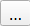

::::{grid} auto
:::{grid-item-card}
:class-card: sd-text-center sd-rounded-circle
:link: ../intro 
{octicon}`home-fill;1.5em;sd-text-danger`
:::

::::

# Exercises 1: Automation <a id="exercises-1-automation"></a>

🚧This part of training platform is under ⚠️construction⚠️ and may not be shared or published! 🚧

## Characteristics of the exercise <a id="characteristics-of-the-exercise"></a>


::::{grid} 2
:::{grid-item-card}
__Type of trainings exercise:__
^^^

- This exercise can be used in online and presence training. 
- It can be done as a follow-along exercise or individually as a self-study.

:::

:::{grid-item-card}


:::

::::

::::{grid} 2
:::{grid-item-card}
__Estimated time demand for the exercise__
^^^


:::

:::{grid-item-card}
__Relevant Wiki Articles__
^^^

* [Zonal Statistics](../Wiki/en_qgis_raster_basic_wiki.md)
* [Intersection](../Wiki/en_qgis_spatial_joins_wiki.md#join-attributes-by-location-summary)
* [Projections](../Wiki/en_qgis_projections_wiki.md)
* [Buffer](../Wiki/en_qgis_projections_wiki.md)
* [Clip](../Wiki/en_qgis_projections_wiki.md)
* [Automation](../Wiki/en_qgis_automation_wiki.md)

:::

::::

:::{card}
:class-card: sd-border-1 sd-shadow-none
__Aim of the exercise:__
Aina, the GIS expert at the Malagasy Red Cross (CRM), is preparing for the upcoming cyclone season. She wants to improve her team’s ability to act quickly once a storm is forecasted by automating key analyses in QGIS. These include estimating exposed populations, identifying impacted services like health and education, and assessing whether health posts can be reached from key warehouses within a critical 10-hour window.
The goal is to prepare an end-to-end analysis and visualization workflow that can support fast, data-driven anticipatory action before a cyclone makes landfall.
^^^


:::

## Instructions for the trainers <a id="instructions-for-the-trainers"></a>

:::{dropdown} __Trainers Corner__ 

### Prepare the training <a id="prepare-the-training"></a>

- Take the time to familiarise yourself with the exercise and the provided material.
- Prepare a white-board. It can be either a physical whiteboard, a flip-chart, or a digital whiteboard (e.g. Miro board) where the participants can add their findings and questions. 
- Before starting the exercise, make sure everybody has installed QGIS and has downloaded __and unzipped__ the data folder.
- Check out [How to do trainings?](../Trainers_corner/en_how_to_training.md#how-to-do-trainings) for some general tips on training conduction

### Conduct the training <a id="conduct-the-training"></a>

__Introduction:__

- Introduce the idea and aim of the exercise.
- Provide the download link and make sure everybody has unzipped the folder before beginning the tasks.

__Follow-along:__

- Show and explain each step yourself at least twice and slow enough so everybody can see what you are doing, and follow along in their own QGIS-project. 
- Make sure that everybody is following along and doing the steps themselves by periodically asking if anybody needs help or if everybody is still following.  
- Be open and patient to every question or problem that might come up. Your participants are essentially multitasking by paying attention to your instructions and orienting themselves in their own QGIS-project.

__Wrap up:__

- Leave time for any issues or questions concerning the tasks at the end of the exercise.
- Leave some time for open questions. 

:::

## Available Data <a id="available-data"></a>

:::{card}
:link: https://nexus.heigit.org/repository/gis-training-resource-center/Module_7/Exercise_1.zip

__Download all datasets [here](https://nexus.heigit.org/repository/gis-training-resource-center/Module_7/Exercise_1.zip), save the folder on your computer and unzip the file.__ 

:::

The folder is called “ and contains the whole [standard folder structure](../Wiki/en_qgis_projects_folder_structure_wiki.md#standard-folder-structure) with all data in the input folder and the additional documentation in the documentation folder.

| Dataset| Source | Descriptions |
| ----- | --- | --- |
| Administrative Boundaries | [HDX](https://data.humdata.org/dataset/cod-ab-mdg) | The administrative boundaries on level 0-4 for Madagascar can be accessed via HDX provided by OCHA. For this trigger mechanism we provide the administrative boundaries on level 1 (regional level) and 2 (district level) as a shapefile. |
| Cyclone Tracks | [International Best Track Archive for Climate Stewardship (IBTrACS)](https://www.ncei.noaa.gov/products/international-best-track-archive)  | IBTrACS project is the most complete global collection of tropical cyclones available. It merges recent and historical tropical cyclone data from multiple agencies to create a unified, publicly available, best-track dataset that improves inter-agency comparisons.  |
| education facilities and health sites| [HOT Export Tool](https://export.hotosm.org/vi/v3/exports/new/describe) | The POI data (education facilities and health sites) is downloaded using the HOT Export Tool based on OpenStreetMap data. |
| Population | [WorldPop](https://hub.worldpop.org/geodata/summary?id=49646) | The worldpop dataset in raster format provides the estimated total number of people per grid-cell for the year 2020. We will be working with the Constrained Individual countries 2020 dataset at a resolution of 100m. |


:::{card} 
__Context__
^^^

```{figure} ../../../fig/IFRC-icons-colour_SURGE.png
---
width: 100px
align: right
name: IFRC Surge Icon
---
```

**Aina** is the GIS expert at the **Croix-Rouge Malagasy (CRM)**. With the cyclone season approaching, she knows that time is of the essence once a storm is forecasted. Every hour counts when it comes to protecting communities at risk.

This year, Aina wants to be one step ahead. Instead of manually analyzing cyclone data under pressure, she decides to **prepare an automated QGIS model** that will help her respond quickly and efficiently.

**Her goal:**  
> Build a workflow that automatically estimates exposed populations and infrastructure at risk.

:::

```{figure} ../../../fig/Module_7/en_ex_m7_cylone_automatisation.drawio.png
---
name: Task_1_workflow
width: 750 px
---

```

## Task 1: Estimating Exposed Population – Aina’s Manual Approach <a id="task-1-estimating-exposed-population-ainas-manual-approach"></a>

Before developing the automated model, Aina used to estimate the exposed population manually whenever a cyclone approached Madagascar. In this task, you will follow the steps she used in the past by working with the historical track of **Cyclone Harald**, WorldPop raster data, and administrative boundaries.

You will manually buffer the cyclone track, clip the population raster, and calculate exposed population using zonal statistics.


1. **Open QGIS** and create a [new project](../Wiki/en_qgis_projects_folder_structure_wiki.md#step-by-step-setting-up-a-new-qgis-project-from-scratch) by clicking on `Project` → `New`

2. **Save the project** in the “project” folder. To do that click on `Project` → `Save as` and navigate to the folder. Name the project “Cyclon_Harald_Exposure”.

3. **Load the GeoJOSN** file "example_Harald_2025_Track.geojson" in your project by drag and drop ([Wiki Video](../Wiki/en_qgis_import_geodata_wiki.md#open-vector-data-via-drag-and-drop)) . Open the folder `data` → `input`.


4. **Reproject the cyclone track** to use meters instead of degrees (important for accurate buffering):
   - In the **Processing Toolbox**, search for `Reproject Layer`.
   - Input: `example_Harald_2025_Track`
   - Target CRS: `EPSG:29738` or another meter-based CRS appropriate for Madagascar.
   - Save the result in the `temp` folder as: **`Harald_Track_Reprojected`**
```{figure} ../../../fig/fr_MDG_AA_reproject_cyclon_track.PNG
---
width: 600px
align: center
---
Reprojetter la trajectoire du cyclone.
```

```{Attention}
Buffer distances must be calculated in meters. Many datasets (like GeoJSON cyclone tracks) use geographic coordinate systems like EPSG:4326, which measure in degrees — not meters. To correctly calculate a 200 km buffer, we must first reproject the track into a projected CRS that uses meters.
```
5. **Buffer the cyclone track**:
   - In the **Processing Toolbox**, search for `Buffer`.
   - Input: `Harald_Track_Reprojected`
   - Buffer distance: `200000` (meters)
   - Segments: Leave default (5)
   - Dissolve: `Yes`
   - Save output in the `temp` folder as: **`Harald_Buffer_200km`**
```{figure} ../../../fig/fr_MDG_AA_cyclon_track_buffer.PNG
---
width: 600px
align: center
---
Tamponner la trajectoire du cyclone
```

:::{dropdown} Intermediate Result: Buffer
```{figure} ../../../fig/fr_MDG_AA_intermediate_result_cyclon_track_buffer.PNG
---
width: 600px
align: center
---
Les résultats intermédiaires doivent montrer la trajectoire du cyclone et la zone tampon de 200 kilomètres autour de celui-ci. La zone tampon doit être une seule entité.
```
:::
6. **Reproject the buffer back to EPSG:4326 (to match the raster's CRS):**
   - In the Processing Toolbox, search for Reproject Layer.
   - Input: Harald_Buffer_200km_29738
   - Target CRS: EPSG:4326 – WGS 84
   - Save the output in the temp folder as: Harald_Buffer_200km_4326
```{figure} ../../../fig/fr_MDG_AA_reproject_cyclon_buffer.PNG
---
width: 600px
align: center
---
Reprojetter la tamponner trajectoire du cyclone
```
   
7. **Load the administrative boundaries**:
   - File: `mdg_admbnda_adm2_BNGRC_OCHA_20181031.gpkg`
   - Add using drag and drop or `Add Vector Layer`.
8. **Load the population raster**:
   - File: `MDG_WorldPop_2020_constrained.tif`
   - Add using `Layer` → `Add Raster Layer`.
9. **Clip the population raster** using the buffered impact zone:
   - In the **Processing Toolbox**, search for `Clip Raster by Mask Layer`.
   - Input raster: `MDG_WorldPop_2020_constrained`
   - Mask layer: `Harald_Buffer_200km`
   - Save output in the `temp` folder as: **`Harald_Pop_Clip`**
```{figure} ../../../fig/fr_MDG_AA_clip_pop_raster.PNG
---
width: 600px
align: center
---
Découpez la population ratser selon la zone affectée par le cyclone (trajectoire tampon du cyclone)
```
:::{dropdown} Intermediate Result: Clip Population Raster Alyer
```{figure} ../../../fig/fr_MDG_AA_intermediate_result_clip_pop_raster.PNG
---
width: 600px
align: center
---
Résultat intermédiaire du découpage de la couche raster de population à l'étendue de la trajectoire tamponnée du cyclone.
```
:::

10. **Calculate total exposed population**:
   - In the **Processing Toolbox**, search for `Zonal Statistics`.
   - Input vector layer: `mdg_admbnda_adm2_BNGRC_OCHA_20181031.gpkg`
   - Raster layer: `Harald_Pop_Clip`
   - Statistic to calculate: `Sum`
   - Field prefix: e.g., `exposed_population_`
   - Save the updated vector layer in the `result` folder as: **`Harald_Exposed_Populationg`**
   - The result will be a new column in the attribute table of the `mdg_admbnda_adm2_BNGRC_OCHA_201810312.gpkg` layer, showing the total population within the cyclone buffer per district.
```{figure} ../../../fig/fr_MDG_AA_pop_zonal_statistic.PNG
---
width: 600px
align: center
---
Calcul de la population exposée aux cyclones par district sur la base du raster de population.
```
   
11. **Visualise the affected population by classifying the results**:
Now that Aina has estimated the exposed population in each district, she wants to clearly show the differences across regions on the map.
To do this, we'll apply a **graduated classification** to the `Harald_Exposed_Population` layer using the new population field created by the Zonal Statistics tool.
- In the **Layers panel**, right-click on the layer `Harald_Exposed_Population` and choose `Properties`.
- Go to the **Symbology** tab on the left.
- At the top of the window, change the style from `Single Symbol` to `Graduated`.
- In the **Value** drop-down menu, select the field that contains the population sum. It typically starts with the prefix you defined earlier, e.g. `exposed_population_sum`.
- Set the **color ramp** to one that suits your map (e.g. `Reds`).
- Choose a **classification mode** (e.g. `Quantile`, `Natural Breaks`, or `Equal Interval`) and select the number of classes (e.g. 5).
- Click `Classify` to generate the classification.
- Click `Apply` and then `OK` to display the classified map.

```{tip}
You can adjust class boundaries or labels by double-clicking on each class entry.
```
```{figure} ../../../fig/fr_MDG_AA_pop_graduadt_classification_exposed_population.PNG
---
width: 600px
align: center
---
Configuration of the visualisation of the exposed population in five classes. 
```

Your results should look something like this: 

```{figure} ../../../fig/fr_MDG_AA_intermediate_result_visualisation_exposed_population.PNG
---
width: 600px
name: the_world_result
align: center
---
Visualisation de la population exposée en cinq classes.
```


## Task 2: Automation of Exposed Population Estimation – Aina's Model <a id="task-2-automation-of-exposed-population-estimation-ainas-model"></a>

After manually estimating exposed populations in past cyclone seasons, Aina has decided to prepare an **automated model** using the **QGIS Graphical Modeller**. This will help her move faster and avoid repeating the same steps manually each time a cyclone is forecasted.

In this task, you will help Aina build a simple version of that model using the tools from Task 1. The model should:

- Reproject the cyclone track to EPSG:29738  
- Buffer the cyclone track  
- Reproject the buffer back to EPSG:4326  
- Clip the population raster  
- Run Zonal Statistics to get exposed population per district

---

1. **Set up the model structure**:
   - Open the **Graphical Modeler** from the top menu:  
     `Processing` → `Graphical Modeler…`

2. **Naming the model**:   
   - A new model window will open. On the **left side**, click on **`Model Properties`** to define basic information about the model:
     - **Model Name**: `Estimate_Exposed_Population`
     - **Group**: `Cyclone Trigger Tools`
     - Leave the description empty or write: _“Automated model to estimate exposed population based on cyclone buffer.”_

3. **Save the model**
   - To save the model:
     - Click the **Save** icon (💾) or go to `Model` → `Save`.
     - Navigate to the **`models` folder** of your training structure.
     - Save the model as:  
       **`Estimate_Exposed_Population`**

4. **Add model inputs**:  
   - On the **left panel**, expand the **Inputs** section.
   - Add the following input layers with type constraints:
     - `+ Vector Layer`  
       - **Label**: `Cyclone Track`  
       - In the **Advanced panel**, set **geometry type** to `Line`
     - `+ Raster Layer`  
       - **Label**: `Population Raster`
     - `+ Vector Layer`  
       - **Label**: `Admin Boundaries`  
       - In the **Advanced panel**, set **geometry type** to `Polygon`
   - These will appear at the top of your model canvas and serve as the input data when the model is run.

     ```{tip}
     All inputs should be set as **mandatory**, so the model always receives the necessary data to run correctly.
     ```

::::{tab-set}

:::{tab-item} Input Cyclon Track
```{figure} ../../../fig/fr_MDG_AA_model_input_cyclon_track.PNG
---
width: 600px
align: center
---
Definition of the model input: Cyclon Track
```
:::

:::{tab-item} Input Admin Boundaries 
```{figure} ../../../fig/fr_MDG_AA_model_input_admin_bounderies.PNG
---
width: 600px
align: center
---
Definition of the model input: Admin Bounderies
:::

:::{tab-item} Population Raster
```{figure} ../../../fig/fr_MDG_AA_model_input_population_raster.PNG
---
width: 600px
align: center
---
Definition of the model input: Population Raster
```
:::
::::
**Intermediate Result**

```{figure} ../../../fig/fr_MDG_AA_intermediate_result_model_input.PNG
---
width: 600px
name: the_world_result
align: center
---
Résultat intermédiaire de la définition des données d'entrée du modèle
```

5. **Reproject the cyclone track to EPSG:29738**  
   - From the **Algorithms** panel, search for **Reproject Layer** .
   - In the configuration window:
     - Add a description: `Reprojecter la couche de trajectoire du cyclone a EPSG : 29738`
     - Set **Input layer** to `Cyclone Track` (from **Model Input**).
     - Set **Target CRS** to `EPSG:29738 – Madagascar / Laborde Grid`.
     - Set the output to **Model Output** (leave the output name **empty**).
   - Click `OK` to add the step to the model.
```{figure} ../../../fig/fr_MDG_AA_model_reporject_cyclon_track.PNG
---
width: 600px
name: the_world_result
align: center
---
Reprojecter la couche de trajectoire du cyclone vers un système de référence de coordonnées métrique (CRS) EPSG : 29738
```
6. **Buffer the reprojected cyclone track**  
   - From the **Algorithms** panel, search for **Buffer**.
   - In the configuration window:
    - Add a description:  `Mettre en mémoire tampon la couche Cyclone reprojetée`
     - Add a description: 
     - Set **Input layer** to the output from the previous step (from **Algorithm Output**).
     - Set **Distance** to `200000` (200 km).
     - Leave **Segments** at the default value (`5`).
     - Set **Dissolve result** to `Yes`.
     - Set the output to **Model Output** (leave the output name **empty**).
   - Click `OK` to add the step to the model.
```{figure} ../../../fig/fr_MDG_AA_model_buffer_cyclon_track.PNG
---
width: 600px
name: the_world_result
align: center
---
Mettre en mémoire tampon la couche Cyclone reprojetée
```
7. **Reproject the buffer back to EPSG:4326**  
   - From the **Algorithms** panel, search for **Reproject Layer**.
   - In the configuration window:
    - Add a description:  `Reprojecter le tampon vers EPSG:4326`
   - In the configuration window:
     - Set **Input layer** to the output from the previous step (from **Algorithm Output**).
     - Set **Target CRS** to `EPSG:4326 – WGS 84`.
     - Set the output to **Model Output** (leave the output name **empty**).
   - Click `OK` to add the step to the model.
```{figure} ../../../fig/fr_MDG_AA_model_reporject_bufferd_cyclon_track.PNG
---
width: 600px
name: the_world_result
align: center
---
Reprojecter le tampon vers EPSG:4326
```
8. **Clip the population raster using the buffered area**  
   - From the **Algorithms** panel, search for **Clip Raster by Mask Layer** .
   - In the configuration window:
     - Add a description: `Découper la couche raster de population pour l'étendre au tampon Cyclon`
   - In the configuration window:
     - Set **Input layer** to `Population Raster` (from **Model Input**).
     - Set **Mask layer** to the output from the previous step (from **Algorithm Output**).
     - Set the output to **Model Output** (leave the output name **empty**).
   - Click `OK` to add the step to the model.
```{figure} ../../../fig/fr_MDG_AA_model_clip_pop_raster.PNG
---
width: 600px
name: the_world_result
align: center
---
Découper la couche raster de population pour l'étendre au tampon Cyclon
```
9. **Calculate zonal statistics to estimate exposed population**  
   - From the **Algorithms** panel, search for **Zonal Statistics** .
   - In the configuration window: Calcul de la population exposée aux cyclones par district
     - Add a description: `Calcul de la population exposée aux cyclones par district`
     - Set **Input layer** to `Admin Boundaries` (from **Model Input**).
     - Set **Raster layer** to the output of the previous step (from **Algorithm Output**).
     - Set **Output column prefix** to `exposed_population_`.
     - Under **Statistics to calculate**, select `Sum`.
     - Set the output to **Model Output** and name it: 
      ```
      exposed_population_sum
      ```
   - Click `OK` to add the step to the model.
```{figure} ../../../fig/fr_MDG_AA_model_zonal_statistic_pop_admin2.PNG
---
width: 600px
name: the_world_result
align: center
---
Calcul de la population exposée aux cyclones par district
```

**Your results should look something like this:** 

```{figure} ../../../fig/fr_MDG_AA_intermediate_result_model_algorythms.PNG
---
width: 600px
name: the_world_result
align: center
---
Votre modèle devrait ressembler à ceci. Tous les algorithmes sont correctement connectés et la sortie du modèle est définie.
```

10. **Validate your model (recommended)**
   - Before saving or running, click the ✔️ **Validate Model** button in the top toolbar.
   - Fix any warnings or errors shown in the log panel.
   - This helps ensure your model is complete and won't break during execution.

11. **Run the model**  
   - Run the model by clicking on `Model` -> `Run Model`
   - Set **Admin Bounderies** to `mdg_admbnda_adm2_BNGRC_OCHA_20181031.gpkg`
   - Set **Cyclone Track** to `example_Harald_2025_Track`
   - Set **Population Raster** to `MDG_WorldPop_2020_constrained.tif`
   - Set the model output **exposed_population_sum** to `Harald_Exposed_Population`and save it in the `data` -> `output`


You can now run this model any time a new cyclone track becomes available.

```{figure} ../../../fig/fr_MDG_AA_model_run_model_M7_e1_task2.PNG
---
width: 600px
name: the_world_result
align: center
---
Pour exécuter le modèle, spécifiez l'entrée comme indiqué dans l'image et définissez le nom de la couche de sortie.
```

**Your results should look something like this:**
```{figure} ../../../fig/fr_MDG_AA_intermediate_result_model_task1_basics.PNG
---
width: 600px
name: the_world_result
align: center
---

``` 
12. **Add the cyclone buffer as an additional model output**  
   - Double-click on the algorithm from step 7 (**Reproject the buffer back to EPSG:4326**) to open its configuration.  
   - In the **Output layer** field, check the box for **Model Output**.  
   - Give the output a clear name, for example:
     ```
     cyclone_harald_buffer
     ```  
   - Click `OK` to save the change.  
   - This will allow the model to produce both the exposed population results and the buffered cyclone impact zone when it is run.

```{figure} ../../../fig/fr_MDG_AA_model_output_buffer.PNG
---
width: 600px
name: the_world_result
align: center
---
```

13. **Run the model again**  
   - Run the model by clicking on `Model` -> `Run Model`
   - Set **Admin Bounderies** to `mdg_admbnda_adm2_BNGRC_OCHA_20181031.gpkg`
   - Set **Cyclone Track** to `example_Harald_2025_Track`
   - Set **Population Raster** to `MDG_WorldPop_2020_constrained.tif`
   - Set the model output **cyclone_harald_buffer** to `cyclone_harald_buffer`and save it in the `data` -> `output`
   - Set the model output **exposed_population_sum** to `Harald_Exposed_Population`and save it in the `data` -> `output`


::::{tab-set}


:::{tab-item} Graphic Modler Output Buffer 

```{figure} ../../../fig/fr_MDG_AA_intermediate_result_model_task1_buffer_output_model_graphic.PNG
---
width: 600px
name: the_world_result
align: center
---
```
Definition of the model input: Admin Bounderies
:::

:::{tab-item} Run Model with Buffer Output
```{figure} ../../../fig/fr_MDG_AA_intermediate_result_model_task1_buffer_output_model_model_exicution.PNG
---
width: 600px
align: center
---
Definition of the model input: Population Raster
```
:::

:::{tab-item} Model Output
```{figure} ../../../fig/fr_MDG_AA_intermediate_result_model_algorythms_extended_buffer.PNG
---
width: 600px
align: center
---
Definition of the model input: Population Raster
```
:::

::::


## Task 3: Identifying Affected Health Facilities and Schools – Aina Adds More Layers <a id="task-3-identifying-affected-health-facilities-and-schools-aina-adds-more-layers"></a>

After building her model to estimate exposed population, Aina wants to expand its usefulness. She decides to also **identify critical services** affected by cyclones — especially **health facilities** and **schools**. 

Not only does she want to know *which* facilities are affected, but also *how many in total exist* per district. That way, she can calculate the **percentage of services affected** in each area.

To achieve this, she will use two point datasets from OpenStreetMap:

- [Health facilities](https://data.humdata.org/dataset/hotosm_mdg_health_facilities)  
- [Education facilities](https://data.humdata.org/dataset/hotosm_mdg_education_facilities)

1. **Load the health and education facilities datasets**
First, let's have a look at the data we want to work with.
- Navigate to your `input` data folder.  
- Drag and drop the following layers into your QGIS project:  
  - `hotosm_mdg_health_facilities`  
  - `hotosm_mdg_education_facilities`  
- Confirm that both layers are visible in the **Layers Panel** 
2. **Save your model under a new name**  
   - Open your existing model `Estimate_Exposed_Population.model3`.
   - Immediately save it under a new name:
     - Click `Model` → `Save As…`
     - Save it to the `project` folder as:
```  
Estimate_Exposed_Population_Health_Education
```
3. **Add new model inputs**  
   - In the **Inputs** section, add:
     - `Vector Layer`  
       - **Description**:
        ```
        Health Facilities
        ```
       - Set **Geometry Type** to `Point`
     - `Vector Layer`  
       - **Description**:
        ```
        Education Facilities
        ``` 
       - Set **Geometry Type** to `Point`
::::{tab-set}

:::{tab-item} Model Input: Health Facilities
```{figure} ../../../fig/fr_MDG_AA_model_input_health_facilities.PNG
---
width: 300px
name: the_world_result
align: center
---
Définir une nouvelle entrée de modèle : couche vectorielle de points représentant les établissements de santé
```
:::
:::{tab-item} Model Input: Education Facilities
```{figure} ../../../fig/fr_MDG_AA_model_input_education_facilities.PNG
---
width: 300px
align: center
---
Définir une nouvelle entrée de modèle : couche vectorielle de points représentant les établissements d'enseignement
```
:::
::::
3. **Count All Health Facilities per Admin 2**  
   - From the **Algorithms** panel, search for **Count Points in Polygon**.
   - Configuration:
     - Add a description: `Comptez le nombre d'établissements de santé dans chaque district.`
     - **Polygon layer**: `Admin Boundaries` (Model Input)
     - **Points layer**: `Health Facilities` (Model Input)
     - **Count field name**: 
      ```
      Count_health_total
      ```
     - Leave output as **Model Output**
```{figure} ../../../fig/fr_MDG_AA_model_count_points_HF_admin2.PNG
---
width: 600px
align: center
---
Configuration de l'opération : compter le nombre d'établissements de santé dans chaque district.
```    
4. **Count All Education Facilities per Admin 2**  
   - Add another **Count Points in Polygon** step.
   - Configuration:
     - Add a description: `Comptez le nombre d'établissements de education dans chaque district`
     - **Polygon layer**: `Admin Boundaries` (Model Input)
     - **Points layer**: `Education Facilities` (Model Input)
     - **Count field name**: 
      ```
      count_education_total
      ```
     - Leave output as **Model Output**
```{figure} ../../../fig/fr_MDG_AA_model_count_points_EF_admin2.PNG
---
width: 600px
align: center
---
Configuration de l'opération : compter le nombre d'établissements scolaires dans chaque district.
```
5. **Intersect Health Facilities with Cyclone Buffer**  
   - From the **Algorithms** panel, search for **Intersection**.
   - In the configuration window:
   - Add a description: 
      ```
      Établissements de santé dans la zone d'impact du cyclone
      ```  
     - **Input layer**: `Health Facilities` (Model Input)
     - **Overlay layer**: buffered cyclone zone (use “Reprojected to EPSG:4326” from **Algorithm Output**)
     - Leave output as **Model Output** 
   - Click `OK`.
```{figure} ../../../fig/fr_MDG_AA_model_clip_intersect_HF_cyclone_buffer.PNG
---
width: 600px
align: center
---
Configuration de l'opération : intersecter les établissements de santé avec la zone d'impact du cyclone.
```
6. **Intersect Education Facilities with Cyclone Buffer**  
   - Add another **Intersection** algorithm.
   - Configuration:
     - Add a description:
       ```
       Établissements de education dans la zone d'impact du cyclone.
       ```  
     - **Input layer**: `Education Facilities` (Model Input)
     - **Overlay layer**: buffered cyclone zone (use “Reprojected to EPSG:4326” from **Algorithm Output**)
     - Leave output as **Model Output**
   - Click `OK`.
```{figure} ../../../fig/fr_MDG_AA_model_clip_intersect_EF_cyclone_buffer.PNG
---
width: 600px
align: center
---
Configuration de l'opération : intersecter les établissements de education avec la zone d'impact du cyclone.
```
7. **Count Affected Health Facilities per Admin 2**  
   - Add **Count Points in Polygon**
   - Add a description: `Compter les établissements de santé touchés par district`
   - Configuration: 
     - Add a description: Compter les établissements de santé touchés par district
       ```
       Compter les établissements de santé touchés par district
       ```  
     - **Polygon layer**: Count total health facilities output
     - **Points layer**: intersected health facilities output
     - **Count field name**: 
       ```
       sum_exposed_health
       ```  
```{figure} ../../../fig/fr_MDG_AA_model_count_points_HF_affected_admin2.PNG
---
width: 600px
align: center
---
Configuration de l'opération : compter les établissements de santé touchés par district.
```
8. **Count Affected Education Facilities per Admin 2**  
   - Add **Count Points in Polygon**
   - Add a description: `Compter les établissements education touchés par district`
   - Configuration:
     - Add a description: 
       ```
       Compter les établissements education touchés par district
       ```   
     - **Polygon layer**: Count total education facilities output
     - **Points layer**: intersected education facilities output
     - **Count field name**: 
       ```
       sum_exposed_education
       ```  
```{figure} ../../../fig/fr_MDG_AA_model_count_points_EF_affected_admin2.PNG
---
width: 600px
align: center
---
Configuration de l'opération : compter les établissements de santé touchés par district.
```
9. **Calculate percentage of affected Health Facilities**
To compute the percentage of affected health sites per administrative area, we will use the **Field Calculator**:
- Add the  **Field Calculator**:
   - Add a description: `Calculer le pourcentage d’établissements de santé touchés par district`
   - Configuration:
     - Add a description:
       ```
       Calculer le pourcentage d’établissements de santé touchés par district
       ```  
    - **Input layer**: the output of Count Affected Health Facilities per Admin 2
    - **Output field name**:  
       ```
       pct_exposed_health
       ``` 
    - **Field type**: Decimal (real)
    - **Expression**:
    ```qgis
     CASE WHEN "count_health_total" > 0
     THEN "sum_exposed_health" / "count_health_total" * 100
     ELSE 0
     END
    ```
  - Set the output as **Model Output**
  - Name it:
   ```
   admin2_health_affected
   ```
```{figure} ../../../fig/fr_MDG_AA_model_field_calc_pct_health_exposed.PNG
---
width: 600px
align: center
---
Configuration de l’opération : calculer le pourcentage d’établissements de santé touchés par district.
```
10. **Calculate percentage of affected Education Facilities**
To compute the percentage of affected education sites per administrative area, we will use the **Field Calculator**:  
- Add the **Field Calculator**:  
   - Add a description: `Calculer le pourcentage d’établissements d’éducation touchés par district`
   - Configuration:  
     - Add a description:  
       ```
       Calculer le pourcentage d’établissements d’éducation touchés par district
       ```  
     - **Input layer**: the output of Count Affected Education Facilities per Admin 2  
     - **Output field name**:  
       ```
       pct_exposed_education
       ```  
     - **Field type**: Decimal (real)  
     - **Expression**:  
       ```qgis
       CASE WHEN "count_education_total" > 0
       THEN "sum_exposed_education_POI" / "count_education_total" * 100
       ELSE 0
       END
       ```  
   - Set the output as **Model Output**  
   - Name it:  
     ```
     admin2_education_affected
     ```
```{figure} ../../../fig/fr_MDG_AA_model_field_calc_pct_education_exposed.PNG
---
width: 600px
align: center
---
Configuration de l’opération : calculer le pourcentage d’établissements d’éducation touchés par district.
```
11. **Validate and Save Your Extended Model**  
   - Click the ✔️ **Validate Model** button to check for errors.
   - Save again to:  
     **`Estimate_Exposed_Population_Health_Education.model3`**
12. **Run the model**
   - Click the ▶️ `Run` button in the top-right corner of the Graphical Modeler window.
   - **Input:**
     - Click on the three dots for each input dataset and select the correct input:
       - `Cyclone Track` → select the GeoJSON of the storm path (e.g. `Harald_2025_Track.geojson`)
       - `Population Raster` → select the WorldPop raster file
       - `Admin Boundaries` → select the Admin 2 layer (e.g. `MDG_adm2.gpkg`)
       - `Health Facilities` → select the point dataset for health sites
       - `Education Facilities` → select the point dataset for schools
   - **Output:**
     - Save all output layers in the output folder and use the names below.
       - `admin2_health_affacted` -> 
        ```
        admin2_health_affected
        ```
       - `admin2_education_affected` ->
        ```
        admin2_education_affected
        ```
       - `cyclone_harald_buffer` ->  
        ```
        cyclone_harald_buffer
        ```
       - `exposed_population_sum` ->
        ```
        admin2_harald_Exposed_Population
        ```
   - Click `Run` to execute the full model.

::::{tab-set}

:::{tab-item} Graphic Modler

```{figure} ../../../fig/fr_MDG_AA_intermediate_result_model_algorythms_task3_exposed_HF_EF_model.PNG
---
width: 600px
align: center
---
Vue d’ensemble du Modèle Graphique de la tâche 3 montrant tous les algorithmes connectés et les sorties définies.
```
:::
:::{tab-item} Run Model Configuration
```{figure} ../../../fig/fr_MDG_AA_intermediate_result_model_algorythms_task3_exposed_HF_EF_run_configurations.PNG
---
width: 600px
align: center
---
Configuration des paramètres pour exécuter le modèle de la tâche 3 avec toutes les couches d’entrée requises.
```
:::
:::{tab-item} Model Output
```{figure} ../../../fig/fr_MDG_AA_intermediate_result_model_algorythms_task3_exposed_HF_EF_model_results_AT.PNG
---
width: 600px
align: center
---
Résultats du modèle de la tâche 3 affichés dans QGIS, y compris les pourcentages d’établissements de santé et d’éducation touchés par district.
```
:::
::::

---

## Task 4: Visualizing Cyclone Impact Results – Aina Styles Her Layers <a id="task-4-visualizing-cyclone-impact-results-aina-styles-her-layers"></a>

Aina now has all the analysis results she needs — but numbers and tables alone won’t convince her colleagues or decision-makers. What they need are clear and easy-to-read maps that can be used directly in meetings and reports.

To save time, Aina doesn’t want to adjust colors and legends manually each time a new cyclone comes in. Instead, she will use ready-made style files (.qml) that instantly give layers a professional and consistent look. Where no style exists yet, she will create one herself, so that next time the map can be updated with just a few clicks.

In this task, you will help Aina make her cyclone impact maps both informative and visually compelling by applying and creating QGIS style files.

### 1. **Load Required Layers (if not already loaded)** <a id="1-load-required-layers-if-not-already-loaded"></a>

Make sure the following layers are already loaded into your QGIS project. These are outputs from **Task 3**:

- `example_Harald_2025_Track`
- `cyclone_harald_buffer`
- `Harald_Exposed_Population`
- `admin2_health_affected`
- `admin2_education_affected`

If any are missing:
- Load them using **drag & drop** from your `results` folder, or
- Use `Layer` → `Add Layer` → `Add Vector Layer` or `Add Raster Layer`

---

### 2. **Apply Predefined Style Files** <a id="2-apply-predefined-style-files"></a>
Apply the following`.qml` style files to the respective layers:

| **Layer**                   | **Style File**                           |
|-----------------------------|------------------------------------------|
| `example_Harald_2025_Track` | `storm_track_cyclone_style.qml`          |
| `cyclone_harald_buffer`     | `exposed_cyclone_area_style.qml`         |
| `Harald_Exposed_Population` | `exposed_population_style.qml`           |
| `admin2_health_affected`    | `exposed_healthsites_style.qml`          |
| `admin2_education_affected` | `exposed_education_facilities_style.qml` |

```{note}
⚠️ For the **health** and **education facilities**, the provided style files are linked to the column containing the **sum of exposed facilities**.  
They are **not** based on the percentage column.  
```


**Steps:**
- Right-click on the layer in the `Layers Panel`.
- Select `Properties`.  
- In the window that opens, go to the `Symbology`tab.  
- At the bottom left, click `Style` → `Load style...`
- Click on the three points   
- Navigate to the corresponding `.qml` file in the folder `layer_sytle`and select it  
- Click `Open`, then `Apply` and `OK` to confirm.  

<video width="100%" controls muted src="https://github.com/GIScience/gis-training-resource-center/raw/main/fig/fr_MDG_model_output_style.mp4"></video>

> 💡 *If the style doesn’t load correctly, double-check the column names and make sure the column name used in the `.qml` file matches the one in your layer. To do this, open the **Attribute Table** of the layer and compare field names.*

---


::::{tab-set}

:::{tab-item} Intermediate result: Exposed Population

```{figure} ../../../fig/fr_MDG_AA_intermediate_result_model_task4_exposed_pop_style.PNG
---
width: 600px
align: center
---
Carte montrant le nombre de personnes exposées par district après l’application du style .qml.
```
:::
:::{tab-item} Intermediate result: Exposed Health Facilities
```{figure} ../../../fig/fr_MDG_AA_intermediate_result_model_task4_exposed_HS_sum_style.PNG
---
width: 600px
align: center
---
Carte indiquant le nombre total d’établissements de santé exposés par district, représentés avec le style prédéfini.
```
:::
:::{tab-item} Intermediate result: Exposed Education Facilities
```{figure} ../../../fig/fr_MDG_AA_intermediate_result_model_task4_exposed_ES_sum_style.PNG
---
width: 600px
align: center
---
Carte affichant le nombre total d’établissements scolaires exposés par district, après application du fichier de style .qml.
```
:::
::::


### 3. **Style Percentage Layers Manually** <a id="3-style-percentage-layers-manually"></a>

Aina also wants to visualise the percentage of exposed health and education facilities. However, since there is no prepared style available, she must complete the process manually.

**Steps:**
- **Right-click** on the layer `admin2_health_affected` → select **Duplicate Layer**  
- **Rename** the duplicated layer to:
  ```
  admin2_health_affected_percentage
  ```
- Right-click on the layer in the **Layers Panel**  
- Select **Properties**  
- In the window that opens, go to the **Symbology** tab  
- Set **Symbology** to `Graduated`
- Choose the correct **field**:
  - `pct_health_affected`
- Open the **Histogram** tab to view the value distribution by clicking on `calculate histogram`
- Next go back to `Classes` and set the following configuration:
  - **Mode**: `Equal Interval`
  - **Classes**: `4`
- Click `OK`.This will create four classes (`0–25%`, `25–50%`, `50–75%`, `75–100%`)
- Choose a color ramp (e.g., light yellow → dark red)
- Optionally customize class labels for clarity
- Click `Apply`.

<video width="100%" controls muted src="https://github.com/GIScience/gis-training-resource-center/raw/main/fig/fr_MDG_model_style_affacted_HS_pct.mp4"></video>

- Repeat the same process for the layer `admin2_education_affected`.
After duplicating the layer, rename the new one to:
 ```
 admin2_health_affected_percentage
``` 


> 🧠 *Why 4 equal classes?*  
> This helps visualize severity across districts using simple and interpretable risk categories. However, you can experiment with **Natural Breaks** if data is unevenly distributed.

---

### 4. **Save Your New Styles for Reuse** <a id="4-save-your-new-styles-for-reuse"></a>

Save your manually created styles as `.qml` files for future reuse.

**Steps:**
- Right-click on the layer in the **Layers Panel**  
- Select **Properties**  
- In the window that opens, go to the **Symbology** tab  
- Click on `Style` → `Save Style…`
- Save the file in the folder `layer_sytle`
- Use these filenames:
   ```
   health_pct_affected_style
  ```
  ```
  education_pct_affected_style
  ```


<video width="100%" controls muted src="https://github.com/GIScience/gis-training-resource-center/raw/main/fig/fr_MDG_model_style_save_new_style.mp4"></video>


### 5. *(Optional)* Import Styles into Your QGIS Library <a id="5-optional-import-styles-into-your-qgis-library"></a>

To reuse your styles in any future project:

- Go to `Settings` → `Style Manager`
- Click `Import/Export` → `Import Items`
- Browse to and select your saved `.qml` files

The styles will now appear as presets in the **Layer Styling Panel**.

---

## Task 5: Quick Map Creation – Aina Uses Map Templates <a id="task-5-quick-map-creation-aina-uses-map-templates"></a>

After all the hard work of analyzing data and styling layers, Aina is ready to **share her results**. But creating a professional-looking map from scratch every time would be slow and repetitive.  

To save time, she uses **map templates (.qpt files)** prepared by her team. These templates already contain the essential elements — map frames, legends, logos, titles, and scale bars. With them, Aina can turn her analysis into a **clean, consistent map** in just a few clicks.  

✅ **Goal**  
Apply a ready-made QGIS map template to quickly create and export maps that show cyclone impacts on population, health facilities, and schools.  


1. Load the pre-made print layout template

- Locate the template `cyclone_impact_population_map_template.qpt` in your project folder under:  
  `Map_Templates/`

- You can load the template **by drag-and-drop**:
  - Open your QGIS project.
  - Drag the `.qpt` file directly into QGIS — a new layout will be created automatically.

- Alternatively:
  - Go to `Project` → `New Print Layout`
  - Enter a name (e.g. `Harald_2025_population`)
  - Click `OK`
  - In the layout, go to `Layout` → `Import from Template…`
  - Select the file `cyclone_impact_overview_map_template.qpt` and click `Open`
 2. Check and set page size
- Right-click anywhere on the white canvas and choose `Page Properties`.
- On the right-side panel, ensure the following:
  - **Page Size**: A3
  - **Orientation**: Landscape

<video width="100%" controls muted src="https://github.com/GIScience/gis-training-resource-center/raw/main/fig/fr_MDG_load_mpa_template.mp4"></video>

3. Update the attribute table of exposed districts
- In the **Print Layout**, click on the attribute table (right-hand side of the layout).
- In the **Item Properties** panel:
  - Ensure the correct layer is selected `Harald_Exposed_population`
  - Click `Refresh Table Data`
  - Click `Attributes…` → in the upper part under **Fields** click on `Clear`
    - Then add the following layer by clicking on ➕ :
    - **Attribute**: `ADM1_EN`; `ADM2_EN`; `ADM2_PCODE`; `exposed_population_sum`
    - To sort the tabel content, under the **Sorting**  clicking on ➕ and add the column `AMD1_EN`
    - **Sort Order**: Ascending
  - Click `OK`.

<video width="100%" controls muted src="https://github.com/GIScience/gis-training-resource-center/raw/main/fig/fr_MDG_map_makingadjust_AT.mp4"></video>

  
```{admonition} ⚠️ Warning – Long Tables
If the attribute table you want to include is **longer than the map frame**, part of it will be cut off in the exported map.  
To fix this, open the table properties in the layout and **reduce the font size** until the full table fits.  
```


5. Adjust the legend
- In the layout, click on the **Legend** item.
- In the **Item Properties** panel:
  - Uncheck **Auto update**
  - Scroll to **Legend items** and remove all entries (🗑️)
  - Add the following relevant layers:
    - `example_Harald_2025_Track`
    - `cyclone_harald_buffer`
    - `Harald_Exposed_Population`
  - When selecting layers, check **Only visible layers**
  - Rename legend entries to match layout naming
    - `example_Harald_2025_Track` ->
     ```
     Cyclone Harald Track
     ```
    - `cyclone_harald_buffer`->
     ```
     Cyclone Harald 200 km Buffer
     ```
    - `Harald_Exposed_Population`->
     ```
     Number of exposed peopel
     ```

<video width="100%" controls muted src="https://github.com/GIScience/gis-training-resource-center/raw/main/fig/fr_MDG_adjust_map_making_Legend.mp4"></video>

6. **Update Logos and Icons**  
- The logos that need to be added to the map are represented by the red **X**.  
- Click on the image in the **Item List**.  
- Click on the three dots  next to the file path.  
- Browse to the folder `logos_pictures` and select the correct logo file.  

<video width="100%" controls muted src="https://github.com/GIScience/gis-training-resource-center/raw/main/fig/fr_MDG_map_making_update_logos.mp4"></video>


7. Review and update layout text elements
- Make sure all text elements are up to date, especially:
  - **Map title**
  - **Cyclone name and date**
  - **Author/Organization** (optional)
- Adjust font size or alignment if necessary

<video width="100%" controls muted src="https://github.com/GIScience/gis-training-resource-center/raw/main/fig/fr_MDG_mak_making_adjust_title.mp4"></video>

### ✅ Final Checklist <a id="final-checklist"></a>

| Task                                      | Done |
|-------------------------------------------|------|
| Page set to A3 Landscape                  | ☐    |
| Only relevant layer group active          | ☐    |
| Exposed districts attribute table updated | ☐    |
| Legend cleaned and renamed                | ☐    |
| All text elements updated                 | ☐    |

---


```{dropdown} Your final output should look like this after styling the layer
The map now clearly displays the exposed population within the affected districts The original storm track line — used as input data — is highlighted, as well as the buffered impact area, which serves as a proxy for identifying exposed districts.

On the right-hand side of the map, a list shows all exposed districts, including data on total population and exposed population. The districts (Admin 2) are organized under their corresponding regions (Admin 1).

```{figure} ../../../fig/MAD_Trigger_Impact_Population_Map_example.png
---
width: 1000px
name: 
align: center
---
```

## Task 6: Exporting Model Results for the Operations Team <a id="task-6-exporting-model-results-for-the-operations-team"></a>

**Background – Aina Supports Decision Makers**

After producing maps and visuals, Aina often gets requests from the operations team:  
> _“Can you send us the data in table format?”_

Instead of exporting these tables manually each time, Aina wants to automate this step within her model — ensuring that every run of the model produces clear, ready-to-use data files.

In this task, you’ll help Aina extend her existing model to export selected layers.

We will join the following layers step by step:

- `admin2_health_affected_pct`:  
  Contains the **total number of health facilities**, the **number of affected health facilities**, and the **percentage of affected health facilities**.

- `admin2_education_affected_pct`:  
  Contains the **total number of education facilities**, the **number of affected education facilities**, and the **percentage of affected education facilities**.

- `exposed_population`:  
  Contains the **total population per district** and the **exposed population** from the zonal statistics step.

---

1. Open your model
- Open `Estimate_Exposed_Population_Health_Education`
- Save a new version as:  
  ```
  Estimate_Exposed_Population_Health_Education_Spreadsheet_Export
  ```
2. Join Health and Education data into one layer
- In the **Algorithms**, search for `Join Attributes by Field Value`.
- Add a description: `Joindre santé et éducation dans une seule couche par ADM2`
- Configure the algorithm as follows:
  - **Input Layer**: `admin2_health_affected` (select from **Algorithm Output**)
  - **Input Layer 2**: `admin2_education_affected` (select from **Algorithm Output**)
  - **Table field**: 
   ```
   ADM2_PCODE
   ```
  - **Table field 2**: 
   ```
   ADM2_PCODE
   ```
  - **Layer 2 fields to copy**: Leave empty (all fields will be copied)
  - **Join type**: Take attributes of the first matching feature only (one-to-one)
  - Leave output as **Model Output**

```{figure} ../../../fig/fr_MDG_AA_model_join_affacted_pop.PNG
---
width: 600px
name: the_world_result
align: center
---
Configuration de l’opération : joindre les données de santé et d’éducation par le champ `ADM2_PCODE` afin de combiner les résultats dans une seule couche.
``` 
3. Join the result with the population data
Now join the result of the previous step (health + education) to the **exposed population** data.
- Add a second `Join Attributes by Field Value` algorithm to the model
- Add a description: `Joindre les données de population avec les indicateurs santé et éducation`
- Configure the algorithm as follows:
  - **Input Layer**: `exposed_population` (select from **Algorithm Output** of the Zonal Statistics step)
  - **Input Layer 2**: Output from Step 2 (health + education)
  - **Table field**: 
   ```
   ADM2_PCODE
   ```
  - **Table field 2**: 
   ```
   ADM2_PCODE
   ```
  - **Layer 2 fields to copy**: *(Enter the following field names exactly as shown — comma-separated, no spaces)*
    ```
    count_health_total;sum_exposed_health;pct_exposed_health;count_education_total;sum_exposed_education;pct_exposed_education
    ```
  - **Join type**: Take attributes of the first matching feature only (one-to-one)
  - Leave output as **Model Output**

```{figure} ../../../fig/fr_MDG_AA_model_join_affacted_pop_HS_ES.PNG
---
width: 600px
name: the_world_result
align: center
---
Configuration de l’opération : joindre les données de population avec les indicateurs de santé et d’éducation.
``` 

::::{tip} Where to find the column names  
Open the **attribute tables** of the outputs `health_total_per_admin2`, `sum_exposed_healthsites_POI`, and `admin2_health_affected_pct` in QGIS.  
Look at the **column headers** to find the exact names of the fields you want to copy.
::::
::::{warning} Invisible spaces will break the join  
If a column name like `count_health_total` has an invisible trailing space, the join will silently fail.  
Always copy field names **directly from the attribute table** to avoid errors.
::::


4. Export results to a spreadsheet
- In the **Processing Toolbox**, search for `Export to spreadsheet` and double-click to open.
- Add a description: `Exporter les données de population, d'éducation et de santé dans un seul tableau`
- Configure the tool as follows:
  - **Input Layer**: Select the output of Step 3 from **Algorithm Output**
  - **Destination spreadsheet**:
    ```
    exposure_indicators_spreadsheet
    ```

  - Click `OK` to add it to the model.
Once you run the model, this step will automatically generate a spreadsheet with all relevant indicators ready for the operations team!

```{figure} ../../../fig/fr_MDG_AA_model_export_as_table.PNG
---
width: 600px
name: the_world_result
align: center
---
Exporter tous les indicateurs (population, santé, éducation) vers un tableau unique au format tableur.
``` 


5. **Validate and Save Your Extended Model**  
   - Click the ✔️ **Validate Model** button to check for errors.
   - Save again to:  
     **`Estimate_Exposed_Population_Health_Education.model3`**
6. **Run the model**
   - Click the ▶️ `Run` button in the top-right corner of the Graphical Modeler window.
   - **Input:**
     - Click on the three dots for each input dataset and select the correct input:
       - `Cyclone Track` → select the GeoJSON of the storm path (e.g. `Harald_2025_Track.geojson`)
       - `Population Raster` → select the WorldPop raster file
       - `Admin Boundaries` → select the Admin 2 layer (e.g. `MDG_adm2.gpkg`)
       - `Health Facilities` → select the point dataset for health sites
       - `Education Facilities` → select the point dataset for schools
   - **Output:**
     - Save all output layers in the output folder and use the names below.
       - `admin2_health_affacted` -> 
        ```
        admin2_health_affected
        ```
       - `admin2_education_affected` ->
        ```
        admin2_education_affected
        ```
       - `cyclone_harald_buffer` ->  
        ```
        cyclone_harald_buffer
        ```
       - `exposed_population_sum` ->
        ```
        admin2_harald_Exposed_Population
        ```
       - `exposure_indicators_spreadsheet` ->
        ```
        exposure_indicators_harald
        ```
   - Click `Run` to execute the full model.

::::{tab-set}

:::{tab-item} Graphic Modler

```{figure} ../../../fig/fr_MDG_AA_intermediate_result_model_algorythms_task_6_export_spreadsheet__model.PNG
---
width: 600px
align: center
---
Vue du modeleur graphique avec l’étape d’exportation vers un tableau ajoutée au modèle.
```
:::
:::{tab-item} Run Model Configuration
```{figure} ../../../fig/fr_MDG_AA_intermediate_result_model_algorythms_task6_export_spreadsheet_run_configurations.PNG
---
width: 600px
align: center
---
Fenêtre de configuration pour exécuter le modèle avec l’option d’export vers un tableau.
```
:::
:::{tab-item} Model Output
```{figure} ../../../fig/fr_MDG_AA_intermediate_result_model_algorythms_task6_export_spreadsheet_results_AT.PNG
---
width: 600px
align: center
---
Résultats finaux du modèle exportés dans un tableau prêt à être utilisé.
```
:::
::::

---


## Task 7: Reachability of health Posts from CRM Warehouses <a id="task-7-reachability-of-health-posts-from-crm-warehouses"></a>

__Context:__

When a cyclone is forecast to make landfall, Aina works with the logistics and health teams to decide **where to send prepositioned medical kits**. However, not all CRM warehouses stock the needed items — only three do.

To make fast, data-driven decisions, Aina wants to know **which health posts are reachable** from those warehouses **within 10 hours**. This analysis helps ensure that kits are sent to facilities **that can actually be reached in time**.

Her goal is to create a clear visual map showing reachable vs. non-reachable health posts — and share this with decision-makers as quickly as possible.


### 1. Filter Health Posts from the National Health Facility Dataset <a id="1-filter-health-posts-from-the-national-health-facility-dataset"></a>

Before checking which facilities are reachable, Aina needs to isolate **health posts** from the broader dataset of all health facilities.

1. **Load the health facilities dataset**  
   - File: `hotosm_mdg_health_facilities_points.gpkg` (or the respective GeoPackage you are using)  
   - Load it via drag and drop or through `Layer` → `Add Vector Layer`.
2. **Open the attribute table** and check the column named `amenity`.
3. **Filter by expression** to keep only health posts:  
   - Right-click the layer → `Filter…`  
   - Use the following expression:
     ```qgis
     "amenity" = 'health_post'
     ```
4. **Export the filtered layer**  
   - Right-click the filtered layer in the Layers Panel → `Export` → `Save Features As…`  
   - Format: `GeoPackage`  
   - Save to your `project` folder as:
     ```
     health_posts_only.gpkg
     ```
   - Click `OK` to confirm export.
5. **Remove the filter** or original layer from your project to avoid confusion.
> 💡 **Tip**: Filtering directly in QGIS lets you work with a specific subset of features without modifying the original dataset.

### 2. Load Isochrone Layers for the Three CRM Warehouses <a id="2-load-isochrone-layers-for-the-three-crm-warehouses"></a>

Aina knows that only **three warehouses** stock the necessary medical supplies:  
**Antananarivo**, **Maroantsetra**, and **Tolanaro**. She will now load the isochrone layers for each of these warehouses to begin analyzing service areas.

1. **Load the individual isochrone layers** for each warehouse:
   - `CRM_warehouse_Isochrones_Antananarivo.gpkg`
   - `CRM_warehouse_Isochrones_Maroantsetra.gpkg`
   - `CRM_warehouse_Isochrones_Tolanaro.gpkg`

   You can drag and drop each file into QGIS or go to `Layer` → `Add Layer` → `Add Vector Layer`.

2. **Inspect the attribute table** of each isochrone layer  
   Confirm that each record has a `traveltime_h` field showing the estimated travel time in **hours**.

3. **Remove all features where travel time is above 10 hours**:  
   - Right-click each layer → `Filter…`
   - Apply the expression:
     ```qgis
     "traveltime_h" <= 10
     ```

4. **Export each filtered layer** to the `temp` folder :
   At this point, Aina also ensures all exported layers are saved in the same CRS as the health post dataset — `EPSG:4326` — to avoid problems in the spatial join.
   - Save each as:
     ```
     CRM_isochrones_Antananarivo_upto10h.gpkg
     CRM_isochrones_Maroantsetra_upto10h.gpkg
     CRM_isochrones_Tolanaro_upto10h.gpkg
     ```

5. **Style the isochrones for clarity** 
   Aina can apply predefined style file to color the layer based on `traveltime_h` to visualize different time bands (4h, 6h, 8h, 10h) later in Step 5.
   - Right-click each filtered layer → `Properties` → `Symbology`
   - Click `Style` at the bottom → `Load Style…`
   - Select the file:  
     `CRM_warehouse_isochrones_style.qml`
   - Click `Open`, then `Apply` and `OK`.

### 3. Visualizing Health Post Reachability from CRM Warehouses <a id="3-visualizing-health-post-reachability-from-crm-warehouses"></a>
Aina needs to identify which health posts can be reached by road from three key CRM warehouses (Antananarivo, Maroantsetra, and Tolanaro) **within 10 hours of travel time**. She will do this manually by combining the 10-hour isochrones from these warehouses and comparing them to the national health post dataset.
1. **Merge the Isochrone Layers from the Three Warehouses**  
   - In the **Processing Toolbox**, search for `Merge Vector Layers`.  
   - **Input layers**:  
     - `CRM_isochrones_Antananarivo_upto10h.gpkg`  
     - `CRM_isochrones_Maroantsetra_upto10h.gpkg`  
     - `CRM_isochrones_Tolanaro_upto10h.gpkg`  
   - **CRS**: `EPSG:4326`  
   - **Save to file**:  
     ```
     merged_isochrones_10h.gpkg
     ```  
   - Click `Run`.
2. **Select Health Posts Reachable Within 10 Hours**  
   - In the **Processing Toolbox**, search for `Select by Location`.  
   - Set the following parameters:  
     - **Input layer**: `health_posts_only.gpkg`  
     - **Predicate**: `intersects`  
     - **Intersect layer**: `merged_isochrones_10h.gpkg`  
   - Click `Run`.
   > 💡 The selected points are those within the 10-hour service areas of the warehouses.
3. **Create a Reachability Field for Selected Health Posts**  
   - Open the **Field Calculator**  on the `health_posts_only` layer.  
   - Check ✅ `Only update selected features`  
   - **Output field name**: `Reachability_time`  
   - **Output field type**: `Text (string)`  
   - **Expression**:
     ```qgis
     'reachable in 10 hours'
     ```  
   - Click `OK` to create and populate the new field for selected features.
4. **Mark the Remaining Health Posts as Not Reachable**  
   - Invert the selection:  
     Go to `Edit` → `Invert Feature Selection`   
     or right-click the layer and select `Invert Selection`.  
   - Open the **Field Calculator** again.  
   - Check ✅ `Only update selected features`  
   - Use the same field: `Reachability_time`  
   - **Expression**:
     ```qgis
     'not reachable in 10 hours'
     ```  
   - Click `OK` to apply the update.

> ✅ Now all health posts are labeled as either **reachable** or **not reachable** in the `Reachability_time` column.


