# Tabla de atributos en QGIS

__🔙[Volver a la página de inicio](../es_intro.md)__

La tabla de atributos, un componente central de los Sistemas de Información Geográfica (SIG), __organiza y presenta__ información detallada sobre las entidades de una capa seleccionada. Cada __fila__ en la tabla representa una __entidad__, mientras que las __columnas__ almacenan __atributos__ específicos. Esta tabla facilita la búsqueda, selección, orden, filtrado y edición de entidades.

:::{figure} ../../../fig/attribute_table.png
---
name: es_attribute_table_wiki
width: 600 px
---
Ejemplo de una tabla de atributos en QGIS.
:::

## Conceptos básicos de la tabla de atributos

### Abrir la tabla de atributos y ordenar las entidades

* __Abrir tabla de atributos:__ haga clic con el botón derecho en su capa y seleccione `Abrir tabla de atributos`.
* __Ordenar columna:__ haga clic en el encabezado de una columna.

<video width="90%" controls muted src="https://github.com/GIScience/gis-training-resource-center/raw/main/fig/qgis_show_attribute_table.mp4"></video>

### Seleccionar las entidades en la tabla de atributos manualmente.

* __Seleccionar:__ haga clic en las líneas de las entidades.
* __Selección múltiple:__ para seleccionar varias entidades, presione <kbd>Ctrl</kbd> (<kbd>Cmd</kbd> en MacOS) y seleccione __objetos espaciales__.
* __Mostrar solo las entidades seleccionadas:__ en la parte inferior izquierda de la tabla de atributos, abra el menú desplegable y seleccione `Mostrar objetos espaciales seleccionados`. Para volver a mostrar todas las entidades, haga clic en `Mostrar todos los objetos espaciales`.
* __Mostrar solo las entidades no seleccionadas__: seleccione las entidades y haga clic en  en la barra de herramientas arriba de la tabla de atributos.

<video width="90%" controls muted src="https://github.com/GIScience/gis-training-resource-center/raw/main/fig/qgis_attribute_table_select.mp4"></video>

### Deseleccionar entidad

* __Deseleccionar:__ haga clic en 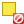 o usa <kbd>Ctrl</kbd> + <kbd>Shift</kbd> + <kbd>A</kbd>.

<video width="90%" controls muted src="https://github.com/GIScience/gis-training-resource-center/raw/main/fig/qgis_attribute_table_unselect.mp4"></video>

### Acercar el zoom a una entidad específica

* __Zoom:__ haga <kbd>clic</kbd> con el botón derecho en su entidad y seleccione `Zoom a objeto`.

<video width="90%" controls muted src="https://github.com/GIScience/gis-training-resource-center/raw/main/fig/qgis_zoom_to_feature.mp4"></video>

## Vista de tabla vs vista de formulario

QGIS proporciona dos vistas para manipular fácilmente los datos en la tabla de atributos:

* __Vista de tabla:__  este modo presenta los valores de múltiples entidades en formato tabular, donde cada fila corresponde a una entidad y cada columna representa un campo.
* __Vista de formulario:__  este modo muestra todos los atributos de _una_ entidad seleccionada.

Para alternar entre estos modos utilice los botones   de la esquina inferior derecha de la tabla de atributos.

% AÑADIR imagen de ejemplo
___

## Tabla de atributos - Edición de datos

### Modificar datos en la tabla de atributos

* __Abrir tabla de atributos:__ Haga clic derecho en su capa y seleccione `Abrir tabla de atributos`.
* __Editar datos:__ Active el modo de edición haciendo clic en  `Conmutar edición`.
    - Navegue hasta la entidad y seleccione el atributo que desea editar.
    - Realice sus ediciones.
* __Guardar ediciones:__ haga clic en  __o__ desactive el modo de edición haciendo clic en  y acepte los cambios guardando su capa.

<video width="90%" controls muted src="https://github.com/GIScience/gis-training-resource-center/raw/main/fig/Attributtabel_edit.mp4"></video>

### Agregar una nueva columna

* __Agregar nueva columna:__ active el modo de edición haciendo clic en  → haga clic en , se abrirá la ventana `Campo nuevo`.
* __Especificar las variables de la columna:__ llene los campos de la ventana y haga clic en `Aceptar`.
    * `Nombre`      = nombre de la columna.
    * `Comment`     = información adicional sobre la columna.
    * `Tipo`        = seleccione el tipo de datos que tendrá la columna. La tabla de tipos de datos se muestra a continuación.
    * `Longitud`    = numero de símbolos del nuevo campo. Relevante para campos de texto (cadena).

| Tipo                       | Propiedad                                                                        |
|----------------------------|----------------------------------------------------------------------------------|
| Número entero              | Números enteros como conteos, cantidades o identificadores.                      |
| Número entero (de 64 bits) | Números enteros muy grandes para cantidades muy grandes.                         |
| Número decimal (real)      | Números con puntos decimales, útiles para medidas y fracciones.                  |
| Texto (cadena)             | Caracteres alfanuméricos, como nombres y descripciones.                          |
| JSON (cadena)              | Los datos de texto estructurados a menudo se utilizan para información compleja. |
| Fecha                      | Fechas específicas del calendario.                                               |
| Fecha y hora               | Fechas y horas combinadas                                                        |
| Objeto binario (BLOB)      | Para almacenar datos binarios como imágenes, audio o archivos.                   |
| Booleano                   | Valores simples de verdadero/falso o sí/no.                                      |

<video width="90%" controls muted src="https://github.com/GIScience/gis-training-resource-center/raw/main/fig/qgis_add_column.mp4"></video>

### Borrar columnas

* __Borrar columna:__ Active el modo de edición haciendo clic en  `Conmutar edición`.
    - Haga clic en 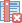 `Borrar campo`.
    - Seleccione las columnas que desea borrar.
    - Haga clic en `Aceptar`.
    - Haga clic en .

:::{Hint}
Para seleccionar varias columnas, presione <kbd>Ctrl</kbd> y seleccione las columnas.
:::

<video width="90%" controls muted src="https://github.com/GIScience/gis-training-resource-center/raw/main/fig/qgis_delet_column.mp4"></video>

## Botones y atajos de la tabla de atributos

A continuación se enumeran todos los botones de la tabla de atributos.

| Icono                                       | Descripción                                        | Objetivo                                                      | Atajo          |
|---------------------------------------------|----------------------------------------------------|---------------------------------------------------------------|----------------|
|           | Conmutar el modo de edición                        | Habilitar las funciones de edición                            | `Ctrl+E`       |
|               | Conmutar el modo de edición múltiple               | Actualizar múltiples campos de muchas entidades               |                |
|               | Guardar ediciones                                  | Guardar las modificaciones actuales                           |                |
|                 | Volver a cargar la tabla                           |                                                               |                |
| 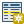            | Añadir objeto espacial                             | Añadir nueva entidad sin geometría                            |                |
|  | Borrar objetos seleccionados                       | Eliminar las entidades seleccionadas de la capa               |                |
| 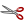                | Cortar las entidades seleccionadas al portapapeles |                                                               | `Ctrl+X`       |
| 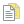           | Copiar las entidades seleccionadas al portapapeles |                                                               | `Ctrl+C`       |
|               | Pegar las entidades desde el portapapeles          | Insertar nuevas entidades a partir de las copiadas            | `Ctrl+V`       |
| 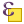         | Seleccionar entidades mediante una expresión       |                                                               |                |
| 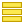              | Seleccionar todo                                   | Seleccionar todas las entidades en la capa                    | `Ctrl+A`       |
|         | Invertir selección                                 | Invertir la selección actual en la capa                       | `Ctrl+R`       |
|     | Deseleccionar todo                                 | Deseleccionar todas las entidades en la capa actual           | `Ctrl+Shift+A` |
| 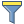              | Filtrar/seleccionar entidades mediante formulario  |                                                               | `Ctrl+F`       |
| 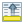          | Mover la selección hacia arriba                    | Mover las filas seleccionadas a la parte superior de la tabla |                |
| 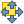          | Desplazar el mapa a las filas seleccionadas        |                                                               | `Ctrl+P`       |
| 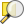         | Hacer zoom a las filas seleccionadas               |                                                               | `Ctrl+J`       |
|            | Campo nuevo                                        | Añadir un campo nuevo a la fuente de datos                    | `Ctrl+W`       |
|         | Borrar campo                                       | Eliminar un campo de la fuente de datos                       |                |
|               | Organizar columnas                                 | Mostrar/ocultar campos de la tabla de atributos               |                |
|          | Abrir la calculadora de campos                     | Actualizar el campo para muchas entidades a la vez            | `Ctrl+I`       |
| 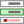  | Formato condicional                                | Habilitar dar formato a la tabla                              |                |
| 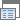                          | Acoplar la tabla de atributos                      | Permite acoplar/desacoplar la tabla de atributos              |                |
|                        | Acciones                                           | Enumera las acciones relacionadas con la capa                 |                |

