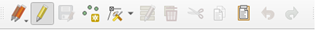
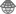
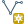
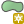
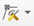
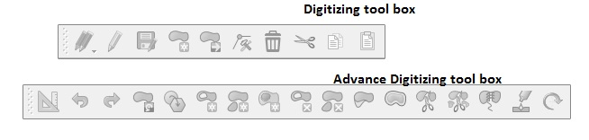
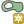

# Digitalización

__🔙[Volver a la página de inicio](../es_intro.md)__

La digitalización es el proceso de conversión de datos geográficos de mapas o imágenes en forma digital comúnmente representados como datos vectoriales.
Durante este procedimiento, se rastrea la información espacial de mapas o imágenes, formando puntos, polilíneas o polígonos.
Para digitalizar los datos de un nuevo conjunto de datos siempre hay que empezar por crear el conjunto de datos antes de llenarlo con datos digitalizados.

## La barra de herramientas de digitalización en QGIS

- La digitalización en QGIS se realiza principalmente con la __barra de herramientas__. Para activar la barra de herramientas, vaya a `Ver` → `Barras de herramientas` → `Digitalización`.

:::{figure} ../../../fig/en_qgis_3.40_activate_digitisation_toolbar_wiki.png
---
name: e_qgis_3.40_activate_digitisation_toolbar_wiki
width: 550 px
---
:::

## Crear una nueva capa

1. En la barra superior, vaya a `Capa` → `Crear capa` → `Nueva capa GeoPackage` o `Nueva capa de archivo Shape...`.
2. Se abrirá una nueva ventana. Aquí puede especificar las propiedades de la capa.
3. En `Base de datos`, haga clic en el  de tres puntos y vaya a la carpeta donde desea guardar el nuevo conjunto de datos.
4. *archivo shapefile específico*: Establezca la codificación del archivo en `UTF-8`.
5. `Tipo de geometría`: Seleccione el tipo de geometría que desea digitalizar: puntos, líneas o polígonos.
::::{margin}
:::{tip}
Si planea realizar un cálculo basado en la distancia con el nuevo conjunto de datos, asegúrese de usar un SRC __métrico__. Las unidades de medida de la capa se expresarán en metros y no en grados (véase [Sistemas de referencia](../Module_2/es_qgis_projections.md) de coordenadas métricas y geográficas).
:::
::::
6. Seleccione el CRS (sistema de referencia de coordenadas) que desea utilizar para la nueva capa. De manera predeterminada, se establece en el proyecto SRC. Si desea cambiar el SRC haga clic en .
7. En `Nuevo campo`, puede agregar columnas a la nueva capa. Aquí puede definir qué tipo de información/datos estarán disponibles en la tabla de atributos para cada entidad.
    - `Nombre`: Asigne a la nueva columna un nombre que represente la información que desea almacenar en ella.
    - `Tipo`: Aquí puede seleccionar el tipo de datos para la nueva columna. Por ejemplo, `Texto (cadena)` agregará una nueva columna con datos de cadena (texto). Para datos numéricos puede elegir `numero entero` o `numero decimal`.
    - `Longitud` define el número máximo de caracteres que puede tener el campo. Esto es relevante para la longitud del texto o la precisión de los números decimales. Por ejemplo, es posible que desee establecer una longitud máxima alta para los campos de texto si desea nombres de calles largas como "Martin Luther King Jr. Boulevard" (34 caracteres).
    * Haga clic en  para añadir la nueva columna a la `lista de campos`.
8. Una vez que haya terminado de agregar los campos, haga clic en `Aceptar`.

<video width="90%" controls src="https://github.com/GIScience/gis-training-resource-center/raw/main/fig/en_qgis_create_layer.mp4"></video>

## Agregar geometrías a una capa

### Creación de datos de punto

1.	Seleccione la capa de puntos a la que desea agregar datos en el panel Layer
2.	Vaya a la barra de herramientas de digitalización y haga clic en . Ahora la capa está en el modo de edición.
3.	Haga clic en .
4.	Haga clic con el botón izquierdo en la entidad que desea digitalizar.
5.	Una vez que haga clic, aparecerá una ventana llamada `[Nombre de la capa]- Atributos del objeto espacial`. Aquí puede agregar la información sobre esta entidad a las diferentes columnas, basándose en la tabla de atributos de la capa.

:::{figure} ../../../fig/point_creation.png
---
width: 700px
name: es_Point creation
align: center
---
:::
% Añadir otra imagen con más columnas

5.	Una vez que haya terminado con las  de digitalización para guardar sus ediciones.
6.	Haga clic de nuevo en  para finalizar el modo de edición.

<video width="90%" controls src="https://github.com/GIScience/gis-training-resource-center/raw/main/fig/Creat_point_feature.mp4"></video>

### Creación de datos de línea

El método es similar a la digitalización de un punto (ver arriba). Primero tienes que crear una nueva capa de línea o usar una existente.

:::{attention}
Si crea una nueva capa de línea recuerde cambiar el tipo de geometría en líneas porque ahora estamos creando datos de líneas.
:::

1. En el panel capas, seleccione la capa de línea a la que desea agregar datos.
2. En la barra de herramientas de digitalización, haga clic en . Ahora la capa está en modo de edición.
3. Haga clic en .
4. Cree la línea en el lienzo del mapa haciendo <kbd>clic izquierdo</kbd> para agregar vértices. Cuando haya terminado, haga clic derecho en el último punto para terminar de editar la geometría.
5. Aparecerá una nueva ventana titulada `[Nombre de la capa]- Atributos de objeto espacial`. Aquí puede completar la información de la columna de la entidad.
6. Una vez que haya terminado con la digitalización, haga clic en  para guardar sus ediciones.
7.	Haga clic en el icono  de nuevo para finalizar el modo de edición.

<video width="90%" controls src="https://github.com/GIScience/gis-training-resource-center/raw/main/fig/Creat_line_feature.mp4"></video>

### Creación de datos de polígono

1. En el panel capas, seleccione la capa de polígono a la que desea agregar datos.
2. Haga clic en  para iniciar el modo de edición.
3. Haga clic en `Añadir polígono`  para agregar polígonos.
4. Dibuje un polígono en el lienzo del mapa con <kbd>el botón izquierdo</kbd>. Haga <kbd>clic derecho</kbd> para finalizar la creación del polígono y unir el primer y el último punto que ha agregado.
5. Se abrirá una nueva ventana. Aquí puede agregar la información de la columna para esta entidad.
4. Guarde las ediciones haciendo clic en el icono de  y saliendo del modo de edición haciendo clic en el icono de .

<video width="90%" controls src="https://github.com/GIScience/gis-training-resource-center/raw/main/fig/en_qgis_digitize_add_feature.mp4"></video>

## Modificación de las geometrías existentes

1. En el panel capas, seleccione la capa con la geometría que desea editar haciendo clic en ella. Aparecerá en azul.
2. En la barra de herramientas de digitalización, haga clic en  para iniciar el modo `Conmutar edición`.
3. En la barra de herramientas de digitalización, haga clic en . Ahora, puede mover y editar vértices de geometrías.
4. Una vez que haya terminado, no olvide salir del modo de edición haciendo clic en  y guarde sus ediciones.

<video width="90%" controls src="https://github.com/GIScience/gis-training-resource-center/raw/main/fig/en_qgis_digitize_move_vertices.mp4"></video>

### Agregar anillo a la capa de polígonos existente

En QGIS, la adición de anillos a polígonos se realiza con la "barra de herramientas de digitalización avanzada". Para activar la barra de herramientas, vaya a `Ver` → `Barras de herramientas` → `Digitalización avanzada`.

1. Haga clic en  para iniciar el modo de edición de una capa de polígono.
2. Haga clic en  (por ejemplo, mapear el patio interior de un edificio, o - como se muestra en el video - crear un círculo para marcar una isla en el lago).

<video width="90%" controls src="https://github.com/GIScience/gis-training-resource-center/raw/main/fig/en_qgis_digitize_add_ring.mp4"></video>

## Recursos adicionales

El siguiente video de YouTube muestra todo el proceso de digitalización de polígonos en QGIS con más detalle. Recuerde que el YouTuber está usando una versión anterior de QGIS, por lo que las cosas podrían ser diferentes en su versión.

<iframe width="560" height="315" src="https://youtu.be/embed/Zer558SnKX4?si=ELKStx6y5_B_ilRe" title="Reproductor de video de YouTube" frameborder="0" allow="accelerometer; autoplay; clipboard-write; encrypted-media; gyroscope; picture-in-picture; web-share" allowfullscreen></iframe>
