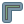
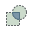

# Procesamiento espacial

__🔙[Volver a la página de inicio](../es_intro.md)__

## Buffer
- Calcule un  `buffer` con una distancia definida.
- Disolver: si dos o más áreas buffer se superponen, se pueden combinar.

:::{Attention}
La unidad de distancia depende de la proyección de la capa. Para crear un buffer, generalmente se necesita un __sistema de coordenadas métricas__ como UTM (Universal Transverse Mercator).
:::

:::{dropdown} Ejemplo: ¿Qué regiones se encuentran dentro de un radio de 100 kilómetros de las principales ciudades?
:open:
<video width="100%" controls src="https://github.com/GIScience/gis-training-resource-center/raw/main/fig/en_qgis_buffer_wiki.mp4"></video>
:::

:::{tip}
Si se trata de “megabuffers”, realmente grandes, o si solo se pueden elegir distancias de buffer en grados en lugar de metros, podría significar que no hay un __sistema de coordenadas métrico__ o que se __reproyectó incorrectamente__. La unidad del buffer__depende__ del __sistemas de referencia de coordenadas de la capa__.
:::

## Recorte
- Con la herramienta  `Cortar` se puede extraer y conservar la extensión espacial de una capa vectorial en función de los límites de otra capa.
- `Capa de entrada`: se refiere a la capa __específica que se va a recortar__, por ejemplo, una red vial.
- `Capa de superposición`: por ejemplo, una capa de polígonos de la región (por ejemplo, las fronteras de Heidelberg).

:::{dropdown} Ejemplo: Extraer la red ferroviaria de Alemania
:open:
<video width="100%" controls src="https://github.com/GIScience/gis-training-resource-center/raw/main/fig/en_qgis_clip_wiki.mp4"></video>
:::

## Disolver
- La herramienta  `Disolver` agrega geometrías con los mismos valores de atributo.
- Cuando dos o más áreas buffer se superponen, se pueden combinar usando disolver.

:::{dropdown} Ejemplo: Extraer la red ferroviaria de Alemania
:open:
<video width="100%" controls src="https://github.com/GIScience/gis-training-resource-center/raw/main/fig/en_qgis_dissolve_wiki.mp4"></video>
:::

:::{Attention}
En QGIS, solo los atributos seleccionados para la operación de disolución recibirán el atributo preciso, mientras que los atributos restantes permanecen sin agregar; por lo tanto, en este ejemplo, el nombre no se representa con precisión (por ejemplo, el nombre de Europa Occidental podría asignarse erróneamente como "Países Bajos").
:::

## Intersección

La herramienta  `Intersección` extrae la parte de las capas que se superponen.

1. En la barra superior, navegue a `Vectorial` → `Geoprocessing Tool` → `Intersección` o busca `Intersección` en la 
2. `Capa de entrada`: seleccione la capa uno
3. `Capa de superposición`: seleccionar la capa dos
4. `Intersección`: Especifique dónde desea guardar los resultados y asígnele un buen nombre

:::{Note}
* El orden de la capa de entrada y la capa de superposición no importa aquí
* Posibilidad de mantener solo ciertos campos de la capa de salida
* ⚠️ Atención: Los valores de atributo que hacen referencia a áreas de salida (por ejemplo, población) ya no son significativos después de la intersección
:::

:::{figure} ../../../fig/Intersect_concept_2.png
---
width: 500px
name: es_Intersect_concept_2
---
`Intersección` Operación entre una capa de entrada de dos entidades y una sola capa de superposición de entidades (izquierda): las entidades resultantes se mueven para mayor claridad (derecha). Fuente: GISGeography.com
:::

:::{dropdown} Ejemplo: Intersección de países con zonas horarias
<video width="100%" controls src="https://github.com/GIScience/gis-training-resource-center/raw/main/fig/qgis_intersect.mp4"></video>
:::

## Centroides

Con la herramienta  `Centroides`, puede crear una nueva capa con puntos en el centro de cada polígono.

1. En la barra superior, navegue a `Vectorial` → `Geometry Tools` → `Centroides`. Alternativamente, busque `Centroides` en la [caja de herramientas de procesos]. Abra la herramienta <kbd>haciendo doble clic</kbd>.
2. `Capa de entrada`: seleccione la capa de polígonos
3. Haga clic en `Ejecutar`.
4. La nueva capa se agregará a su proyecto.

:::{dropdown} Ejemplo: Crear un centroide para cada distrito de Madagascar
<video width="100%" controls src="https://github.com/GIScience/gis-training-resource-center/raw/main/fig/en_qgis_3.40_centroids.mp4"></video>
:::