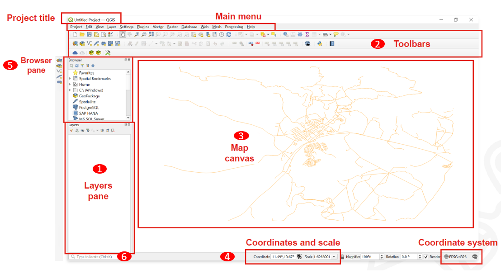
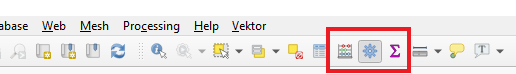
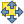
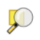
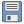
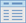
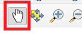
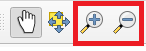

# Interfaz de QGIS

__🔙[Volver a la página de inicio](../es_intro.md)__

## Descripción general de la interfaz de QGIS

1. __Lista de capas/Panel del navegador:__ La __lista de capas__ muestra __todas las capas/los archivos__ que están __cargados en el proyecto__. Se puede mostrar/ocultar capas y configurar otras propiedades.

2. __Barras de herramientas: __Las barras de herramientas__ son atajos__ para ejecutar comandos de uso frecuente. Por ejemplo, existen barras de herramientas especiales para __archivos vectoriales y ráster__, pero también barras generales para guardar su proyecto, etc. La barra de herramientas contiene, entre otras cosas, una lista de todos los comandos que puede utilizar. La barra de herramientas también contiene la __caja de herramientas__, que se utiliza posteriormente en muchos de los videos de la wiki.

3. __Vista de mapa:__ La __vista de mapa__ es el __componente central__ de cada programa SIG. Aquí es donde se muestran los __datos geográficos__. La vista de mapa tiene una proyección que no siempre se corresponde con la proyección de las capas.

4. __Barra de estado:__ En la __barra de estado__ se encuentra la __Información central sobre la vista actual del mapa__. Aquí puede configurar la __proyección de la vista del mapa y la escala__. Puede leer las coordenadas del puntero del mouse y así averiguar rápidamente las coordenadas de los puntos en el mapa. Se puede rotar la vista del mapa, por ejemplo, si se quiere crear un mapa orientado hacia el sur.

5. __Barra de herramientas lateral__. Es posible que vea una __barra de herramientas lateral__. Esta es otra forma sencilla de abrir archivos vectoriales y ráster en QGIS.

6. __Barra de localización__. Aquí puede __buscar herramientas y capas__. Si no sabe dónde encontrar una herramienta, intente aquí.

__Documentación oficial de QGIS: [Descripción general de la interfaz](https://docs.qgis.org/3.4/de/docs/training_manual/introduction/overview.html)__

___

## Botones y atajos

### Navegación en la vista de mapa

| Nombre | Opción de menú | Atajo | Descripción |
|---------------------------|--------------------------------|---------------------------------|---------------------------------------------|
| Mapa panorámico |  | <kbd>Barra espaciadora</kbd>, <kbd>Re Pág</kbd>, <kbd>Av Pág</kbd> o las <kbd>teclas de flecha</kbd> | Mover el mapa |
| Desplazar mapa a la selección |  |                                  | Desplazar el mapa al elemento seleccionado |
| Acercar zoom |  | <kbd>Ctrl</kbd> + <kbd>Alt</kbd> + <kbd>+</kbd> o la <kbd>rueda del mouse</kbd> | Ampliar el mapa |
| Alejar zoom |  | <kbd>Ctrl</kbd> + <kbd>Alt</kbd> + <kbd>-</kbd> o la <kbd>rueda del mouse</kbd> | Alejar zoom del mapa |
| Zoom completo |  | <kbd>Ctrl</kbd> + <kbd>Shift</kbd> + <kbd>F</kbd> | Acercar al elemento seleccionado |
| Zoom a la selección |  | <kbd>Ctrl</kbd> + <kbd>L</kbd> | Acercar al elemento seleccionado |
| Zoom a la capa |  |                                  | Zoom a la capa seleccionada |
| Zoom a la resolución nativa |  |                             | Acercar a la resolución nativa (100 %) |
| Zoom último |  |                                 | Acercar al último zoom |
| Zoom siguiente |  |                                 | Acercarse al siguiente zoom |

### Gestión de proyectos
| Nombre | Opción de menú | Atajo | Descripción |
|-----------------|------------------------------------|------------------|-----------------------------------------|
| Nuevo proyecto |  | <kbd>Ctrl</kbd> + <kbd>N</kbd> | Crear un nuevo proyecto |
| Abrir proyecto |  | <kbd>Ctrl</kbd> + <kbd>A</kbd> | Abrir un proyecto existente |
| Guardar |  | <kbd>Ctrl</kbd> + <kbd>G</kbd> | Guardar proyecto |
| Guardar como… |  | <kbd>Ctrl</kbd> + <kbd>Shift</kbd> + <kbd>G</kbd> | Guardar proyecto como… |
| Propiedades |                                    | <kbd>Ctrl</kbd> + <kbd>Shift</kbd> + <kbd>P</kbd> | Abrir las propiedades del proyecto |
| Nueva composición de impresión |  | <kbd>Ctrl</kbd> + <kbd>P</kbd> | Abre el cuadro de diálogo para crear una nueva composición de impresión |
| Buscar |                                    | <kbd>Ctrl</kbd> + <kbd>K</kbd> | Abre la barra de búsqueda |

### Gestión de capas
| Nombre | Opción de menú | Atajo | Descripción |
|-----------------------------|----------------------------------------------|----------------------|-----------------------------------|
| Administrador de fuentes de datos |  |                | Añadir una nueva capa |
| Nueva capa GeoPackage |  | <kbd>Ctrl</kbd> + <kbd>Shift</kbd> + <kbd>N</kbd> | Añadir una nueva capa GeoPackage |
| Añadir capa vectorial |  | <kbd>Ctrl</kbd> + <kbd>Shift</kbd> + <kbd>V</kbd> | Añadir una nueva capa vectorial |
| Añadir capa ráster |  | <kbd>Ctrl</kbd> + <kbd>Shift</kbd> + <kbd>R</kbd> | Añadir una nueva capa ráster |
| Eliminar la capa seleccionada |  | <kbd>Ctrl</kbd> + <kbd>E</kbd> | Eliminar la capa seleccionada |
| Alternar vista de capas |                                              | <kbd>Ctrl</kbd> + <kbd>1</kbd> | Alternar la vista de capas |
| Alternar vista del navegador |                                              | <kbd>Ctrl</kbd> + <kbd>2</kbd> | Alternar la vista del navegador |

### Herramientas de análisis
| Nombre | Opción de menú | Atajo | Descripción |
|------------------------------------------|---------------------------------------------|-----------------------------|--------------------------------------------------------|
| Identificar entidades |  | <kbd>Ctrl</kbd> + <kbd>Shift</kbd> + <kbd>I</kbd> | Identificar las entidades en la vista de mapa haciendo clic en ellos |
| Seleccionar entidad |  |                               | Seleccionar una entidad por área o con un solo clic |
| Seleccionar una entidad por valor |  | <kbd>F3</kbd> | Seleccionar entidades por valor |
| Abrir tabla de atributos |  | <kbd>F6</kbd> | Abrir tabla de atributos |
| Abrir tabla de atributos (objetos seleccionados) |  | <kbd>Shift</kbd> + <kbd>F6</kbd> | Abra la tabla de atributos solo con las entidades seleccionadas |
| Abrir tabla de atributos (objetos visibles) |  | <kbd>Ctrl</kbd> + <kbd>F6</kbd> | Abrir la tabla de atributos mostrando solo las entidades visibles |

### Herramientas avanzadas
| Nombre | Opción de menú | Atajo | Descripción |
|-------------------------|----------------------------------------|--------------------|------------------------------|
| Caja de herramientas de procesos |  | <kbd>Ctrl</kbd> + <kbd>Alt</kbd> + <kbd>T</kbd> | Abre la caja de herramientas de procesos |
| Consola de Python |  | <kbd>Ctrl</kbd> + <kbd>Alt</kbd> + <kbd>P</kbd> | Abre la consola de Python |

## Desplaza una orientación en el lienzo del mapa

### Desplaza la vista del mapa

Para moverse por el lienzo del mapa con el cursor del mouse, debe activar el botón de la mano.

También puede desplazarse por el lienzo del mapa con las teclas de flecha del teclado.

<video width="100%" controls src="https://github.com/GIScience/gis-training-resource-center/raw/main/fig/qgis_move.mp4"></video>

### Acercar la vista del mapa

La forma más sencilla de hacer zoom en el lienzo del mapa es __desplazándose con el mouse__.

O con los atajos de teclado rápido <kbd>Ctrl</kbd> + <kbd>+</kbd> y <kbd>Ctrl</kbd> + <kbd>-</kbd>

Otra forma es utilizar los botones de zoom del caja de herramientas.

<video width="100%" controls src="https://github.com/GIScience/gis-training-resource-center/raw/main/fig/qgis_zoom.mp4"></video>
___

## Caja de herramientas de procesos

Todas las funciones, herramientas y aplicaciones de QGIS están organizadas en la __Caja de herramientas de procesos__.
Si alguna vez necesita encontrar una herramienta o un algoritmo, abra la caja de herramientas y utilice la función de búsqueda para encontrarlo.

### Abrir la caja de herramientas

Para abrir la Caja de herramientas en QGIS, haga clic en el botón de la rueda dentada. O haga clic en `Procesos` → `Caja de herramientas de Procesos`.

Puede utilizar la barra de búsqueda para encontrar herramientas específicas.

<video width="100%" controls src="https://github.com/GIScience/gis-training-resource-center/raw/main/fig/qgis_open_toolbars.mp4"></video>

## Barras de herramientas

Algunas herramientas tienen sus propias barras de herramientas que se pueden agregar a su interfaz de QGIS. Aparecen sobre el lienzo del mapa como iconos que permiten acceder rápidamente a funcionalidades específicas.
Para evitar una interfaz sobrecargada, es conveniente activar las barras de herramientas o paneles específicos solo cuando realmente los necesite.

### Mostrar y ocultar pantallas y barras de herramientas

Para agregar o eliminar barras de herramientas de su interfaz, haga clic en `Ver` → `Barras de herramientas` → Marque o desmarque las casillas de la caja de herramientas que desee agregar o eliminar.

Para añadir o eliminar paneles de su interfaz, haga clic en `Ver` → `Paneles` → Marque o desmarque los paneles que desea agregar o eliminar

<video width="100%" controls src="https://github.com/GIScience/gis-training-resource-center/raw/main/fig/Anzeigen_einblenden_ausblenden.mp4"></video>

### Mover y organizar las barras de herramientas

En cada barra de herramientas hay un campo con dos líneas punteadas. Si mueve el puntero del mouse sobre él hasta que aparezca una cruz de flechas y luego mantiene pulsado el botón izquierdo del mouse, puede mover la barra de herramientas. Esto permite una organización individualizada de sus propias herramientas. Al comprimir todas las barras de herramientas en unas pocas líneas, también se puede ampliar la ventana de visualización del mapa.

<video width="100%" controls src="https://github.com/GIScience/gis-training-resource-center/raw/main/fig/qgis_arrange_toolbars.mp4"></video>

## Guardar y abrir proyectos QGIS

Guardar el progreso o abrir un proyecto existente en QGIS es muy similar a programas como MS Word. Sin embargo, existe una __GRAN__ diferencia.
En QGIS, los datos geográficos con los que trabaja __no__ se guardan en el archivo de proyecto de QGIS. En cambio, el archivo del proyecto solo contiene las rutas de los archivos donde se encontraban los datos geográficos en el momento en que el proyecto se guardó por última vez en el PC. Si posteriormente se cambia la ubicación de estos datos geográficos, aparecerá el mensaje de error “handle unavailable layers” cuando se vuelva a abrir el proyecto.

### Proyectos abiertos

Para abrir un proyecto QGIS existente, haga clic en `Proyecto` → `Abrir...` → Busque su proyecto y ábralo.

<video width="100%" controls src="https://github.com/GIScience/gis-training-resource-center/raw/main/fig/qgis_open_project.mp4">
</video>

### Guardar proyectos

* __Cuando guarde por primera vez__: Para guardar el proyecto QGIS en el que está trabajando, haga clic en `Proyecto` → `Guardar como...` → Vaya hasta la carpeta donde desea guardar el proyecto → Nombre al proyecto → `Guardar`.
* __Cuando guarde el progreso__: Para guardar el progreso de un proyecto que ya se guardó en algún lugar del ordenador, existen dos buenas opciones:
    * Utilice la tecla de acceso rápido <kbd>Ctrl</kbd> + <kbd>G</kbd> en su teclado.
    * Haga clic en `Proyecto` → `Guardar`.

<video width="100%" controls src="https://github.com/GIScience/gis-training-resource-center/raw/main/fig/qgis_save_project.mp4"></video>