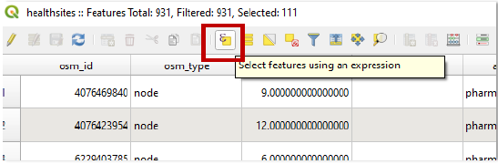
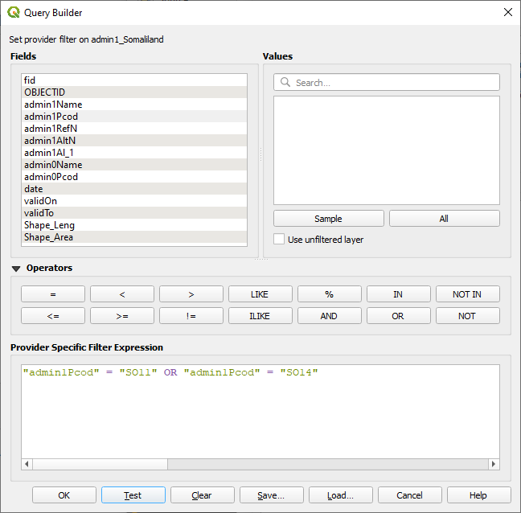

# Consultas no espaciales


__🔙[Volver a la página de inicio](../es_intro.md)__

## Selección manual

- Haga clic en la __tabla de atributos__ para seleccionar manualmente las entidades.
- Si mantiene presionado <kbd>Ctrl</kbd> mientras seleccionas entidades, puede seleccionar varias entidades al mismo tiempo.

:::{dropdown} Ejemplo: Seleccionar manualmente los países con la tabla de atributos
:open:
<video width="100%" controls src="https://github.com/GIScience/gis-training-resource-center/raw/main/fig/en_qgis_select_by_attribute_table_wiki.mp4"></video>
:::

## Seleccionar por expresión

La herramienta `Seleccionar por expresión` le permite crear una expresión para seleccionar las entidades de una capa. Por ejemplo, puede seleccionar atributos específicos o seleccionar entidades donde el valor de un atributo se encuentre en un rango específico.

1. Abra la tabla de atributos y seleccione la herramienta `Seleccionar por expresión`.



2. Se abrirá el generador de expresiones.




### Operadores de comparación
- `>`, `<`, `=`, `!=`

:::{dropdown} Ejemplo: Seleccione todas las ciudades con más de 20 millones de habitantes en 2015: `"2015" > 20000`
:open:
<video width="100%" controls src="https://github.com/GIScience/gis-training-resource-center/raw/main/fig/en_qgis_select_by_expresion_greater_wiki.mp4"></video>
:::

### Operadores especiales

- `LIKE`

:::{dropdown} Ejemplo: Seleccione todos los países de Asia: `"continent" LIKE 'asia'`
:open:
<video width="100%" controls src="https://github.com/GIScience/gis-training-resource-center/raw/main/fig/en_qgis_select_by_expression_like_wiki.mp4"></video>
:::

### Operadores lógicos
- `AND`, `OR`
- Se puede utilizar para combinar diferentes consultas o criterios.

:::{dropdown} Ejemplo: Las ciudades, que no contaban con una población de un millón de habitantes en 1950, habían aumentado vertiginosamente hasta superar los 10 millones de habitantes en 2015: `"1950" < 1000 AND "2015" > 10000`
:open:
<video width="90%" controls src="https://github.com/GIScience/gis-training-resource-center/raw/main/fig/en_qgis_select_by_expression_and_wiki.mp4"></video>
:::

## Expresiones complejas

También es posible agregar expresiones que encadenen diferentes requisitos. En este caso, no olvide encerrar entre corchetes las partes individuales de la expresión, como por ejemplo:

```

```

### Guardar las entidades seleccionadas como un archivo nuevo

- Clic derecho en la capa → `Exportar` → `Guardar objetos seleccionados como`.

:::{dropdown} Ejemplo: Exportar las entidades seleccionadas como un archivo nuevo
:open:
<video width="90%" controls src="https://github.com/GIScience/gis-training-resource-center/raw/main/fig/en_qgis_select_export_wiki.mp4"></video>
:::


## Seleccionar por opciones de expresión

::::{tab-set}

:::{tab-item} Operadores aritméticos
| operador | función          |
|----------|------------------------|
| __`+`__    | suma               |
| __`-`__    | resta           |
| __`*`__    | multiplicación         |
| __`/`__    | división               |
| __`%`__    | resto de la división  |
:::

:::{tab-item} Operadores de comparación
| operador | función            |
|----------|--------------------------|
| __`=`__    | igual a                   |
| __`!=`__   | no igual a                |
| __`<`__    | menor que                |
| __`>`__    | mayor que             |
| __`<=`__   | menor o igual que    |
| __`>=`__   | mayor o igual que |
:::

:::{tab-item} Operadores lógicos
Se pueden utilizar operadores como AND, OR para combinar diferentes consultas o criterios.
| operador | función          |
|----------|------------------------|
| __`AND`__  | lógico Y            |
| __`OR`__   | lógico O            |
| __`NOT`__ |  lógico NO            |
:::

:::{tab-item} Operadores especiales
| operador      | función                                  |
|---------------|------------------------------------------------|
| __`LIKE`__      | concordancia de patrones                               |
| __`IN`__        | comprueba si un valor está en una lista de valores       |
| __`IS NULL`__   | comprueba si hay valores NULL                         |
| __`BETWEEN`__   | comprueba si un valor se está dentro de un rango especificado  |
| __`CASE WHEN`__ | expresiones condicionales                        |
:::

::::

## Recursos adicionales

Puede acceder a la información sobre operadores lógicos en la documentación de QGIS a través del [siguiente enlace](https://docs.qgis.org/3.28/en/docs/user_manual/working_with_vector/attribute_table.html#selecting-features).
