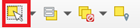

# Consultas espaciales

__🔙[Volver a la página de inicio](../es_intro.md)__

## Selección manual

- En la barra de herramientas, seleccione la herramienta  `Seleccionar objetos espaciales`.
- Seleccione las entidades de forma individual haciendo clic sobre cada entidad.
- Para seleccionar varias entidades, puede mantener pulsado <kbd>Ctrl</kbd> (<kbd>Cmd</kbd> en MacOS) y seleccionar una entidad tras otra.
- Las entidades seleccionadas aparecerán resaltadas en amarillo brillante.
- Si abre la [tabla de atributos](es_qgis_table_functions_wiki.md), la entidad seleccionada aparecerá en azul.

:::{dropdown} Ejemplo: Seleccionar países manualmente
:open:
<video width="90%" controls src="https://github.com/GIScience/gis-training-resource-center/raw/main/fig/en_qgis_select_features_by_click_wiki.mp4"></video>
:::

## Seleccionar por ubicación

- QGIS permite seleccionar entidades basándose en su ubicación utilizando la herramienta `Seleccionar por localización`.
- La herramienta utiliza consultas espaciales para seleccionar las entidades. Estas analizan las relaciones espaciales entre un conjunto de entidades.
- Por ejemplo, dos entidades pueden intersecarse, o una entidad puede estar completamente contenida dentro de otra, o dos entidades pueden no tocarse entre sí (no interseca).
- QGIS utiliza las siguientes relaciones espaciales: Intersecar, contiene, no interseca, igual, toca, superpuesta, dentro de y cruza.
- Consulte la [documentación de QGIS sobre relaciones espaciales](https://docs.qgis.org/3.40/en/docs/user_manual/processing_algs/qgis/vectorselection.html#exploring-spatial-relations) para conocer las diferencias entre cada relación espacial.

:::{dropdown} Ejemplo: Seleccionar todas las ciudades de China (`intersect`)
:open:
<video width="90%" controls src="https://github.com/GIScience/gis-training-resource-center/raw/main/fig/en_qgis_select_by_location_intersect_wiki.mp4"></video>
:::

:::{dropdown} Ejemplo: Seleccionar todos los países vecinos de China (`touch`)
:open:
<video width="90%" controls src="https://github.com/GIScience/gis-training-resource-center/raw/main/fig/en_qgis_select_by_location_touch_wiki.mp4"></video>
:::

## Exportar selección

- Una vez seleccionadas, puede seguir manipulando las entidades, por ejemplo, exportándolas a una nueva capa:
    - Haga <kbd>clic derecho </kbd> sobre la capa con las entidades seleccionadas → `Exportar` → `Guardar objetos seleccionados como...`

