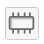

::::{grid} auto
:::{grid-item-card}
:class-card: sd-text-center sd-rounded-circle
:link: ../fr_intro.md 
{octicon}`home-fill;1.5em;sd-text-danger`
:::

:::{grid-item-card}
:link: fr_qgis_module_3_exercises.md

__Cliquez ici pour revenir à l’aperçu des exercices du module 3.__ 
:::
::::

# Exercice 3 : Requêtes de données <a id="exercise-3-data-queries"></a>

## Caractéristiques de l’exercice <a id="characteristics-of-the-exercise"></a>

:::{topic}
__Objectif de l’exercice :__
^^^
L’objectif de cet exercice est d’apprendre à manipuler des données secondaires afin de générer des informations utiles. Dans cet exercice, nous déterminerons quels bâtiments ont été affectés par une inondation et appliquerons un filtre pour identifier ceux qui font partie des infrastructures critiques. 
:::


### Liens vers les articles Wiki <a id="links-to-wiki-articles"></a>

* [Interface QGIS](../../en/Wiki/en_qgis_interface_wiki.md)
* [Types de géodonnées](../../en/Wiki/en_qgis_geodata_types_wiki.md)
* [Importation de géodonnées dans QGIS](../../en/Wiki/en_qgis_import_geodata_wiki.md)
* [Concept de couche](../../en/Wiki/en_qgis_layer_concept_wiki.md)
* [Requêtes non spatiales](../../en/Wiki/en_qgis_non_spatial_queries_wiki.md)
* [Requêtes spatiales](../../en/Wiki/en_qgis_spatial_queries_wiki.md)
* [Fonction de table - Ajouter un champ](../../en/Wiki/en_qgis_table_functions_wiki.md)
* [Géotraitement - Découper](../../en/Wiki/en_qgis_geoprocessing_wiki.md#clip) 


## Données <a id="data"></a>

Téléchargez tous les jeux de données [ici](https://nexus.heigit.org/repository/gis-training-resource-center/Module_3/Exercise_3/Module_3_Exercise_3_Data_Queries.zip), enregistrez le dossier sur votre ordinateur et décompressez le fichier. Le dossier zip comprend :

- `som_admbnda_adm2_ocha_20230308.shp` : ce fichier contient des informations sur les limites administratives de niveau 0 à 2 de la Somalie, ainsi que sur les niveaux 1 et 2 des États et des zones opérationnelles, sous forme de shapefiles. Les données peuvent également être trouvées sur [HDX](https://data.humdata.org/dataset/cod-ab-som).
- `GF2_20231123_FloodExtent_BeledweyneCity_HiraanRegion.shp` : ce shapefile illustre les eaux de surface détectées par satellite dans la ville de Beledweyne, district de Beledweyne, région de Hiraan, Somalie, le 12 novembre 2023 à 07:32 UTC. Les données sont également disponibles sur [HDX](https://data.humdata.org/dataset/water-extent-in-beledweyne-city-beledweyne-district-hiraan-region-somalia-12-november-2023).
- `buildings_belet_weyne.geojson` : ce jeu de données a été téléchargé à l’aide de [HOT Export Tool](https://export.hotosm.org/v3/exports/new/describe) et contient des informations sur les bâtiments du district de Beledweyne.


Le dossier s’appelle **Module_3_Exercise_3_Data_Queries** et contient toute la [structure de dossiers standard](../../en/Wiki/en_qgis_projects_folder_structure_wiki.md#standard-folder-structure), avec toutes les données dans le dossier input.

:::{Note}
La dénomination des districts et des États n’est pas cohérente entre les différents jeux de données. Vous trouverez différentes orthographes pour le nom du district **Beledweyne**, qui sera au centre de cet exercice. D’autres orthographes possibles sont **Belet Weyne** ou **Belete Weyne**. Dans de nombreux cas, vous devrez modifier les valeurs dans les jeux de données pour corriger les différences d’orthographe ou les fautes de frappe. Ce processus est appelé "nettoyage des données".
:::

## Tâches <a id="tasks"></a>

1. Ouvrez QGIS et créez un [nouveau projet](../../en/Wiki/en_qgis_projects_folder_structure_wiki.md#step-by-step-setting-up-a-new-qgis-project-from-scratch) en cliquant sur `Project` → `New`.

2. Une fois le projet créé, [enregistrez le projet](../../en/Wiki/en_qgis_projects_folder_structure_wiki.md#save-project) dans le **dossier project** de l’exercice **Module_3_Exercise_1_Queries_Somalia**. Pour cela, cliquez sur `Project` → `Save as`, puis naviguez jusqu’au dossier. Nommez le projet **Somalia_flood_affected_Beledweyne_2023**.

3. Pour charger les fichiers suivants dans votre projet, faites-les glisser-déposer ([Vidéo Wiki](../../en/Wiki/en_qgis_import_geodata_wiki.md#open-vector-data-via-drag-and-drop)). Ou cliquez sur `Layer` → `Add Layer` → `Add Vector Layer`. Cliquez sur les trois points  et naviguez jusqu’au fichier. Sélectionnez le fichier puis cliquez sur `Open`. De retour dans QGIS, cliquez sur `Add` ([Vidéo Wiki](../../en/Wiki/en_qgis_import_geodata_wiki.md#open-vector-data-via-layer-tab)).
    - `som_admbnda_adm2_ocha_20230308.shp`
    - `GF2_20231123_FloodExtent_BeledweyneCity_HiraanRegion.shp`
    - `Buildings_Belete_Weyne.geojson` : une fenêtre contextuelle apparaîtra pour ce fichier et vous devrez décider quelles données importer. Sélectionnez les polygones.

:::{tip}
Assurez-vous de __décompresser__ le dossier de l’exercice avant de charger les couches dans QGIS. QGIS n’accepte pas les fichiers compressés.
:::

### Extraire le district (adm2) de la couche des limites administratives <a id="extract-the-district-adm2-from-the-administrative-boundaries-layer"></a>

4. Tout d’abord, nous voulons exporter le district __Beledweyne__ de la région de Hiraan à partir de `som_admbnda_adm2_ocha_20230308.shp` afin de l’avoir comme couche vectorielle autonome. Pour cela :
    1. Ouvrez la table attributaire de `som_admbnda_adm2_ocha_20230308.shp` en faisant un clic droit sur la couche → `Open Attribute Table` ([Vidéo Wiki](../../en/Wiki/en_qgis_attribute_table_wiki.md)).
    2. Trouvez la ligne de `Belet Weyne` et sélectionnez-la en cliquant sur le numéro situé tout à gauche de la table attributaire. La ligne sera surlignée en bleu et le district apparaîtra en jaune dans le canevas cartographique. Vous pouvez faire un clic droit sur la ligne et cliquer sur `Zoom to Feature` ([Vidéo Wiki](../../en/Wiki/en_qgis_attribute_table_wiki.md#zoom-in-on-a-specific-feature)).
    3. Faites ensuite un clic droit sur la couche dans le panneau des couches, puis cliquez sur `Export` → `Save Selected Features as`. Nous voulons enregistrer Beledweyne comme GeoPackage, donc ajustez le `Format` en conséquence. Cliquez sur les trois points et naviguez jusqu’à votre **dossier temp**. Vous pouvez y donner à la couche le nom **AOI_Beledweyne**, puis cliquer sur `Save`. Cliquez ensuite sur `Ok` ([Vidéo Wiki](../../en/Wiki/en_qgis_non_spatial_queries_wiki.md#save-selected-features-as-a-new-file)). Dans cet exercice, nous ne reprojeterons pas les couches et travaillerons avec les données en `ESPG:4326 - WGS84`.

### Identifier les bâtiments susceptibles d’être affectés par l’inondation <a id="identify-the-building-that-might-be-affected-by-the-flooding"></a>

5. Dans les étapes suivantes, nous voulons identifier tous les bâtiments susceptibles d’avoir été affectés par les récentes inondations. Pour cela, nous utiliserons l’outil `Extract by Location`.
    :::{figure} ../../../fig/Extract_by_location_Belet_Weyne.png
    ---
    width: 500 px
    name: extract_by_location
    align: center
    ---
    La fenêtre d’extraction par localisation dans QGIS 3.36.
    :::
    1. Dans la __"Processing Toolbox"__ → recherchez `Extract by Location`.
    2. __"Extract features from"__ : `Buildings_Belete_Weyne.geojson`
    3. __"Where the features (geometric predicate)"__ : `are within`
    4. __"By comparing to the features from"__ : `GF2_20231123_FloodExtent_BeledweyneCity_HiraanRegion.shp`
    5. Sous `Extracted`, cliquez sur les trois points  → `Save to File...`, puis naviguez jusqu’à votre **dossier temp** et enregistrez la nouvelle couche sous le nom **Beledweyne_buildings_affected**, puis cliquez sur `Save`. 
    6. Cliquez ensuite sur `Run`.
    7. Ajustez vos couches afin de ne voir que les zones inondées et votre nouvelle couche **Beledweyne_buildings_affected**. Supprimez les couches `som_admbnda_adm2_ocha_20230308.shp` et `Buildings_Belete_Weyne.geojson`.

    :::{Attention}
    L’outil [`Select by Location`](../../en/Wiki/en_qgis_spatial_queries_wiki.md#select-by-location) est très similaire. Cet outil fonctionne de la même manière, mais au lieu d’extraire directement les entités, il les sélectionne.
    :::

### Identifier les infrastructures critiques affectées par les inondations <a id="identify-critical-infrastructure-affected-by-the-floods"></a>

6. Dans l’étape suivante, nous voulons identifier des bâtiments particuliers parmi les bâtiments affectés. Ouvrez la table attributaire et vérifiez quels types de bâtiments se trouvent dans la couche. Cette information se trouve dans la colonne "building". Vous pouvez trier cette colonne.
Pour extraire les "hospitals", "schools" et "mosques", nous pouvons utiliser l’outil `Extract by Expression`.
    1. Trouvez l’outil `Extract by Expression` dans la `Toolbox`.
    2. `Expression` : cliquez sur . 
    3. La fenêtre "Expression" s’ouvrira. Nous pouvons y construire une requête très spécifique. Dans le panneau central, ouvrez `Field and values`. Vous pourrez y voir toutes les colonnes de la couche. Cliquez sur `building`. Sur le côté droit, vous devriez maintenant voir l’option `All unique`. Cliquez dessus. Vous verrez alors toutes les valeurs uniques de la colonne „building“.
    4. Dans le champ `Expression`, saisissez l’expression suivante (voir la figure ci-dessous) :
        ```
        "building" = 'hospital' or
        "building" = 'school' or
        "building" = 'mosque' 
        ```
    5. Cliquez sur `Ok`. La fenêtre se fermera et vous verrez l’expression que vous avez créée dans le champ `Expression` de la fenêtre `Extract by Expression` (voir la figure ci-dessous). 
    6. Cliquez sur `Run`. Une nouvelle couche temporaire appelée `Matching Features` sera ajoutée à votre projet QGIS. Fermez la fenêtre `Extract by Expression`.
   
:::{figure} ../../../fig/en_extract_by_expression_som.png
---
name: extract_by_expression1
width: 400 px
---
La fenêtre d’expression dans QGIS 3.36 avec une expression permettant d’extraire les polygones dont la valeur du champ "building" est 'hospital', 'school' et 'mosque'. 
:::


:::{figure} ../../../fig/en_extract_by_expression_som2.png
---
name: extract_by_expression2
width: 400 px
---
La fenêtre `Extract by Expression` dans QGIS 3.36
:::

:::{attention}
Une couche temporaire ne sera pas enregistrée dans votre projet QGIS, même après l’enregistrement du projet. Les couches temporaires sont marquées par une icône . Pour enregistrer la couche de manière permanente, faites un <kbd>clic droit</kbd> sur la couche que vous souhaitez rendre permanente. Sélectionnez ensuite l’emplacement d’enregistrement de la nouvelle couche. Assurez-vous de l’enregistrer dans le bon dossier (voir la [structure de dossiers standard](../../en/Wiki/en_qgis_projects_folder_structure_wiki.md)). 
:::

 
7. Explorez la nouvelle couche en ouvrant la table attributaire, puis en activant et désactivant la couche dans le panneau des couches. 
8. Faites un <kbd>clic droit</kbd> sur la couche `Matching Features` et enregistrez-la dans le dossier de votre projet sous `/data/output/` avec le nom `Belet_Weyne_POI_affected.gpkg`. 

Félicitations ! Les informations extraites peuvent maintenant être utilisées pour réaliser d’autres analyses ou créer des cartes complètes des points d’intérêt affectés. 

<!--ADD picture of this step-->

<!---:::{note}
This exercise has an optional part 2 in module 4, covering the visualisation of the processed data. 

You can find the exercise [here].

:::
--->
