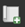
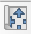

# Exercice 3: Visualisation des infrastructures de santé, de la population et de l'incidence de rougeole dans QGIS 

## Contexte

Maintenant que vous avez préparé et enrichi vos jeux de données dans les exercices 1 et 2, il est temps de créer des cartes claires et visuellement attrayantes à l’intention des décideurs.
Ces cartes aideront le ministère de la Santé et ses partenaires à comprendre :

Quels établissements de santé disposent d’une capacité de stockage frigorifique pour les vaccins

Où se concentre la population

Quels districts présentent les taux d’incidence de la rougeole les plus élevés ?

Dans cet exercice, vous créerez deux cartes prêtes à être publiées à l’aide du composeur de mise en page de QGIS.

## Objectifs 

À la fin de cet exercice, vous serez en mesure de :

- Configurer la symbologie de la carte
- Créer deux mises en pages de cartes distinctes en utilisant la mise en page d'impression
- Ajouter des éléments de carte essentiels (titre, légende, barre d'échelle, flèche du nord, logos)
- Exporter les cartes en format PDF ou PNG de haute qualité

## Données disponibles 

À partir des exercices précédents :

| Jeux de Données | Description |
| --------------------------------------------------------------------- | ------------------------------------------------------------ |
| `Healthsites_points_capacities` | Établissements de santé enrichis avec des informations sur la chaîne froide et la capacité |
| `tcd_admbnda_adm2_20250212_AB` (adm2_pop / adm2_population_incidence) | Limites administratives de niveau 2 enrichies avec les données de population et d’incidence de la rougeole |
| `OpenStreetMap basemap (XYZ tiles)` | Contexte général |
| `tcd_admbnda_adm1_20250212_AB` | Limites administratives de référence |

## Tâches 

### Tâche 1 : Visualiser les capacités des établissements de santé 

1. Dans le *panneau Couches*, faites un <kbd>clic droit</kbd> sur `Healthsites_points_capacities` → `Properties`.

2. Accédez à l’onglet **Symbologie**.
3. Modifiez le style de `Single Symbol` à `Categorized`.
4. Sous **Valeur**, sélectionnez `cold_chain`.
5. Cliquez sur `Classify`.
6. Ajustez les symboles (par exemple, bleu pour « oui » et gris pour « non »).

7. Cliquez sur `Apply`.

### Tâche 2 : Préparer la couche d’incidence de la rougeole 

1. <kbd>Faites un clic droit</kbd> sur la couche `adm2_incidence` → `Properties`.

2. **Faites un clic droit** sur la couche  → .

3. Définissez
   - **Style :** Gradué
   
   - **Colonne** `incidence_rate`
   - **Mode :** Quantile ou Ruptures naturelles
   
4. Choisissez une rampe de couleurs séquentielle ou rouge–jaune.
5. Cliquez sur `Classify` et `Apply`.

### Tâche 3 : Créer une carte dans le composeur de mise en page 

:::{admonition}
:class: tip

Le composeur de mise en page est une fenêtre distincte de QGIS dans laquelle vous pouvez concevoir une carte imprimable ou publiable en ajoutant des canevas de carte, des éléments de légende, des zones de texte, des tables attributaires, etc., afin de créer un produit cartographique finalisé.

:::

1. Premièrement, nous devons créer une nouvelle mise en page d'impression :
    - Menu haut : `Project` → `New Print Layout…`
    - Nommez le : **Health_Facilities_Capacity_Map**
    - Une nouvelle fenêtre s'ouvrira, il s'agit du [éditeur de mise en page d'impression](https://giscience.github.io/gis-training-resource-center/english/content/en/Module_4/en_qgis_map_design_2.html). Prenez le temps de  [comprendre l'interface et les différents outils](https://giscience.github.io/gis-training-resource-center/english/content/en/Module_4/en_qgis_understanding_print_layout.html).

2. Ajoutez un nouveau cadre de carte :
    - Sélectionnez `Add Map`  dans la barre d'outils à gauche.
    - Dessinez un rectangle sur la page blanche.
    - Ajustez l’étendue (déplacement et zoom) à l’aide de l’outil `Move item content` .

