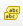
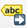

::::{grid} auto
:::{grid-item-card}
:class-card: sd-text-center sd-rounded-circle
:link: ../intro
{octicon}`home-fill;1.5em;sd-text-danger`
:::
::::

# Étiquettes pour données vectorielles 

Les étiquettes sont du texte qui affiche des informations ou des valeurs des données. Dans QGIS, vous pouvez sélectionner __Étiquettes uniques__ ou __Étiquetage basé sur des règles__. Pour chaque option, un attribut (`value`) sera affiché sur la carte. Par exemple, le
nom d’une ville ou d’une région.  De plus, vous pouvez __modifier la police, la taille de police, la couleur et certaines autres options de style__
du texte de l’étiquette. Lorsque vous créez une carte, vous pouvez ajouter des étiquettes pour aider votre lecteur à comprendre rapidement la carte. Cependant,
sachez qu’un excès d’informations textuelles peut surcharger la carte avec trop d’informations à traiter pour le lecteur.

### Étiquettes simples et basées sur des règles 

QGIS propose deux méthodes pour afficher les libellés : __Single Labels__ et __Étiquetage basé sur une règle__

#### Étiquettes uniques 

Crée un style d'étiquette unique pour chaque caractéristique du calque. Vous pouvez sélectionner un attribut (valeur) qui sera
affiché. Par exemple, le nom d'un règlement. Vous devez savoir quel attribut affiche les informations que vous voulez
. Regardez la table d'attributs du jeu de données pour le découvrir.

:::{figure} ../../../fig/labels_single_labels_example_nga_adm1.png
---
width: 600 px
name: labels_single_labels_example_nga_adm1
---
Étiquettes uniques pour chaque région administrative (adm1) au Nigeria. Le lecteur est en mesure d'assigner chaque étiquette à l'entité administrative respective.
:::

:::{figure} ../../../fig/en_30.30.2_assigning_value_to_labels.png
---
width: 600 px
name: en_30.30.2_assigning_value_to_labels
---
Attribuer la valeur correcte de l'attribut dans les options d'étiquetage. QGIS a besoin de savoir quel attribut (colonne) de la table d'attributs doit être affiché en tant que label. Dans ce cas, nous voulons que le nom de la région administrative (`ADM1_EN`) soit affiché.
:::

#### Ajouter des étiquettes uniques à une couche 

1. Dans le panneau de style, cliquez sur l'onglet `Labels`-sous l'onglet Symbologie.
2. Sélectionnez  `Single labels`.
3. `Value` est l'endroit où vous choisissez l'attribut qui sera affiché comme étiquette. Par exemple `*ADM1_EN*` affichera les noms anglais des états nigérians pour chaque fonctionnalité dans le jeu de données.
4. __Modifions la police__ : ouvrez le menu déroulant de la police et sélectionnez Arial. Mettez le texte en `Bold` dans le menu déroulant Style. Modifiez la couleur en cliquant sur `Colour`, puis définissez la `Size` sur 8 pt
5. __Ajoutons un tampon blanc__ autour de l'étiquette. Dans l'onglet `Labels` vous trouverez une liste avec différentes options pour styliser les étiquettes. Pour l'instant, nous sommes dans le menu `Text` . Sélectionnez `Buffer` et cochez l'option `Draw text buffer` . Cela fera ressortir les étiquettes plus sur les cartes sombres ou bondées.
7. Cliquez sur `Apply` et `OK`.

:::{figure} ../../../fig/en_30.30.2_setting_up_labels.png
---
width: 600px
name: en_30.30.2_setting_up_labels
---
Configurer les étiquettes dans QGIS 30.30.2
:::

<video width="100%" controls src="https://github.com/GIScience/gis-training-resource-center/raw/main/fig/en_30.30.2_setting_up_labels.mp4"></video>

::::{attention}

Les étiquettes uniques ne sont pas toujours utiles. Par exemple, si le jeu de données est trop grand, ou si vous voulez seulement afficher certaines fonctionnalités dans le jeu de données. Dans l'exemple ci-dessous, il y a trop de règlements pour afficher des étiquettes pour chaque règlement. Au lieu de cela, il pourrait être utile de n'afficher que les capitales régionales et nationales ; pour un tel cas d'utilisation, l'étiquetage basé sur les règles est idéal.

:::{figure} ../../../fig/single_labels_bad_example.png
---
name: single_labels_bad_example
width: 400 px
---
Les étiquettes individuelles ont été sélectionnées pour afficher les noms des colonies (points rouges). Une carte avec autant d'informations textuelles est illisible et les informations sont difficilement compréhensibles.
:::

::::

#### Étiquetage basé sur des règles 

Créer des règles en utilisant des expressions pour sélectionner avec précision quelles fonctionnalités doivent être étiquetées. Chaque règle peut avoir un formatage de texte
différent. Utilisez ceci si vous voulez avoir plus de contrôle sur les informations qui seront affichées comme étiquettes. Pour
par exemple, vous pouvez filtrer vos données pour n'afficher que les noms des majuscules régionales.

:::{figure} ../../../fig/rule-based_labeling_example_settlements_nga.png
---
name: rule-based_labeling_example_settlements_nga
width: 500 px
---
L'étiquetage basé sur des règles vous permet de filtrer les jeux de données. De cette façon, vous pouvez afficher les étiquettes uniquement pour les fonctionnalités sélectionnées sans modifier le jeu de données.
:::

Les règles, ou filtres, sont basées sur une expression. Vous pouvez utiliser la  `Expression string builder` à droite de l'option __Filtre__ dans le panneau d'étiquettes.

#### Ajout d'étiquettes basées sur des règles à une couche 

1. Dans le panneau de style, cliquez sur l'onglet `Labels` sous l'onglet Symbologie.
2. Sélectionnez  `Rule-based Labeling`.
3. Ajoutez une règle en cliquant sur le bouton `+`dans le coin gauche du panneau de style. Une nouvelle fenêtre s'ouvre dans le panneau de style. Dans cette fenêtre, vous entrerez la règle (`Filter`) et personnaliserez la police, la taille et le placement du libellé. De plus, vous pouvez entrer une description.
4. Entrez un filtre (boîte rouge dans la figure ci-dessous). Le moyen le plus simple est d'utiliser la `Expression string builder` à droite de l'option Filtre. Cliquez sur le symbole -Un nouveau panneau s'ouvre.
5. Dans le constructeur de chaînes d'expressions entrez une règle. Dans l'exemple de la vidéo ci-dessous, nous voulons afficher uniquement les colonies qui sont des capitales nationales ou régionales. Cela correspond à la chaîne `("CLASS" = 1 ) OR ("CLASS" = 2)`. Nous le savons parce que nous connaissons nos données et avons regardé la table d'attributs à l'avance.
6. Cliquez sur `OK`.
7. Définissez la taille de la police et de la police.
8. Cliquez sur `Apply`.

<video width="100%" controls src="https://github.com/GIScience/gis-training-resource-center/raw/main/fig/en_30.30.2_adding_rule-based_labels.mp4"></video>

:::{note}
Pour ajouter des règles à vos étiquettes, vous devez être familier avec vos données ! Regardez les métadonnées (dans les propriétés ou à la source) et regardez la table d'attributs. Pensez à ce que les différentes colonnes signifient et identifiez les attributs. Cela peut ne pas toujours être facile, car ils peuvent avoir des noms abrégés, mais comme vous travaillez plus avec des données, cela deviendra plus facile.
:::

Voici quelques autres considérations à garder à l'esprit lors de l'utilisation des étiquettes:

- Affichet uniquement les informations qui servent le but de la carte ou qui sont utiles au lecteur. Des informations utiles peuvent être le nom d'une colonie ou d'un lieu, afin que le lecteur puisse assigner un certain symbole sur la carte à cet endroit particulier.

- Si vous voulez afficher différents types d'informations en tant qu'étiquettes, la police doit être différente pour que le lecteur puisse faire la différence entre les différents types d'information qui sont affichés. Une bonne pratique consiste à afficher les étiquettes dans une couleur similaire aux objets auxquels elles font référence. Par exemple, le texte bleu foncé pour les étiquettes des plans d'eau bleus clairs, ou le texte marron pour les étiquettes des maisons marronnières.

:::{figure} ../../../fig/good_labels_example.png
---
width: 400 px
name: good_labels_example
---
Un bon exemple de placement d'étiquette et de police. Faites attention aux couleurs et à l'orientation du texte. Chaque étiquette peut facilement être attribuée à la bonne fonctionnalité cartographique. (Source: [Axis Maps](https://www.axismaps.com/guide/labeling))
:::

::::::{Attention}

- Dans la plupart des cas, afficher des valeurs numériques comme des étiquettes est déroutant pour le lecteur et rend la carte trop complexe. Dans la plupart des cas, pour les données numériques, vous pouvez choisir une visualisation différente telle que les couleurs ou la taille des symboles.

:::::{grid} 2
::::{card}

:::{figure} ../../../fig/labels_numerical_values_bad_example.png
---
name: labels_numerical_values_bad_example
---
Étiquettes numériques pour données vectorielles
:::

::::

::::{card}

:::{figure} ../../../fig/labels_graduated_symbology_example.png
---
name: labels_graduated_symbology_example
---
[Symbologie graduée](../Module_3/en_qgis_data_classification.md#graduated-classification)
:::

::::

:::::

::::::

- QGIS place automatiquement les étiquettes. Parfois, si vous utilisez beaucoup de contours noirs ou de couleurs sombres, le texte noir est difficile à lire sur la carte. Dans ce cas, vous pouvez ajouter un tampon blanc autour du texte pour le rendre visible.

:::{figure} ../../../fig/label_text_buffer_example.png
---
width: 500 px
name: label_text_buffer_example
---
Une étiquette sans tampon de texte (à gauche) et une étiquette avec un tampon de texte blanc (à droite).
:::

:::{note}
QGIS affiche automatiquement les étiquettes.
Parfois, les étiquettes peuvent bloquer d'autres symboles. Dans ce cas, vous pouvez soit ajuster le placement des étiquettes dans l'onglet __Libellé__, ou utilisez l'outil  `Move a Label, Diagram, or Callout`-outil dans __Barre d'outils__.

Par défaut, QGIS rend les étiquettes de sorte qu'elles ne se chevauchent pas avec d'autres étiquettes. Cela signifie que toutes les étiquettes ne seront pas visibles si les données sont denses ou rapprochées les unes des autres. Vous pouvez optimiser le rendu sous l'option de rendu.

:::

:::{Attention}

Consultez l'article [du wiki](../Wiki/en_qgis_representation_wiki.md) pour des tutoriels détaillés étape par étape sur la façon d'utiliser les différentes fonctionnalités du panneau de style.

Vous pouvez également lire plus loin dans l'article "[Étiquetage et hiérarchie de texte dans la cartographie](https://www.axismaps.com/guide/labeling)" par Axis Maps.

:::

## Questions d'auto-évaluation 

::::{admonition} Testez vos connaissances
:class: note

1. __Lorsque vous utilisez les Étiquettes uniques, que devez-vous choisir pour que les étiquettes soient affichées, c’est-à-dire à quoi « Valeur » fait-elle référence ?__

:::{dropdown} Réponse
- En mode Étiquettes uniques, vous devez choisir un champ d'attribut ____ (colonne) à partir du calque dont les valeurs seront affichées en tant que labels. Cela s'appelle le champ Valeur, par exemple, vous pouvez choisir la colonne stockant le nom d'une rue pour afficher les noms de rue sur votre carte.
- Vous pouvez également utiliser une expression à la place d'un simple champ, par exemple concaténer plusieurs champs ou des fonctions d'inclusion, pour construire ce que le label affiche.

2. __Qu’est-ce qu’une « règle » dans l’étiquetage basé sur des règles, et comment en créer une, par exemple en utilisant des expressions ?__

:::{dropdown} Réponse
- Une règle ____ dans l'étiquetage basé sur des règles est une condition (filtre) qui détermine quelles fonctionnalités sont étiquetées sous cette règle, et éventuellement avec le style particulier. Chaque règle peut avoir son propre style d'étiquette (police de caractère, taille etc.)
- Pour construire une règle : dans les propriétés Label du calque, sélectionnez l'étiquetage basé sur la règle. Ensuite, ajoutez une nouvelle règle, donnez-lui une description, et définissez une expression de filtre (en utilisant le générateur d'expression) qui teste certains attributs (et éventuellement l'échelle, la visibilité, etc.). . Seules les fonctionnalités satisfaisant l'expression sont étiquetées sous cette règle.
:::

3. __Pourquoi préféreriez-vous l’étiquetage basé sur des règles plutôt que d’étiqueter chaque entité avec les Étiquettes uniques ? Donnez un exemple de scénario.__

:::{dropdown} Réponse
- __L'étiquetage basé sur la règle__ vous permet d'étiqueter sélectivement (seulement quelques fonctionnalités, e. . - seulement les grandes routes, seulement les capitales, ou les caractéristiques supérieures à une certaine taille), en évitant l'encombrement.
- Il vous permet également de varier le style d'étiquette par règle (taille de police différente, couleur, style) en fonction de l'attribut ou de l'échelle de la caractéristique.
- __Scénario Exemple__: Supposons que vous ayez une carte des villes, et vous voulez étiqueter uniquement les grandes villes (population > 100, 000) avec leurs noms dans la grande police en gras, les moyennes villes dans la police de plus petite taille, et omettre de très petites villes pour réduire la population. Vous pouvez faire des règles comme `"population" > 100000, 10000 < "population" <= 100000`, etc. Chaque règle n'étiquettent que ces fonctionnalités, stylisées de manière appropriée. Cela évite d'étiqueter toutes les petites villes qui pourraient se chevaucher et s'encombrer
:::

4. __Pourquoi est-il généralement déconseillé d’étiqueter directement les valeurs numériques continues sous forme d’étiquettes textuelles ?__

:::{dropdown} Réponse
- Valeurs numériques continues (p. ex. comptes, mesures, etc.) tendent à produire __trop d'étiquettes uniques__, qui peut encombrer la carte ou se chevaucher, ce qui rend difficile à lire.
- Ils changent souvent en permanence, de sorte que de petits changements (précision mineure) peuvent ne pas être utiles et peuvent submerger l'étiquetage.
- En outre, les valeurs continues sont mieux représentées via les variables visuelles __notées__ (par ex. la couleur, la taille ou le choropleth) plutôt que le texte, donc les spectateurs perçoivent une magnitude relative plus naturellement.
:::

::::

## Ressources supplémentaires 

- Polices [conformes à la marque IFRC](https://learn-sims.org/style-guidance/standard-fonts/)
